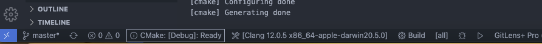

# CMake 编译打包

编译流程主要是依据参数来生成不同的工程文件，比如Debug/Release，是否编译公共库，是否编译第三方库，编译win/linux平台等等。
打包流程主要是将编译生成的文件制作成安装包。

## 编译流程
```CMake
# 目录结构
CMakeDemo
|_ build
|_ CMake
    |_ Modules
    |_ Scripts
|_ Common
|_ Src
|_ CMakeLists.txt
|_ .gitignore
```

* CMake/Scripts：编译打包脚本放在这个里面。

### 编译指令
使用cmake编译工程项目，本质就是调用一下命令行。  
configure：`cmake ..`  
build：`cmake --build slnRootDir --config release --taget all -j 4`
* --build：指定项目根目录，项目根CMakeLists.txt所在的目录。
* --config：编译方式，debug/release/RelWithDebInfo。
* --target: all表示全部编译，或者指定某个工程的名字。
* --j：cpu核数，并发编译的线程数量。

我们需要做的事情，就是通过传参的方式控制cmake命令行内容，达到编译工程项目的目的。

### 编译脚本
```CMake
# 目录结构
CMakeDemo
|_ build
|_ CMake
    |_ Modules
    |_ Scripts
        |_ Build.sh
        |_ Pack.sh
        |_ Package.sh
|_ Common
|_ Src
|_ CMakeLists.txt
|_ .gitignore
```
我们将`Package.sh`作为打包脚本的入口，在`Package.sh`内部调用`Build.sh`和`Pack.sh`分别执行编译和打包流程。

### 命令行解析
我们自行定义了一些参数，利用shell的getopts来解析参数。  
具体的函数可以看脚本`Bash.sh`，这里仅为示意。
```bash
parse_args() {
    while getopts :a:b:m:t:v:o:r:s: OPT
    do
        case "${OPT}" 
        in
            a) PLATFORM_ARCH=${OPTARG};;
            b) BUILD_CONFIG=${OPTARG};;
            m) BUILD_MODULES=${OPTARG};;
            t) PKG_TYPE=${OPTARG};;
            v) PKG_VERSION=${OPTARG};;
            o) PKG_OUTPUT=${OPTARG};;
            s) PLATFORM_OS=${OPTARG};;
            r) REBUILD=${OPTARG};;
            ?) echo "unknown" ${OPTARG}
        esac
    done
    shift $(($OPTIND - 1))
}
```

### 配置和编译
我们使用一些开源项目的时候，常常会遇到`configure`和`build`的场景。这是因为对于一些大型项目，cmake解析项目配置就需要一段不小的耗时，因此，configure和build实际是分两步完成的。  
从另一个角度看，我们这个demo工程，如果用vscode打开，vscode会自动解析cmake配置并生成cmake缓存。如果cmake配置正确，那么vscode自动解析以后，在底部会展示如下内容。这里是mac电脑的一个显示。
  

有些时候，我们修改cmake文件，可能不会触发cmake缓存更新，这个时候需要手动清理缓存再重新解析。一种比较暴力的方法是删除整个build目录，另一个方法是用vscode的命令`Ctrl/Cmd+P`，`>CMake: Delete Cache and Reconfigure`。

#### configure
在一开始，我们用cmake的时候，是在根目录创建了一个build目录，然后在build目录下`cmake ..`，`make`。
```bash
# 当前处于工程根目录
$ mkdir build # 创建缓存目录
$ cd build
$ cmake .. # 在缓存目录下configure项目
$ make # 编译工程
```

我们手动cmake的时候，是在build目录下调用了`cmake ..`，这会在build目录下生成cmake cache。但是，使用脚本要如何指定build缓存目录呢？  
一种方法是不要设置，在工程的根目录下直接`cmake`，那么会在当前目录下寻找CMakeLists文件并开始配置工程。  
另一种方法是使用 -B 参数。  
`cmake [<选项>] -S <源路径> -B <构建路径>`  
指定的路径可以是绝对路径，也可以是相对路径当前工作目录。源路径必须包含一个CMakeLists.txt文件。构建路径如果不存在，则会自动创建目录。

方法2是cmake保持旧版本兼容所保留的一种方法，如果方法2不可行，可以试试方法1。
```bash
#方法1
if [[ ! -d $BUILD_DIR ]]; then
    info "build dir does NOT exists, make build dir: $BUILD_DIR"
    mkdir -p $BUILD_DIR
fi

cd ${BUILD_DIR}
cmake ..
cd ${WORKSPACE}

# 方法2
cmake -B${BUILD_DIR} # 注意-B之后是没有空格的。

```

reconfigure其实就是删除cmake的几个缓存文件。
```bash
configure() {
    info "re configure: ${RE_CONFIGURE}"
    if [[ ${RE_CONFIGURE} == "ON" ]]; then
        info "delete cmake reconfigure..."
        rm -rf $BUILD_DIR/CMakeFiles
        rm -rf $BUILD_DIR/CMakeCache.txt
    fi

    # ...
}
```