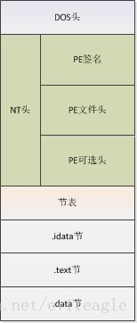

# PE文件结构

PE（ Portable Execute）文件是Windows下可执行文件的总称，常见的有 DLL，EXE，OCX，SYS 等。它是微软在 UNIX 平台的 COFF（通用对象文件格式）基础上制作而成。最初设计用来提高程序在不同操作系统上的移植性，但实际上这种文件格式仅用在 Windows 系列操作系统下。PE文件是指 32 位可执行文件，也称为PE32。64位的可执行文件称为 PE+ 或 PE32+，是PE(PE32)的一种扩展形式（请注意不是PE64）。

PE文件的结构一般来说如下图所示：从起始位置开始依次是 DOS头，NT头，节表 以及 具体的节。

  

## PE 文件的执行顺序
1. 当一个 PE 文件 被执行时，PE 装载器 首先检查 DOS header 里的 PE header 的偏移量。如果找到，则直接跳转到 PE header 的位置。
2. 当 PE装载器 跳转到 PE header 后，第二步要做的就是检查 PE header 是否有效。如果该 PE header 有效，就跳转到 PE header 的尾部。
3. 紧跟 PE header 尾部的是节表。PE装载器执行完第二步后开始读取节表中的节段信息，并采用文件映射（ 在执行一个PE文件的时候，Windows并不在一开始就将整个文件读入内存，而是采用与内存映射的机制，也就是说，Windows装载器在装载的时候仅仅建立好虚拟地址和PE文件之间的映射关系，只有真正执行到某个内存页中的指令或者访问某一页中的数据时，这个页面才会被从磁盘提交到物理内存，这种机制使文件装入的速度和文件大小没有太大的关系 ）的方法将这些节段映射到内存，同时附上节表里指定节段的读写属性。
4. PE文件映射入内存后，PE装载器将继续处理PE文件中类似 import table （输入表）的逻辑部分。

## PE 文件结构说明
1. DOS头 是用来兼容 MS-DOS 操作系统的，目的是当这个文件在 MS-DOS 上运行时提示一段文字，大部分情况下是：This program cannot be run in DOS mode. 还有一个目的，就是指明 NT 头在文件中的位置。
2. NT头 包含 windows PE 文件的主要信息，其中包括一个 'PE' 字样的签名，PE文件头（IMAGE_FILE_HEADER）和 PE可选头（IMAGE_OPTIONAL_HEADER32）。
3. 节表：是 PE 文件后续节的描述，windows 根据节表的描述加载每个节。
4. 节：每个节实际上是一个容器，可以包含 代码、数据 等等，每个节可以有独立的内存权限，比如代码节默认有读/执行权限，节的名字和数量可以自己定义，未必是上图中的三个。