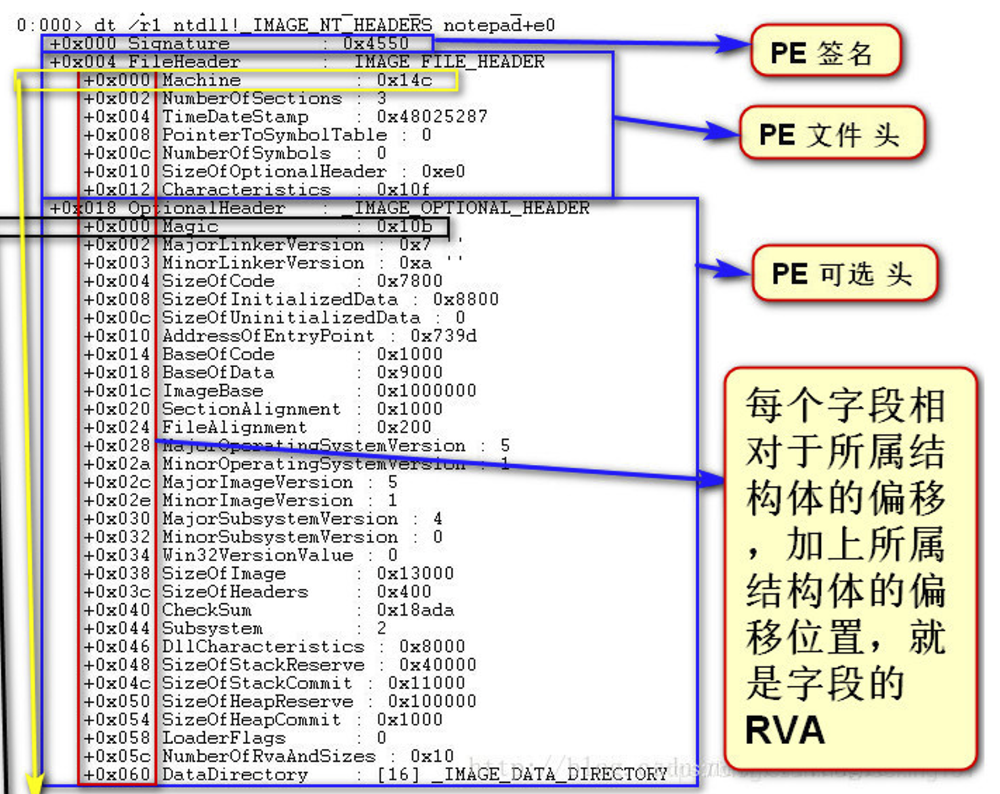

# PE NT头

顺着 DOS 头中的 e_lfanew，我们很容易可以找到 NT头，这个才是 32位PE文件中最有用的头，定义如下:
```c
typedef struct _IMAGE_NT_HEADERS {
    DWORD Signature;
    IMAGE_FILE_HEADER FileHeader;
    IMAGE_OPTIONAL_HEADER32 OptionalHeader;
} IMAGE_NT_HEADERS32, *PIMAGE_NT_HEADERS32;
```

下图是一张真实的 PE文件头结构 以及其 各个域的取值。
  


## Signature
类似于 DOS头中的 e_magic，其高16位是0，低16是0x4550，用字符表示是 'PE'。

## IMAGE_FILE_HEADER
PE文件头的定义如下。
```c
typedef struct _IMAGE_FILE_HEADER {
    WORD    Machine; // 该文件的运行平台，是 x86、x64 还是 I64 等等
    WORD    NumberOfSections; // 该PE文件中有多少个节
    DWORD   TimeDateStamp; // PE文件的创建时间
    DWORD   PointerToSymbolTable; // COFF文件符号表在文件中的偏移
    DWORD   NumberOfSymbols; // 符号表的数量
    WORD    SizeOfOptionalHeader; // 紧随其后的可选头的大小
    WORD    Characteristics; //  可执行文件的属性
} IMAGE_FILE_HEADER, *PIMAGE_FILE_HEADER;
```

## IMAGE_OPTIONAL_HEADER32
PE可选头的定义如下。

PE 可选头，别看他名字叫可选头，其实一点都不能少。32位下是IMAGE_OPTIONAL_HEADER32，而在64位下是IMAGE_OPTIONAL_HEADER64。为了简单起见，我们只看32位。
```c
typedef struct _IMAGE_OPTIONAL_HEADER {
    WORD    Magic; // 可选头的类型，32b/64b。
    BYTE    MajorLinkerVersion; // 链接器的版本号
    BYTE    MinorLinkerVersion;
    DWORD   SizeOfCode; // 代码段的长度，如果有多个代码段，则是代码段长度的总和
    DWORD   SizeOfInitializedData;
    DWORD   SizeOfUninitializedData;
    DWORD   AddressOfEntryPoint; // 程序入口的 RVA
    DWORD   BaseOfCode;
    DWORD   BaseOfData;
    DWORD   ImageBase; // 基地址，这个基地址是建议
    DWORD   SectionAlignment;
    DWORD   FileAlignment;
    WORD    MajorOperatingSystemVersion;
    WORD    MinorOperatingSystemVersion;
    WORD    MajorImageVersion;
    WORD    MinorImageVersion;
    WORD    MajorSubsystemVersion;
    WORD    MinorSubsystemVersion;
    DWORD   Win32VersionValue;
    DWORD   SizeOfImage; // PE文件加载到内存中空间是连续的，这个值指定占用虚拟空间的大小
    DWORD   SizeOfHeaders; // 所有文件头（包括节表）的大小，这个值是以FileAlignment对齐的
    DWORD   CheckSum;
    WORD    Subsystem;
    WORD    DllCharacteristics;
    DWORD   SizeOfStackReserve;
    DWORD   SizeOfStackCommit;
    DWORD   SizeOfHeapReserve;
    DWORD   SizeOfHeapCommit;
    DWORD   LoaderFlags;
    DWORD   NumberOfRvaAndSizes; // 数据目录的项数，即下面这个数组的项数
    IMAGE_DATA_DIRECTORY DataDirectory[IMAGE_NUMBEROF_DIRECTORY_ENTRIES]; // 数据目录
} IMAGE_OPTIONAL_HEADER32, *PIMAGE_OPTIONAL_HEADER32;
```
* AddressOfEntryPoint：程序入口的 RVA，对于exe这个地址可以理解为WinMain的RVA。对于DLL，这个地址可以理解为DllMain的RVA，如果是驱动程序，可以理解为DriverEntry的RVA。当然，实际上入口点并非是WinMain，DllMain和DriverEntry，在这些函数之前还有一系列初始化要完成。

### DataDirectory
数据目录，这是一个数组，数组的项定义如下。
```c
typedef struct _IMAGE_DATA_DIRECTORY {
    DWORD   VirtualAddress; // RVA
    DWORD   Size;
} IMAGE_DATA_DIRECTORY, *PIMAGE_DATA_DIRECTORY;
```
这两个数有什么用呢 ？一个是地址，一个是大小，可以看出这个数据目录项定义的是一个区域。那他定义的是什么东西的区域呢？前面说了，DataDirectory 是个数组，数组中的每一项对应一个特定的数据结构，包括导入表，导出表等等，根据不同的索引取出来的是不同的结构，头文件里定义各个项表示哪个结构，如下面的代码所示：

```c
#define IMAGE_DIRECTORY_ENTRY_EXPORT          0   // Export Directory
#define IMAGE_DIRECTORY_ENTRY_IMPORT          1   // Import Directory
#define IMAGE_DIRECTORY_ENTRY_RESOURCE        2   // Resource Directory
#define IMAGE_DIRECTORY_ENTRY_EXCEPTION       3   // Exception Directory
#define IMAGE_DIRECTORY_ENTRY_SECURITY        4   // Security Directory
#define IMAGE_DIRECTORY_ENTRY_BASERELOC       5   // Base Relocation Table
#define IMAGE_DIRECTORY_ENTRY_DEBUG           6   // Debug Directory
//      IMAGE_DIRECTORY_ENTRY_COPYRIGHT       7   // (X86 usage)
#define IMAGE_DIRECTORY_ENTRY_ARCHITECTURE    7   // Architecture Specific Data
#define IMAGE_DIRECTORY_ENTRY_GLOBALPTR       8   // RVA of GP
#define IMAGE_DIRECTORY_ENTRY_TLS             9   // TLS Directory
#define IMAGE_DIRECTORY_ENTRY_LOAD_CONFIG    10   // Load Configuration Directory
#define IMAGE_DIRECTORY_ENTRY_BOUND_IMPORT   11   // Bound Import Directory in headers
#define IMAGE_DIRECTORY_ENTRY_IAT            12   // Import Address Table
#define IMAGE_DIRECTORY_ENTRY_DELAY_IMPORT   13   // Delay Load Import Descriptors
#define IMAGE_DIRECTORY_ENTRY_COM_DESCRIPTOR 14   // COM Runtime descriptor
```
NT头中最重要的就是DataDirectory，里面定义的各个section（节），我们再继续往后看。