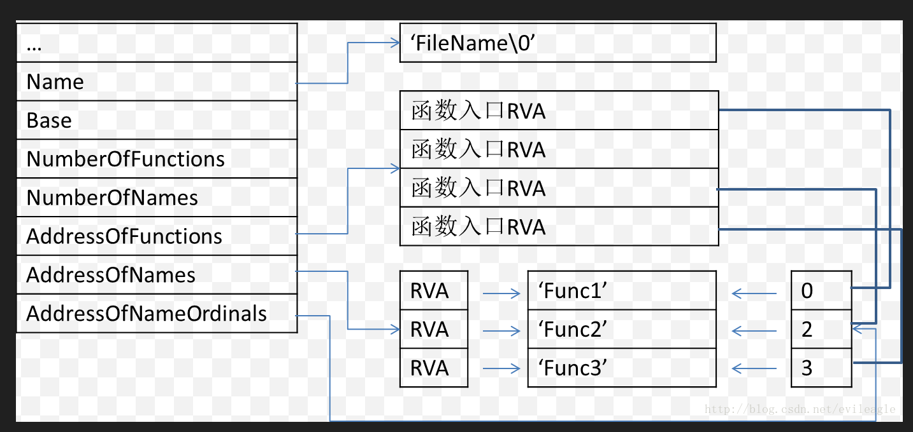

# PE 导出表

DataDirectory中的第0个元素是导出表。导出表是用来描述 模块（dll）中的导出函数的结构，如果一个模块导出了函数，那么这个函数会被记录在导出表中，这样通过GetProcAddress函数就能动态获取到函数的地址。导出表 就是一个"表格"。
```c
#define IMAGE_DIRECTORY_ENTRY_EXPORT          0   // Export Directory
```
扩展名为.exe不存在导出表，导出表存在在dll文件中，就是导出函数给别人用。

函数导出的方式有两种：一种是按 名字 导出，一种是按 序号 导出。

## IMAGE_EXPORT_DIRECTORY
```c
typedef struct _IMAGE_EXPORT_DIRECTORY {
    DWORD   Characteristics;
    DWORD   TimeDateStamp;
    WORD    MajorVersion;
    WORD    MinorVersion;
    DWORD   Name; // 模块的名字
    DWORD   Base; // 序号的基数，按序号导出函数的序号值从Base开始递增
    DWORD   NumberOfFunctions; // 所有导出函数的数量
    DWORD   NumberOfNames; // 按名字导出函数的数量
    DWORD   AddressOfFunctions;     // RVA from base of image
    DWORD   AddressOfNames;         // RVA from base of image
    DWORD   AddressOfNameOrdinals;  // RVA from base of image
} IMAGE_EXPORT_DIRECTORY, *PIMAGE_EXPORT_DIRECTORY;
```
* AddressOfFunctions：一个RVA，指向一个DWORD数组，数组中的每一项是一个导出函数的RVA，顺序与导出序号相同。
* AddressOfNames：一个RVA，依然指向一个DWORD数组，数组中的每一项仍然是一个RVA，指向一个表示函数名字。
* ddressOfNameOrdinals：一个RVA，还是指向一个WORD数组，数组中的每一项与AddressOfNames中的每一项对应，表示该名字的函数在AddressOfFunctions中的序号。

看下面的图片会更加清晰。
  
