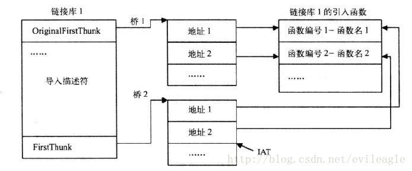
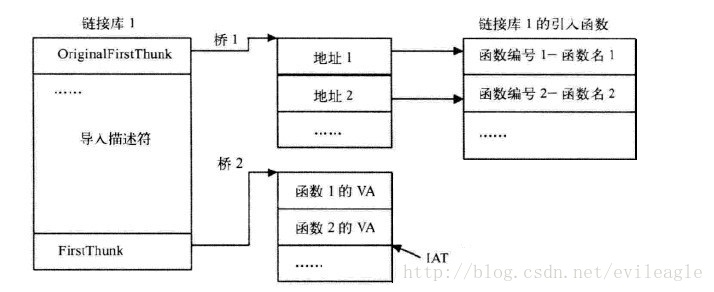
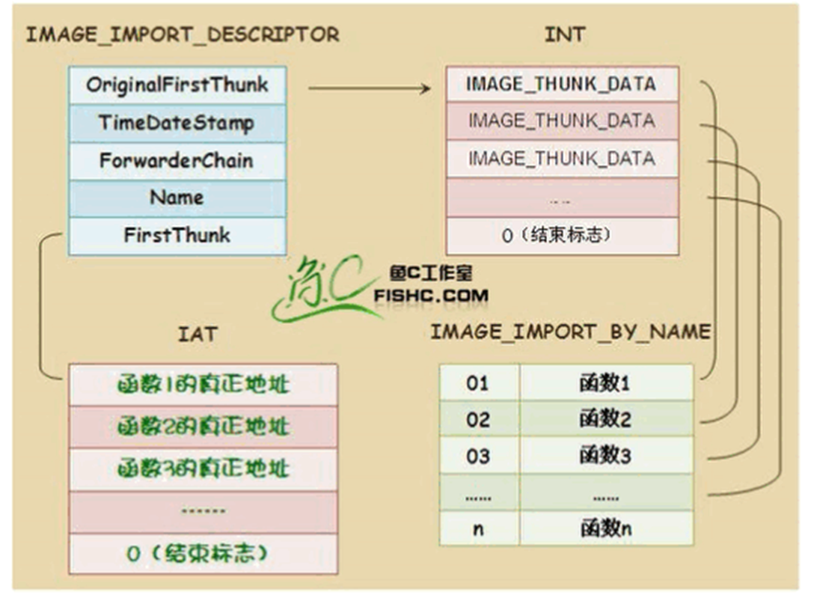

# PE 导入表

.exe 文件存在导入表，就是导入函数，然后自己使用。

导入表 在 PE 文件加载时，会根据这个表里的内容加载依赖的 DLL ( 模块 )，并填充所需函数的地址。

在 IMAGE_DATA_DIRECTORY 中，有几项的名字都和导入表有关系，其中包括：
1. IMAGE_DIRECTORY_ENTRY_IMPORT 就是我们通常所知道的 导入表，在 PE 文件加载时，会根据这个表里的内容加载依赖的 DLL ( 模块 )，并填充所需函数的地址。
2. IMAGE_DIRECTORY_ENTRY_BOUND_IMPORT 叫做 绑定导入表，在第一种导入表导入地址的修正是在PE加载时完成，如果一个PE文件导入的DLL或者函数多那么加载起来就会略显的慢一些，所以出现了绑定导入，在加载以前就修正了导入表，这样就会快一些。
3. IMAGE_DIRECTORY_ENTRY_DELAY_IMPORT 叫做 延迟导入表，一个PE文件也许提供了很多功能，也导入了很多其他DLL，但是并非每次加载都会用到它提供的所有功能，也不一定会用到它需要导入的所有DLL，因此延迟导入就出现了，只有在一个PE文件真正用到需要的DLL，这个DLL才会被加载，甚至于只有真正使用某个导入函数，这个函数地址才会被修正。
4. IMAGE_DIRECTORY_ENTRY_IAT 是 导入地址表，前面的三个表其实是导入函数的描述，真正的函数地址是被填充在导入地址表中的。

举个实际的例子，看一下下面这张图：
  
这个代码调用了一个 RegOpenKeyW 的导入函数，我们看到其 opcode 是 FF 15 00 00 19 30，其实 FF 15 表示这是一个间接调用，即 call dword ptr [30190000] ，这表示要调用的地址存放在 30190000 这个地址中，而 30190000 这个地址在导入地址表的范围内，当模块加载时，PE 加载器会根据导入表中描述的信息修正30190000这个内存中的内容。

## 导入表 IMAGE_IMPORT_DESCRIPTOR
```c
typedef struct _IMAGE_IMPORT_DESCRIPTOR {
    union {
        DWORD   Characteristics; // 0 for terminating null import descriptor
        DWORD   OriginalFirstThunk; // RVA to original unbound IAT (PIMAGE_THUNK_DATA)
    } DUMMYUNIONNAME;
    DWORD   TimeDateStamp;
    DWORD   ForwarderChain; // -1 if no forwarders
    DWORD   Name; // 指向dll文件名，每个dll都有一个导入表
    DWORD   FirstThunk; // RVA to IAT (if bound this IAT has actual addresses)
} IMAGE_IMPORT_DESCRIPTOR;

typedef IMAGE_IMPORT_DESCRIPTOR UNALIGNED *PIMAGE_IMPORT_DESCRIPTOR;
```
* Characteristics 和 OriginalFirstThunk：一个联合体，如果是数组的最后一项 Characteristics 为 0，否则 OriginalFirstThunk 保存一个 RVA，指向一个 IMAGE_THUNK_DATA 的数组，这个数组中的每一项表示一个导入函数。
* TimeDateStamp：映象绑定前，这个值是0，绑定后是导入模块的时间戳。
* ForwarderChain：转发链，如果没有转发器，这个值是 -1 。
* Name：一个 RVA，指向导入模块的名字，所以一个 IMAGE_IMPORT_DESCRIPTOR 描述一个导入的DLL。
* FirstThunk：也是一个 RVA，也指向一个 IMAGE_THUNK_DATA 数组。

从Name字段可以知道，如果从n个dll中导入了函数，就会有n个 IMAGE_IMPORT_DESCRIPTOR 结构，最后以一个空的 IMAGE_IMPORT_DESCRIPTOR 作为结束。

  

既然 OriginalFirstThunk 与 FirstThunk 都指向一个 IMAGE_THUNK_DATA 数组，而且这两个域的名字都长得很像，他俩有什么区别呢？为了解答这个问题，先来认识一下 IMAGE_THUNK_DATA 结构：
```c
typedef struct _IMAGE_THUNK_DATA32 {
    union {
        DWORD ForwarderString; // PBYTE 
        DWORD Function; // 函数地址
        DWORD Ordinal; // 序号
        DWORD AddressOfData; // 指向函数名字
    } u1;
} IMAGE_THUNK_DATA32;

typedef IMAGE_THUNK_DATA32 * PIMAGE_THUNK_DATA32;
```
* Function：表示函数地址。
* Ordinal：按序号导入就看这个值。
* AddressOfData：按名字导入就看这个值。

此union结构到底是序号导入还是名字导入呢？看Ordinal字段。

1. 如果Ordinal的最高位是1，就是按序号导入的，这时候，低16位就是导入序号。
2. 如果最高位是0，则AddressOfData是一个RVA，指向一个IMAGE_IMPORT_BY_NAME结构，用来保存名字信息。

由于Ordinal和AddressOfData实际上是同一个内存空间，所以AddressOfData其实只有低31位可以表示RVA，但是一个PE文件不可能超过2G，所以最高位永远为0，这样设计很合理的利用了空间。

实际编写代码的时候微软提供两个宏定义处理序号导入：`IMAGE_SNAP_BY_ORDINAL`判断是否按序号导入，`IMAGE_ORDINAL`用来获取导入序号。

这时我们可以回头看看 OriginalFirstThunk 与 FirstThunk，OriginalFirstThunk 指向的 IMAGE_THUNK_DATA 数组包含导入信息，在这个数组中只有 Ordinal 和 AddressOfData 是有用的，因此可以通过 OriginalFirstThunk 查找到函数的地址。

FirstThunk则略有不同，在PE文件加载以前或者说在导入表未处理以前，他所指向的数组与 OriginalFirstThunk 中的数组虽不是同一个，但是内容却是相同的，都包含了导入信息，而在加载之后，FirstThunk 中的 Function 开始生效，他指向实际的函数地址，因为FirstThunk 实际上指向 IAT 中的一个位置，IAT 就充当了 IMAGE_THUNK_DATA 数组，加载完成后，这些 IAT 项就变成了实际的函数地址，即 Function 的意义。

还是上个图对比一下：

加载前的样子如下：
  

加载后的样子如下：
  

为什么由两个并行的指针数组同时指向 IMAGE_THUNK_DATA 结构呢? 

第一个数组（由OriginalFirstThunk 所指向）是单独的一项，而且不能被改写，我们前边称为 INT。第二个数组（由 FirstThunk 所指向）事实上是由 PE 装载器重写的。

那么 PE 装载器的核心操作时如何的呢？
PE 装载器首先搜索 OriginalFirstThunk ，找到之后加载程序迭代搜索数组中的每个指针，找到
每个 IMAGE_THUNK_DATA 结构所指向的输入函数的地址，然后加载器用函数真正入口
地址来替代由 FirstThunk 数组中的一个入口，因此我们称为输入地址表(IAT)。所以，当我
们的 PE 文件装载内存后准备执行时，刚刚的图就会转化为下图:

  

此时，输入表中其他部分就不重要了，程序依靠 IAT 提供的函数地址就可正常运行。

最后总结一下：

导入表其实是一个 IMAGE_IMPORT_DESCRIPTOR 的数组，每个导入的 DLL 对应一个 IMAGE_IMPORT_DESCRIPTOR。

IMAGE_IMPORT_DESCRIPTOR 包含两个 IMAGE_THUNK_DATA 数组，数组中的每一项对应一个导入函数。

加载前 OriginalFirstThunk 与 FirstThunk 的数组都指向名字信息，加载后 FirstThunk 数组指向实际的函数地址。

## 延迟导入表
我们来看一下另外一种导入表：延迟导入（Delay Import）。看名字就知道，这种导入机制导入其他DLL的时机比较“迟”，为什么要迟呢？因为有些导入函数可能使用的频率比较低，或者在某些特定的场合才会用到，而有些函数可能要在程序运行一段时间后才会用到，这些函数可以等到他实际使用的时候再去加载对应的DLL，而没必要再程序一装载就初始化好。

延迟导入的加载只发生在函数第一次被调用的时候，之后IAT就填充为正确函数地址，不会再走 __delayLoadHelper了。

延迟导入一次只会导入一个函数，而不是一次导入整个模块的所有函数。