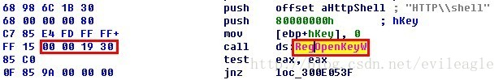
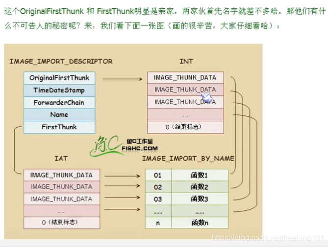

# PE 导入表

.exe 文件存在导入表，就是导入函数，然后自己使用。

导入表 在 PE 文件加载时，会根据这个表里的内容加载依赖的 DLL ( 模块 )，并填充所需函数的地址。

在 IMAGE_DATA_DIRECTORY 中，有几项的名字都和导入表有关系，其中包括：
1. IMAGE_DIRECTORY_ENTRY_IMPORT 就是我们通常所知道的 导入表，在 PE 文件加载时，会根据这个表里的内容加载依赖的 DLL ( 模块 )，并填充所需函数的地址。
2. IMAGE_DIRECTORY_ENTRY_BOUND_IMPORT 叫做 绑定导入表，在第一种导入表导入地址的修正是在PE加载时完成，如果一个PE文件导入的DLL或者函数多那么加载起来就会略显的慢一些，所以出现了绑定导入，在加载以前就修正了导入表，这样就会快一些。
3. IMAGE_DIRECTORY_ENTRY_DELAY_IMPORT 叫做 延迟导入表，一个PE文件也许提供了很多功能，也导入了很多其他DLL，但是并非每次加载都会用到它提供的所有功能，也不一定会用到它需要导入的所有DLL，因此延迟导入就出现了，只有在一个PE文件真正用到需要的DLL，这个DLL才会被加载，甚至于只有真正使用某个导入函数，这个函数地址才会被修正。
4. IMAGE_DIRECTORY_ENTRY_IAT 是 导入地址表，前面的三个表其实是导入函数的描述，真正的函数地址是被填充在导入地址表中的。

举个实际的例子，看一下下面这张图：
  
这个代码调用了一个 RegOpenKeyW 的导入函数，我们看到其 opcode 是 FF 15 00 00 19 30，其实 FF 15 表示这是一个间接调用，即 call dword ptr [30190000] ，这表示要调用的地址存放在 30190000 这个地址中，而 30190000 这个地址在导入地址表的范围内，当模块加载时，PE 加载器会根据导入表中描述的信息修正30190000这个内存中的内容。

## IMAGE_IMPORT_DESCRIPTOR
```c
typedef struct _IMAGE_IMPORT_DESCRIPTOR {
    union {
        DWORD   Characteristics;    // 0 for terminating null import descriptor
        DWORD   OriginalFirstThunk; // RVA to original unbound IAT (PIMAGE_THUNK_DATA)
    } DUMMYUNIONNAME;
    DWORD   TimeDateStamp;
    DWORD   ForwarderChain;         // -1 if no forwarders
    DWORD   Name;
    DWORD   FirstThunk;             // RVA to IAT (if bound this IAT has actual addresses)
} IMAGE_IMPORT_DESCRIPTOR;

typedef IMAGE_IMPORT_DESCRIPTOR UNALIGNED *PIMAGE_IMPORT_DESCRIPTOR;
```
* Characteristics 和 OriginalFirstThunk：一个联合体，如果是数组的最后一项 Characteristics 为 0，否则 OriginalFirstThunk 保存一个 RVA，指向一个 IMAGE_THUNK_DATA 的数组，这个数组中的每一项表示一个导入函数。
* TimeDateStamp：映象绑定前，这个值是0，绑定后是导入模块的时间戳。
* ForwarderChain：转发链，如果没有转发器，这个值是 -1 。
* Name：一个 RVA，指向导入模块的名字，所以一个 IMAGE_IMPORT_DESCRIPTOR 描述一个导入的DLL。
* FirstThunk：也是一个 RVA，也指向一个 IMAGE_THUNK_DATA 数组。

  
