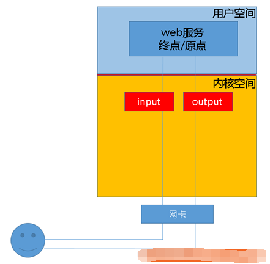
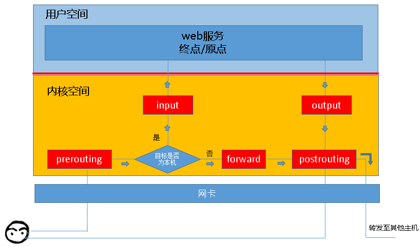
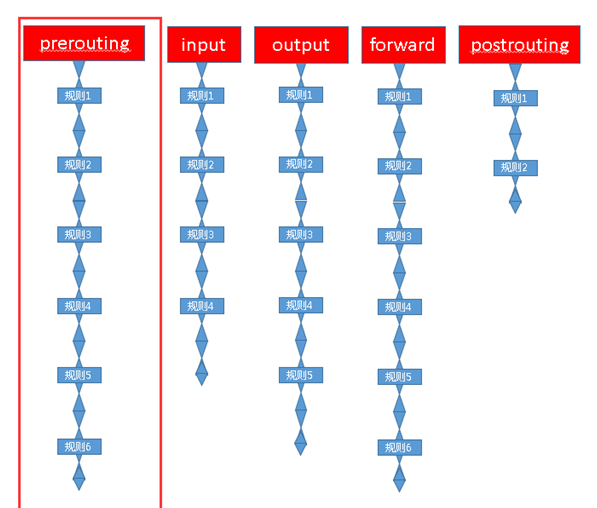
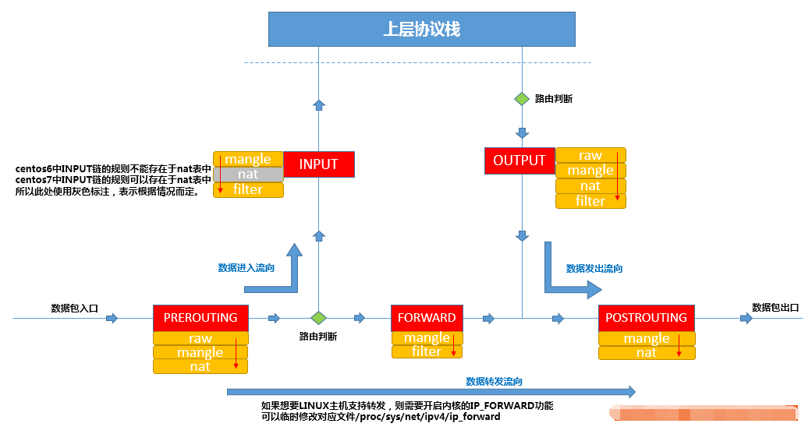
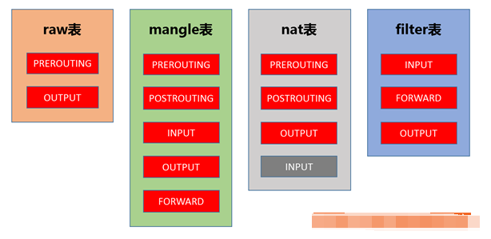

# iptables

## 介绍
iptables是Linux系统上的网络防火墙，但iptables其实不是真正的防火墙，我们可以把它理解成一个客户端代理，用户通过iptables这个代理，将用户的安全设定执行到对应的“安全框架”中，这个“安全框架”才是真正的防火墙，这个框架的名字叫netfilter。

iptables的前身叫ipfirewall （内核1.x时代）,这是一个作者从freeBSD上移植过来的，能够工作在内核当中的，对数据包进行检测的一款简易访问控制工具。但是ipfirewall工作功能极其有限(它需要将所有的规则都放进内核当中，这样规则才能够运行起来，而放进内核，这个做法一般是极其困难的)。当内核发展到2.x系列的时候，软件更名为ipchains，它可以定义多条规则，将他们串起来，共同发挥作用，而现在，它叫做iptables，可以将规则组成一个列表，实现绝对详细的访问控制功能。

* netfilter才是防火墙真正的安全框架（framework），netfilter位于内核空间。
* iptables其实是一个命令行工具，位于用户空间，我们用这个工具操作真正的框架。

虽然我们使用service iptables start启动iptables”服务”，但是其实准确的来说，iptables并没有一个守护进程，所以并不能算是真正意义上的服务，而应该算是内核提供的功能。

## 基础
我们知道iptables是按照规则来办事的，我们就来说说规则（rules），规则其实就是网络管理员预定义的条件，规则一般的定义为”如果数据包头符合这样的条件，就这样处理这个数据包”。规则存储在内核空间的信息包过滤表中，这些规则分别指定了源地址、目的地址、传输协议（如TCP、UDP、ICMP）和服务类型（如HTTP、FTP和SMTP）等。当数据包与规则匹配时，iptables就根据规则所定义的方法来处理这些数据包，如放行（accept）、拒绝（reject）和丢弃（drop）等。配置防火墙的主要工作就是添加、修改和删除这些规则。

举个例子：当客户端访问服务器的web服务时，客户端发送报文到网卡，而tcp/ip协议栈是属于内核的一部分，所以，客户端的信息会通过内核的TCP协议传输到用户空间中的web服务中，而此时，客户端报文的目标终点为web服务所监听的套接字（IP：Port）上，当web服务需要响应客户端请求时，web服务发出的响应报文的目标终点则为客户端，这个时候，web服务所监听的IP与端口反而变成了原点，我们说过，netfilter才是真正的防火墙，它是内核的一部分，所以，如果我们想要防火墙能够达到”防火”的目的，则需要在内核中设置关卡，所有进出的报文都要通过这些关卡，经过检查后，符合放行条件的才能放行，符合阻拦条件的则需要被阻止，于是，就出现了input关卡和output关卡，而这些关卡在iptables中不被称为”关卡”,而被称为”链”。

  

其实我们上面描述的场景并不完善，因为客户端发来的报文访问的目标地址可能并不是本机，而是其他服务器，当本机的内核支持IP_FORWARD时，我们可以将报文转发给其他服务器，所以，这个时候，我们就会提到iptables中的其他”关卡”，也就是其他”链”，他们就是  “路由前”、”转发”、”路由后”，他们的英文名是PREROUTING、FORWARD、POSTROUTING。

PREROUTING链使得我们有机会在路由决策之前对数据包进行处理。如果需要NAT和DNAT时，目标地址转换也必须在路由之前进行转换。

当我们启用了防火墙功能时，报文需要经过如下关卡。任何一个数据包，只要经过本机，必将经过这五个链中的其中一个链。

  

所以，根据上图，我们能够想象出某些常用场景中，报文的流向：

* 到本机某进程的报文：PREROUTING –> INPUT
* 由本机转发的报文：PREROUTING –> FORWARD –> POSTROUTING
* 由本机的某进程发出报文（通常为响应报文）：OUTPUT –> POSTROUTING

## 表和链
### 链（chain）
现在，我们想象一下，这些”关卡”在iptables中为什么被称作”链”呢？我们知道，防火墙的作用就在于对经过的报文匹配”规则”，然后执行对应的”动作”,所以，当报文经过这些关卡的时候，则必须匹配这个关卡上的规则，但是，这个关卡上可能不止有一条规则，而是有很多条规则，当我们把这些规则串到一个链条上的时候，就形成了”链”,所以，我们把每一个”关卡”想象成如下图中的模样  ，这样来说，把他们称为”链”更为合适，每个经过这个”关卡”的报文，都要将这条”链”上的所有规则匹配一遍，如果有符合条件的规则，则执行规则对应的动作。

  

### 表（table）
我们再想想另外一个问题，我们对每个”链”上都放置了一串规则，但是这些规则有些很相似，比如，A类规则都是对IP或者端口的过滤，B类规则是修改报文，那么这个时候，我们是不是能把实现相同功能的规则放在一起呢，必须能的。

我们把具有相同功能的规则的集合叫做”表”，所以说，不同功能的规则，我们可以放置在不同的表中进行管理，而iptables已经为我们定义了4种表，每种表对应了不同的功能，而我们定义的规则也都逃脱不了这4种功能的范围。

iptables为我们提供了如下规则的分类，或者说，iptables为我们提供了如下”表”。

* filter表：负责过滤功能，防火墙；内核模块：iptables_filter。
* nat表：network address translation，网络地址转换功能；内核模块：iptable_nat。
* mangle表：拆解报文，做出修改，并重新封装 的功能；iptable_mangle。
* raw表：关闭nat表上启用的连接追踪机制；iptable_raw。

也就是说，我们自定义的所有规则，都是这四种分类中的规则，或者说，所有规则都存在于这4张”表”中。

### 表和链的关系
但是我们需要注意的是，某些”链”中注定不会包含”某类规则”，就像某些”关卡”天生就不具备某些功能一样。

我们来总结一下，每个”关卡”都拥有什么功能，或者说，每个”链”中的规则都存在于哪些”表”中。

* PREROUTING：的规则可以存在于：raw表，mangle表，nat表。
* INPUT：的规则可以存在于：mangle表，filter表，（centos7中还有nat表，centos6中没有）。
* FORWARD：的规则可以存在于：mangle表，filter表。
* OUTPUT：的规则可以存在于：raw表mangle表，nat表，filter表。
* POSTROUTING：的规则可以存在于：mangle表，nat表。

但是，我们在实际的使用过程中，往往是通过”表”作为操作入口，对规则进行定义的，之所以按照上述过程介绍iptables，是因为从”关卡”的角度更容易从入门的角度理解，但是为了以便在实际使用的时候，更加顺畅的理解它们，此处我们还要将各”表”与”链”的关系罗列出来。

* raw：表中的规则可以被哪些链使用：PREROUTING，OUTPUT。
* mangle：表中的规则可以被哪些链使用：PREROUTING，INPUT，FORWARD，OUTPUT，。POSTROUTING
* nat：表中的规则可以被哪些链使用：PREROUTING，OUTPUT，POSTROUTING（centos7中还有INPUT，centos6中没有）。
* filter：表中的规则可以被哪些链使用：INPUT，FORWARD，OUTPUT。

其实我们还需要注意一点，因为数据包经过一个”链”的时候，会将当前链的所有规则都匹配一遍，但是匹配时总归要有顺序，我们应该一条一条的去匹配，而且我们说过，相同功能类型的规则会汇聚在一张”表”中，那么，哪些”表”中的规则会放在”链”的最前面执行呢，这时候就需要有一个优先级的问题。

iptables为我们定义了4张”表”,当他们处于同一条”链”时，执行的优先级如下。

优先级次序（由高而低）：raw –> mangle –> nat –> filter 。

为了更方便的管理，我们还可以在某个表里面创建自定义链，将针对某个应用程序所设置的规则放置在这个自定义链中，但是自定义链接不能直接使用，只能被某个默认的链当做动作去调用才能起作用，我们可以这样想象，自定义链就是一段比较”短”的链子，这条”短”链子上的规则都是针对某个应用程序制定的，但是这条短的链子并不能直接使用，而是需要”焊接”在iptables默认定义链子上，才能被IPtables使用，这就是为什么默认定义的”链”需要把”自定义链”当做”动作”去引用的原因。

## 流量图
结合上述所有的描述，我们可以将数据包通过防火墙的流程总结为下图。

  

表中的规则可以被哪些链使用。

  

## 规则和动作
说了一圈又说回来了，在上述描述中我们一直在提规则，可是没有细说，现在说说它。

规则：根据指定的匹配条件来尝试匹配每个流经此处的报文，一旦匹配成功，则由规则后面指定的处理动作进行处理。

规则由匹配条件和处理动作组成。

### 匹配条件
匹配条件分为基本匹配条件与扩展匹配条件。

* 基本匹配条件：源地址Source IP，目标地址 Destination IP。
* 扩展匹配条件：除了上述的条件可以用于匹配，还有很多其他的条件可以用于匹配，这些条件泛称为扩展条件，这些扩展条件其实也是netfilter中的一部分，只是以模块的形式存在，如果想要使用这些条件，则需要依赖对应的扩展模块，例如，源端口Source Port, 目标端口Destination Port。

### 处理动作
处理动作在iptables中被称为target（这样说并不准确，我们暂且这样称呼），动作也可以分为基本动作和扩展动作。

此处列出一些常用的动作：

* ACCEPT：允许数据包通过。
* DROP：直接丢弃数据包，不给任何回应信息，这时候客户端会感觉自己的请求泥牛入海了，过了超时时间才会有反应。
* REJECT：拒绝数据包通过，必要时会给数据发送端一个响应的信息，客户端刚请求就会收到拒绝的信息。
* SNAT：源地址转换，解决内网用户用同一个公网地址上网的问题。
* MASQUERADE：是SNAT的一种特殊形式，适用于动态的、临时会变的ip上。
* DNAT：目标地址转换。
* REDIRECT：在本机做端口映射。
* LOG：在/var/log/messages文件中记录日志信息，然后将数据包传递给下一条规则，也就是说除了记录以外不对数据包做任何其他操作，仍然让下一条规则去匹配。
