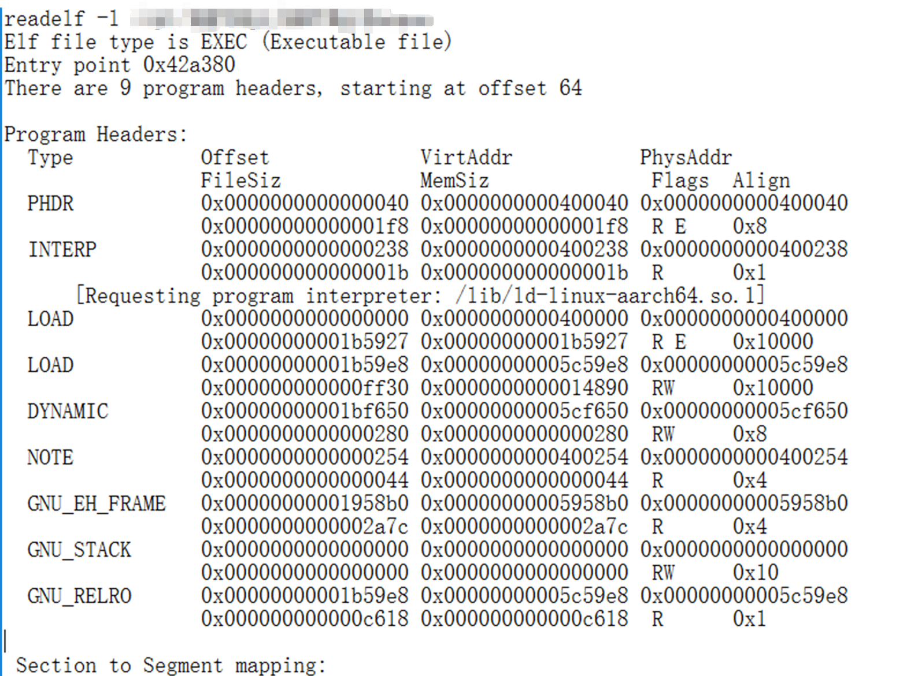

# Linux PageSize兼容性问题

## 问题
在aarch64架构的机器上，运行进程提示
```
[root@xxx xxx]# ./xxx
./xxx: error while loading shared libraries: libQt5Core.so.5: ELF load command alignment not page-aligned
```

## 分析
https://github.com/numpy/numpy/issues/16677  
网上的说法是 系统在加载进程时，会判断PageSize是否对齐，进程文件的PageSize要是系统PageSize的整数倍。

* 看系统PageSize大小。
aarch64架构的机器，运行系统PageSize是0x10000 = 65536，也就是64KB对齐。
```
[root@xxx xxx]# getconf PAGESIZE 
65536
```

* 看xxx进程报错提到的libQt5Core.so的PageSize。
  我们看LOAD部分`Align`字段，libQt5Core.so的对齐最小是0x1000，也就是4KB。在x86架构下大部分是4KB对齐的。
```
readelf -l ./libQt5Core.so.5 

Elf file type is DYN (Shared object file)
Entry point 0xb5764
There are 11 program headers, starting at offset 64

Program Headers:
  Type           Offset             VirtAddr           PhysAddr
                 FileSiz            MemSiz              Flags  Align
  PHDR           0x0000000000000040 0x0000000000000040 0x0000000000000040
                 0x0000000000000268 0x0000000000000268  R      0x8
  LOAD           0x0000000000000000 0x0000000000000000 0x0000000000000000
                 0x000000000043f1a8 0x000000000043f1a8  R E    0x10000
  GNU_STACK      0x0000000000000000 0x0000000000000000 0x0000000000000000
                 0x0000000000000000 0x0000000000000000  RW     0x10
  NOTE           0x0000000000000270 0x0000000000000270 0x0000000000000270
                 0x0000000000000044 0x0000000000000044  R      0x10
  INTERP         0x00000000003c4ee8 0x00000000003c4ee8 0x00000000003c4ee8
                 0x000000000000001b 0x000000000000001b  R      0x1
      [Requesting program interpreter: /lib/ld-linux-aarch64.so.1]
  GNU_EH_FRAME   0x000000000042bb94 0x000000000042bb94 0x000000000042bb94
                 0x0000000000013614 0x0000000000013614  R      0x4
  LOAD           0x00000000004449b0 0x00000000004549b0 0x00000000004549b0
                 0x0000000000012ef8 0x0000000000016da9  RW     0x10000
  TLS            0x00000000004449b0 0x00000000004549b0 0x00000000004549b0
                 0x0000000000000000 0x0000000000000020  R      0x8
  GNU_RELRO      0x00000000004449b0 0x00000000004549b0 0x00000000004549b0
                 0x000000000000b650 0x000000000000b650  RW     0x8
  DYNAMIC        0x000000000054b000 0x000000000054b000 0x000000000054b000
                 0x00000000000002e0 0x00000000000002e0  RW     0x8
  LOAD           0x000000000054b000 0x000000000054b000 0x000000000054b000
                 0x0000000000038aa0 0x0000000000038aa0  RW     0x1000
```

* 看到这里我们就可以确认问题了，xxx进程的PageSize不对。
* 同样的，我们再看另外一个进程yyy。
  这个进程的PageSize是0x10000，因此是可以运行起来的。
  

## 结论
网上有一个方法，说是通过`patchelf --page-size 65536 ./xxx`的方式来调整文件PageSize，但是这个方法不靠谱。  
能解决这个问题的方法是 重新编译xxx及其依赖的libQ5Core.so，在编译的时候设置PageSize。
```
add_definitions(-Wl,-z,max-page-size=65536)
add_definitions(-Wl,-z,common-page-size=65536)
```

网上的说法这个比较靠谱。  
I'm talking in generalities here, and as a toolchain developer I wanted to comment on the general concepts that impact this issue.

You cannot change the alignment of a PT_LOAD segment to be larger than required by the segment. If the kernel is using larger page sizes then the kernel will only have protections on larger page sized boundaries, while the object may need such protection on smaller page boundaries e.g. two pages may be too close together with different protections (and must stay that way to allow constant offsets in generated code to work). Therefore the dynamic loader explicitly checks that the PT_LOAD segment alignment requirement and fails the to load the segment if the requirements are not met.

There is also the matter of the address congruence relationship required for the mappings. The offset must be congruent to the address modulo the alignment. If you increase the alignment the offset and address are no longer congruent. For example, take the last PT_LOAD which is offset 0x3fb000 virtual address 0x3e1000 and alignment 0x1000. The "offset - virtual address" is divisible by the alignment. If you raise the alignment to 0x10000, then 0x1a000 (the difference) is no longer divisible by the alignment. This congruence is critical to offsets, alignments, and the algorithms employed the static and dynamic loader.

In summary:

* You cannot safely raise the PT_LOAD alignment even if patchelf could do it.
* Built binaries must agree to a kernel page size maximum and compile for that maximum e.g. 64KiB, or kernels must agree to a runtime page size.
* Binaries with alignments smaller than the running kernel's page size are incompatible with that running kernel ("ELF load command alignment not page-aligned" / "ELF load command address/offset not properly aligned")
* Binaries with alignments larger than the running kernel's page size are compatible with that running kernel.