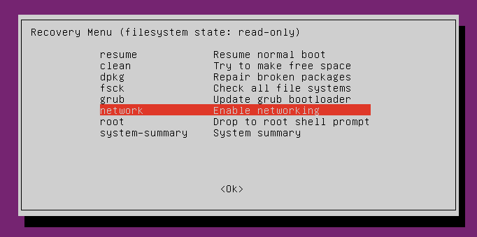
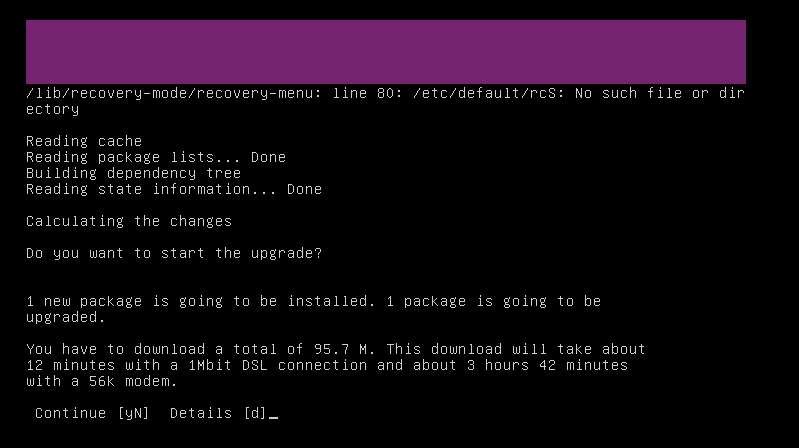
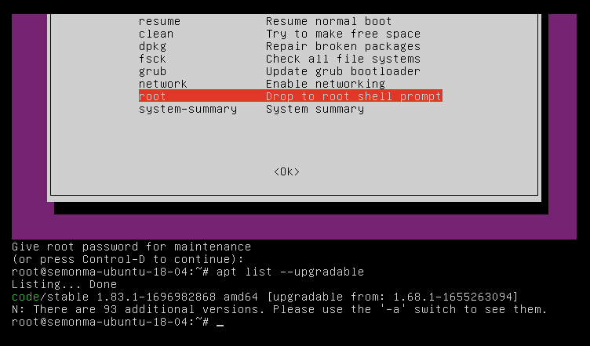

# Ubuntu恢复模式

1. 启动时按住Esc
2. 选择高级模式
3. 可以看到Recovery Mode

  
  
  

$lsb_release -a
No LSB modules are available.
Distributor ID:	Ubuntu
Description:	Ubuntu 20.04.3 LTS
Release:	20.04
Codename:	focal
