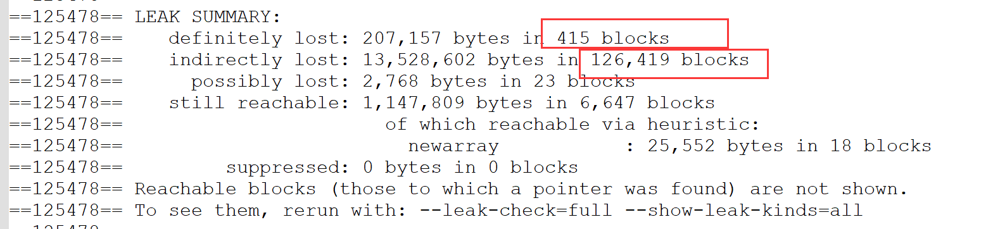
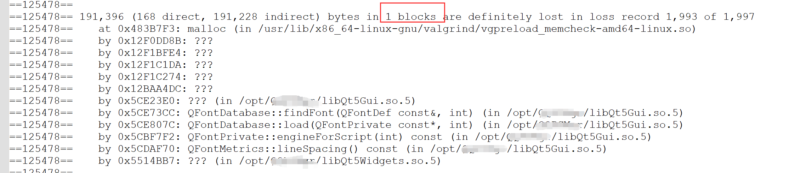
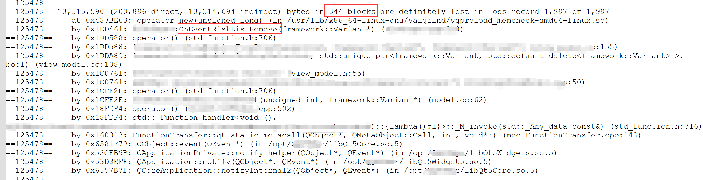

# 内存泄漏

本文记录一次遇到的内存泄漏问题。

## 背景
某天测试反馈，病毒扫描正常，但是病毒清理的时候UI卡死。  
环境：Linux。  
病毒数量：1w+。  

## 分析
### 场景分析
小样本数量时病毒扫描+清理正常，但是病毒样本过万时，扫描正常，清理异常，之前没有验过压测的场景，不确定哪个环境出问题了。
### 日志分析
ui卡死时，看日志，ipc有收到很大的一个数据包（1.7G）。  
* step1：日志往上溯源，附近有哪个ipc消息可能发送大数据包？  
  找到一个ipc消息，可能发送大数据包，继续确认此消息，读取db并发包，db里面1.6w条记录，撑死10M级别，不可能达到1.7G的量级。
* step2：梳理一下病毒清理的逻辑，哪里有大数据包？  
    病毒扫描结果汇总以后一次性通知出去，1w个病毒结果，可能会很大。日志中还真的打印了信息，提取出来看一下，大概2M的字符串，也不是这里。
* step3：梳理ipc收发逻辑。
    ipc是linux下基于socket unix实现的，类似tcp网络通信。  
    在数据发包的时候，ipc内部有max size判断，max size=100M，超过100M的包就丢弃了。  
    在数据接收的时候，ipc内部也有max size判断，过大的包，循环读取完数据也丢弃了。

结论：无法解释这个日志的结果。
### 尝试复现
本地复现，压测到1w个病毒样本的时候，确实出现了ui卡死。同时发现系统桌面也出现了卡死。
* step1：ui卡死引起了系统卡住，应该是有资源泄漏，看文件句柄，看内存占用。
* step2：病毒扫描的时候，内存占用正常，但是，清理的时候，内存不断上涨，最终涨到5个G，然后系统卡死。
### 分析内存泄漏
知道了是内存泄漏引起的问题，这就好办了。  
* step1：病毒扫描没有问题，但是清理的时候有问题，那就去review清理的代码，清理额外做了哪些事情，ui响应了哪些ipc消息，哪里会有泄漏。  
* step2：最后发现，在ui做病毒list更新时，Qt table控制在remove item时，new了一个buffer但是没有delete，这个buffer里面有一个vector，vector存储了扫描出来的病毒文件路径，相当于每次new的时候，都copy了一份1w+的字符串路径。
* step3：我们计算一下，1w个路径，一个路径100B，10个路径是1kB，1w个路径=1k * 1kB = 1MB。ui显示的病毒list，每清理一个病毒要remove一条table item，就需要new一份buffer，泄漏1M内存，那么，1w个病毒，1w * 1MB，这妥妥的吃光了系统内存。
### 事后工具追踪
虽然通过代码review发现了问题所在，但是linux下也有一些工具可以检测内存泄漏，比如valgrind。
* step1：安装valgrind。
* step2：把pdb拷贝到进程所在目录。
* step3：valgrind拉起ui进程，指定--leak-check=full检测内存泄漏。
* step4：执行一次病毒扫描+清理，然后分析valgrind输出结果。

看内存泄漏的结果，我们确实有泄漏，415处地方一共泄漏了207KB内存。
  

挨个查看内存泄漏的地方。

比如这个qt的报错。这个错误可以忽略，qt是自行管理内存的，而且，这种只有1 block的泄漏，表示只泄漏了一次，单次的内存泄漏不可能引起进程内存的不断增长。
  

这一行才是真正的内存泄漏，334 blocks泄漏了内存，看函数调用栈，OnEventRiskListRemove这个地方有new内存，对比代码，跟我们前面代码review找出来的错误一样。
  
