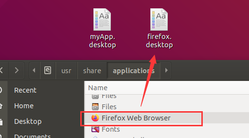
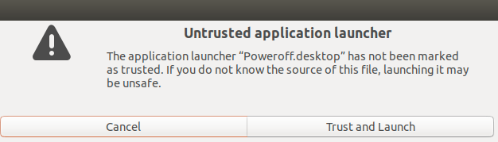

# ubuntu桌面

ubuntu桌面跟gnome有什么关系？

## 快捷方式
### 新建快捷方式
新建一个后缀为 `.desktop` 类型的文件，在文件里面填充快捷方式的信息，这就生成了一个lnk文件。  
我们可以参考系统应用的快捷方式，比如ubuntu系统的应用在`/usr/share/applications`下有大量的快捷方式。
```
[Desktop Entry]
Encoding=UTF-8
Version=1.0
Name=myApp
GenericName=myApp
Exec=/opt/myAppInstallDir/myApp showui
Terminal=false
Icon=/opt/myAppInstallDir/imgs/AppIcon.png
Type=Application
Categories=System;
Comment=myApp
MimeType=MimeType=text/html
```

### 修改快捷方式
新建的快捷方式通常并不会跟我们预期的一样，`.desktop`显示的并不是应用程序的ico，而且双击运行的时候，甚至会被默认的文本编辑器打开。  
即使我们从applications里面拷贝一份firefox的快捷方式到桌面，它也不会向applications里面那样，显示应用图标。
  

用户可以尝试双击快捷方式，系统会弹框提示“Untrusted application launcher”，点击“Trust and Launch”以后，快捷方式会恢复正常 -- 显示应用ico，直接拉起应用程序。但是，如何通过脚本来实现这个确认呢？
  

```shell
sudo chmod a+x myApp.desktop

# 自测发现，ubuntu 18 此命令可以，ubuntu 20下，这个命令无效。
gio set myApp.desktop "metadata::trusted" yes

# cmd以后还要刷新一下桌面才会生效。
sudo apt install xautomation
xte 'key F5'
```

注意，以下几点。
* You have to run this command with the same user as the owner of the desktop files
* It only works if you run the command in the gnome shell (not via SSH)
To do this automatically at logon, you have to make a logon script what will execute an script, as this only run when Gnome is started. For example you can create an .desktop file in `~/.config/autostart/` what execute some shell script including the gio commands
* Make sure `nautilus-desktop` is really started. You can create an while loop with a sleep 1 till nautilus-desktop run
* Icon's will not refresh automatically. You can achieve this with pressing F5 on the desktop or restart nautilus in your autostart script. `killall nautilus && nautilus-desktop &` (the last & sign is to make sure the rest of your code will run. Otherwise it will stop the script there till you close `nautilus-desktop` process again)

下面有个实践，从网上抄过来的，没实际用过。

Inspired by the great answer of @Sander, i am quite happy with this approach in Ubuntu 18.04. I use this in an automated VM creation setup, where first the desktop icons are placed, and then these scripts are prepared. They are only executed at the first start.  

I create a desktop file `~/.config/autostart/desktop-truster.desktop` with the following content:
```
[Desktop Entry]
Name=Desktop-Truster
Comment=Autostarter to trust all desktop files
Exec=~/.config/autostart/desktop-truster.sh
Type=Application
```
Next to it, a script `~/.config/autostart/desktop-truster.sh`, which is invoked by the autostart desktop file:
```shell
#!/bin/bash
# Wait for nautilus-desktop
while ! pgrep -f 'nautilus-desktop' > /dev/null; do
  sleep 1
done
# Trust all desktop files
for i in ~/Desktop/*.desktop; do
  [ -f "${i}" ] || break
  gio set "${i}" "metadata::trusted" yes
done
# Restart nautilus, so that the changes take effect (otherwise we would have to press F5)
killall nautilus-desktop && nautilus-desktop &
# Remove X from this script, so that it won't be executed next time
chmod -x ${0}
```

*附网址：* https://ubuntu.forumming.com/question/9301/trust-desktop-icons-without-clicking-them-manually-in-ubuntu-18-04-gnome-3