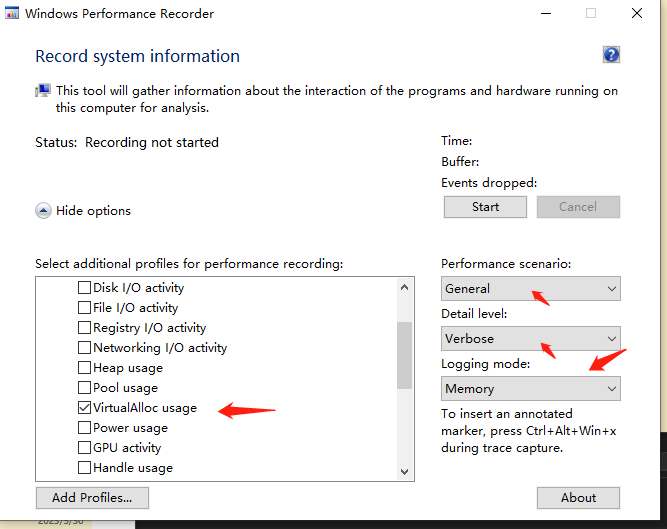

# etw

etw,  下载最新 windows performance toolkit, 有两个模式, 分析的话：

1. 抓 virtual memory 模式， 用 wprui 勾选一个下图选项就行

  

2. 堆快照模式：
命令，管理员权限运行
2.1 wpr -snapshotconfig heap -name  xxx.exe
2.2 wpr -snapshotconfig heap -name xxx.exe enable
2.3 wpr -start heapsnapshot -filemode
repeat, 执行两次就是两个快照了
2.4 wpr -singlesnapshot heap 14804   
2.5 wpr -stop heapsnapshot.etl
2.6 wpr -snapshotconfig heap -name xxx.exe disable