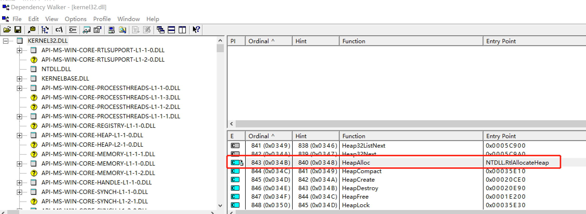

# windbg 断点

Kernel32.dll的HeapAlloc函数，实际是个函数转发器，Kernel32中的HeapAllock被转向到NTDLL!RtlAllocateHeap中。

  

所以，断点应该是
```shell
# 搜索某个函数符号
0:075> x *!*HeapAlloc*
76bf8530          KERNELBASE!PsspDefaultProcessHeapAllocRoutine (void)
76b6e019          KERNELBASE!WerpHeapAlloc (void)
77d2eeb8          ntdll!RtlpScanHeapAllocBlocks (_RtlpScanHeapAllocBlocks@0)

# 设置断点
bp ntdll!RtlAllocateHeap
bp ntdll!RtlAllocateHeap "j (@esp+0xc == 0x400) ''; 'gc'"

# 查看断点
0:078> bl
     0 e Disable Clear  77c95ef0     0001 (0001)  0:**** ntdll!RtlAllocateHeap

# 删除断点，用序号删除
bc 0

```
