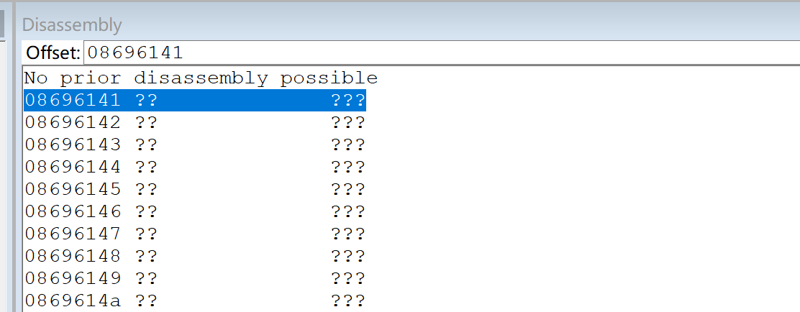
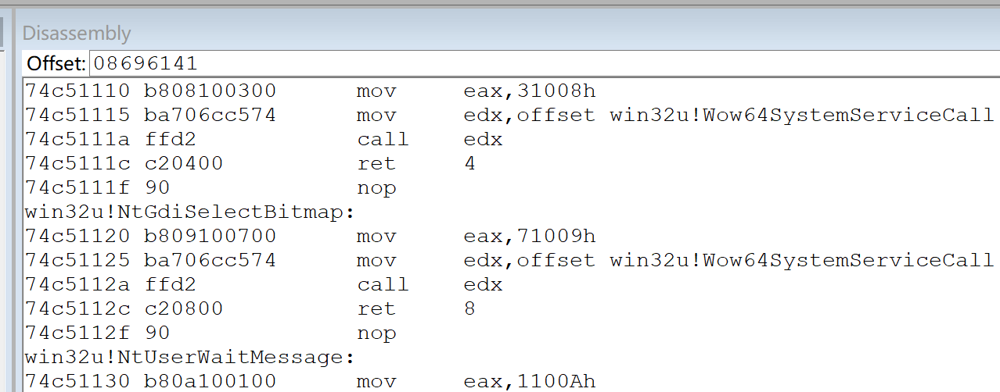

# windbg栈

```
// 栈结构如下：
低地址   ESP
...     栈变量
...     旧的EBP，再将ESP赋值给EBP，这样，EBP指向栈底
...     return addr
...     params // 从右向左压栈
高地址  父函数的栈空间
```
ESP始终指向栈顶，EBP始终指向栈底。

## 手动栈回溯
1. 我们看到下面的栈，在`KERNELBASE!GlobalUnlock`之下的栈明显不对了，栈指针的值从`0899f44c`直接跳到了`15cf4020`，这明显是不对的。
```
0:000> k
  *** Stack trace for last set context - .thread/.cxr resets it
 # ChildEBP RetAddr  
00 0899f2f0 086afa37 KERNELBASE!RaiseException+0x62
01 0899f328 08696051 hook_x86!_CxxThrowException+0x46
02 0899f338 08695978 hook_x86!ATL::AtlThrowImpl+0x17 
03 0899f388 76fe0859 hook_x86!ATL::AtlConvAllocMemory<wchar_t>+0xe
04 0899f44c 7697f39c ntdll!RtlSetLastWin32Error+0x39
05 15cf4020 00330039 KERNELBASE!GlobalUnlock+0xc
WARNING: Frame IP not in any known module. Following frames may be wrong.
06 15cf4028 00380036 0x330039
07 15cf402c 00320030 0x380036
08 15cf4030 00300038 0x320030
```

2. 看栈信息。
`dds esp`：显示指针，并显示可能的symbol符号。  
同时，也可以把esp的值贴到memory窗口去，选择`Pointer and symbol`

```
0:000> r
Last set context:
eax=0899f298 ebx=18ba6e71 ecx=00000003 edx=00000000 esi=0899f380 edi=0899f384
eip=7696a942 esp=0899f298 ebp=0899f2f0 iopl=0         nv up ei pl nz ac po nc
cs=0023  ss=002b  ds=002b  es=002b  fs=0053  gs=002b             efl=00000212
KERNELBASE!RaiseException+0x62:
7696a942 8b4c2454        mov     ecx,dword ptr [esp+54h] ss:002b:0899f2ec=5bb5ddc1

// 我们可以多看一些
0:000> dds esp L100
0899f298  e06d7363
0899f29c  00000001
0899f2a0  00000000
0899f2a4  7696a942 KERNELBASE!RaiseException+0x62
0899f2a8  00000003
0899f2ac  19930520
0899f2b0  0899f340
0899f2b4  086caecc hook_x86!_TI1?AVCAtlExceptionATL
0899f2b8  00000000
0899f2bc  00000000
0899f2c0  0899f2d8
0899f2c4  76fcc65e ntdll!RtlAllocateHeap+0x3e
0899f2c8  00000008
0899f2cc  00000000
0899f2d0  3174dce2
0899f2d4  3174dce2
0899f2d8  0899f318
0899f2dc  086ab6de hook_x86!_calloc_impl+0xc4 
0899f2e0  08750000
0899f2e4  00000008
0899f2e8  086ab737 hook_x86!_calloc_impl+0x11d 
0899f2ec  5bb5ddc1
0899f2f0  0899f328
0899f2f4  086afa37 hook_x86!_CxxThrowException+0x46 
0899f2f8  e06d7363
0899f2fc  00000001
0899f300  00000003
0899f304  0899f31c
0899f308  e06d7363
0899f30c  00000001
0899f310  00000000
0899f314  00000000
0899f318  00000003
0899f31c  19930520
0899f320  0899f340
0899f324  086caecc hook_x86!_TI1?AVCAtlExceptionATL
0899f328  0899f338
0899f32c  08696051 hook_x86!ATL::AtlThrowImpl+0x17
0899f330  0899f340
0899f334  086caecc hook_x86!_TI1?AVCAtlExceptionATL
0899f338  0899f360
0899f33c  08695978 hook_x86!ATL::AtlConvAllocMemory<wchar_t>+0xe 
0899f340  8007000e
0899f344  08694651 hook_x86!ATL::CA2WEX<128>::Init+0x39 
0899f348  00000000
0899f34c  30a18020
0899f350  086d0c68 hook_x86!ATL::g_strmgr+0x18
0899f354  0899f484
0899f358  0899f384
0899f35c  18ba6e71
0899f360  0899f490
0899f364  08696141 hook_x86!clipGetHtml+0x78 
0899f368  0899f380
0899f36c  30a18020
0899f370  a2af2bf8
0899f374  086d0c68 hook_x86!ATL::g_strmgr+0x18
0899f378  086d0c68 hook_x86!ATL::g_strmgr+0x18
0899f37c  086d0c68 hook_x86!ATL::g_strmgr+0x18
0899f380  00000000
0899f384  00008000
0899f388  15cf4020
0899f38c  76fe0859 ntdll!RtlSetLastWin32Error+0x39
0899f390  0899f3a4
0899f394  0000000d
0899f398  00000000
0899f39c  00003368
0899f3a0  0000ffdf
0899f3a4  7f1960f4
0899f3a8  00000000
0899f3ac  1368339a winahdcore32+0x21339a
0899f3b0  00000003
0899f3b4  0aacee58
0899f3b8  977ceb82
0899f3bc  0a520520
0899f3c0  01559dcb
0899f3c4  ffffffff
0899f3c8  0aacee50
0899f3cc  00000000
0899f3d0  01120000
0899f3d4  0a520520
0899f3d8  00000000
0899f3dc  00000000
0899f3e0  0899f3fc
0899f3e4  00000002
0899f3e8  0aacee00
0899f3ec  00000000
0899f3f0  0899f420
0899f3f4  086b57fb hook_x86!_VEC_memcpy+0x52
0899f3f8  207de030
0899f3fc  15cf4020
0899f400  0aacee00
0899f404  086d0c58 hook_x86!ATL::g_strmgr+0x8
0899f408  0000003a
0899f40c  207c2e20
0899f410  2b2ace30
0899f414  00000000
0899f418  0aacee3a
0899f41c  0556771d
0899f420  0899f43c
0899f424  086ad0ad hook_x86!memcpy_s+0x48 
0899f428  207de030
0899f42c  15cf4020
0899f430  0aacee3a
0899f434  06b119dc
0899f438  0899f4bc
0899f43c  0899f470
0899f440  08695ba2 hook_x86!ATL::CSimpleStringT<wchar_t,0>::CopyChars+0x17 
0899f444  207de030
0899f448  0aacee3a
0899f44c  15cf4020
0899f450  7697f39c KERNELBASE!GlobalUnlock+0xc
0899f454  5bb5dbdd
0899f458  00000000
0899f45c  15cf4020
0899f460  086d0c68 hook_x86!ATL::g_strmgr+0x18
0899f464  00000000
0899f468  00000001
0899f46c  0899f454
0899f470  0899f480
0899f474  0899f4c8
0899f478  76971830 KERNELBASE!_except_handler4
0899f47c  25882b59
0899f480  fffffffe
0899f484  0899f4c8
0899f488  086c2d66 hook_x86!_ftol2+0x6e0
0899f48c  ffffffff
0899f490  0899f4d4
0899f494  0869690a hook_x86!clipGetData+0xc8 
0899f498  0899f4b8
0899f49c  0899f4bc
0899f4a0  a2af2bbc
0899f4a4  086d0c50 hook_x86!ATL::g_strmgr
0899f4a8  00000000
0899f4ac  086c8640 hook_x86!`string'
0899f4b0  00000000
0899f4b4  0899f49c
0899f4b8  086d0c68 hook_x86!ATL::g_strmgr+0x18
0899f4bc  207de030
0899f4c0  0cc7f438
0899f4c4  0cc7f4f0
0899f4c8  0899f78c
0899f4cc  086c31b7 hook_x86!_ftol2+0xb31
0899f4d0  00000003
0899f4d4  0899f79c
0899f4d8  0869cb5b hook_x86!HandleClipData+0x21d
0899f4dc  0899f530
0899f4e0  0899f544
```

3. 结合k命令，手动回溯。
```
// k命令
0:000> k
  *** Stack trace for last set context - .thread/.cxr resets it
 # ChildEBP RetAddr  
00 0899f2f0 086afa37 KERNELBASE!RaiseException+0x62
01 0899f328 08696051 hook_x86!_CxxThrowException+0x46
02 0899f338 08695978 hook_x86!ATL::AtlThrowImpl+0x17 
03 0899f388 76fe0859 hook_x86!ATL::AtlConvAllocMemory<wchar_t>+0xe 
04 0899f44c 7697f39c ntdll!RtlSetLastWin32Error+0x39
05 15cf4020 00330039 KERNELBASE!GlobalUnlock+0xc
WARNING: Frame IP not in any known module. Following frames may be wrong.
06 15cf4028 00380036 0x330039
07 15cf402c 00320030 0x380036
08 15cf4030 00300038 0x320030

// memory，这里是栈01
0899f2f0  0899f328
0899f2f4  086afa37 hook_x86!_CxxThrowException+0x46 
0899f2f8  e06d7363

// 再往前看，这里是栈02
0899f328  0899f338
0899f32c  08696051 hook_x86!ATL::AtlThrowImpl+0x17 
0899f330  0899f340

// 再往前看，这里是栈03
0899f338  0899f360
0899f33c  08695978 hook_x86!ATL::AtlConvAllocMemory<wchar_t>+0xe 

// 再往前看，这里是栈04
0899f360  0899f490
0899f364  08696141 hook_x86!clipGetHtml+0x78

// 再往前看
0899f490  0899f4d4
0899f494  0869690a hook_x86!clipGetData+0xc8 

// 再往前
0899f4d4  0899f79c
0899f4d8  0869cb5b hook_x86!HandleClipData+0x21d 
```
* 栈01号栈回溯  
内存上`0899f2f4  086afa37`是函数`hook_x86!_CxxThrowException`的返回地址，在return addr之上是EBP，是旧的EBP（`0899f2f0  0899f328`），上一个函数调用的栈底。

因此，栈地址`0899f2f0`所指向的值`0899f328`就是上一个函数的栈底。我们去看`0899f328`指向了哪里。

* 栈02号回溯  
内存`0899f328  0899f338`，这也是个EBP，是上一层函数的调用的EBP。我们看栈上`0899f328`附近的值，EBP下面的函数返回地址`0899f32c  08696051 hook_x86!ATL::AtlThrowImpl+0x17`，这个函数地址正好就是栈02号上的内容。

* 栈03号回溯  
内存`0899f338  0899f360`就存储了上一个函数调用的信息，`0899f360`是上一个EBP。栈内存`0899f338  0899f360`附近能看到栈03号的信息。

* 栈04号  
内存`0899f360  0899f490`附近能看到下一个返回地址`0899f364  08696141 hook_x86!clipGetHtml+0x78`。

我们就这样一层一层的往回看。

我们可以看到，k命令的04号栈信息就已经不对。跟我们手动回溯出来的不一样。我们手动回溯的栈，是能看到明确的函数异常源头的。

k命令可以看指定地址的栈。例如：
```
// 看内存
0899f360 0899f490 
0899f364 08696141 hook_x86!clipGetHtml+0x78

// k=EBP地址，能自动列出一段栈。
0:000> k=0899f490 
 # ChildEBP RetAddr  
00 0899f490 0869690a KERNELBASE!RaiseException+0x62
01 0899f4d4 0869cb5b hook_x86!clipGetData+0xc8 
02 0899f79c 0869ff23 hook_x86!HandleClipData+0x21d
03 0899f7c8 08696a41 hook_x86!OnClipChanged+0xef 
04 0899f7e0 08696e20 hook_x86!CClipMonWnd::ProcessWindowMessage+0x64
05 0899f830 76003773 hook_x86!ATL::CWindowImplBaseT<ATL::CWindow,ATL::CWinTraits<1442840576,0> >::WindowProc+0x5a 
06 0899f85c 75ff4596 user32!_InternalCallWinProc+0x2b
07 0899f954 75ff2e55 user32!UserCallWinProcCheckWow+0x4c6
08 0899f9d0 75ff29a0 user32!DispatchMessageWorker+0x4a5
09 0899f9dc 08696b0c user32!DispatchMessageW+0x10
0a 0899fa58 75d77ba9 hook_x86!clipMonThread+0xa7 
0b 0899fa68 76fec10b kernel32!BaseThreadInitThunk+0x19
0c 0899fac0 76fec08f ntdll!__RtlUserThreadStart+0x2b
0d 0899fad0 00000000 ntdll!_RtlUserThreadStart+0x1b
```

## 栈优化
k命令显示的原理跟手动栈回溯是一样的，只是有时候windbg缺失了二进制dll的汇编信息，因此，windbg在遇到栈优化（FPO）时缺少相关信息，导致回溯异常。
1. 打开Disassembly窗口，看函数返回地址。若汇编缺失，会显示全????。
     
2. 加载dll二进制  
   `.reload hook_x86.dll`，把dll放到pdb路径并使用reload命令加载。
3. 再看反汇编。
     
4. 再看k命令，此时栈完整了。
```
0:000> k
  *** Stack trace for last set context - .thread/.cxr resets it
 # ChildEBP RetAddr  
00 0899f2f0 086afa37 KERNELBASE!RaiseException+0x62
01 0899f328 08696051 hook_x86!_CxxThrowException+0x46 
02 0899f338 08695978 hook_x86!ATL::AtlThrowImpl+0x17
03 0899f340 08694651 hook_x86!ATL::AtlConvAllocMemory<wchar_t>+0xe (FPO: [0,0,0]) (CONV: cdecl)
05 0899f490 0869690a hook_x86!clipGetHtml+0x78
06 0899f4d4 0869cb5b hook_x86!clipGetData+0xc8 
07 0899f79c 0869ff23 hook_x86!HandleClipData+0x21d 
08 0899f7c8 08696a41 hook_x86!OnClipChanged+0xef
09 0899f7e0 08696e20 hook_x86!CClipMonWnd::ProcessWindowMessage+0x64 
0a 0899f830 76003773 hook_x86!ATL::CWindowImplBaseT<ATL::CWindow,ATL::CWinTraits<1442840576,0> >::WindowProc+0x5a 
0b 0899f85c 75ff4596 user32!_InternalCallWinProc+0x2b
0c 0899f954 75ff2e55 user32!UserCallWinProcCheckWow+0x4c6
0d 0899f9d0 75ff29a0 user32!DispatchMessageWorker+0x4a5
0e 0899f9dc 08696b0c user32!DispatchMessageW+0x10
0f 0899fa58 75d77ba9 hook_x86!clipMonThread+0xa7
10 0899fa68 76fec10b kernel32!BaseThreadInitThunk+0x19
11 0899fac0 76fec08f ntdll!__RtlUserThreadStart+0x2b
12 0899fad0 00000000 ntdll!_RtlUserThreadStart+0x1b
```
