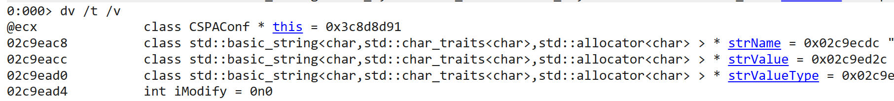

# windbg命令

## 时间
* dmp生成的时间
  .time
## 查看耗时
!runaway

## 查看符号
lmvm kernel32

## 断点
符号断点  
bu Kernel32!CreateProcess

```bash
# 搜索某个函数符号
0:075> x *!*HeapAlloc*
76bf8530          KERNELBASE!PsspDefaultProcessHeapAllocRoutine (void)
76b6e019          KERNELBASE!WerpHeapAlloc (void)
77d2eeb8          ntdll!RtlpScanHeapAllocBlocks (_RtlpScanHeapAllocBlocks@0)
77cbc810          ntdll!RtlDisownModuleHeapAllocation (_RtlDisownModuleHeapAllocation@8)
77cb4bf3          ntdll!RtlpLowFragHeapAllocateFromZone (@RtlpLowFragHeapAllocateFromZone@8)
77d48b1e          ntdll!RtlpHpHeapAllocate (_RtlpHpHeapAllocate@16)
77d3f157          ntdll!RtlpLogHeapAllocateEvent (_RtlpLogHeapAllocateEvent@16)
```

## 查看内存
dt 0x1234 ModuleName!Class

* 查看当前栈变量
dt /v /t
  

## 线程
* 当前线程
  ~.
* 通过线程id切换线程，例如，切换到1号线程
  ~1 s
* 遍历栈
  ~*kvn
* 通过线程地址查看线程信息
```
0:000:x86> ~~[0x000005f4]
   3  Id: aa0.5f4 Suspend: -1 Teb: 7efd5000 Unfrozen
      Start: iOAEntBiz!CTPNEvtMgr::Thread2WatchEvent (0040e619)
      Priority: 0  Priority class: 32  Affinity: 3
```
* 通过线程地址切换线程。
```
0:000:x86> ~~[0x000005f4]s
ntdll_77980000!NtWaitForSingleObject+0x15:
7799f901 83c404          add     esp,4
```

## 32位切换
.load wow64exts
!sw

## 清空屏幕
.cls

## 查看临界区
* 显示所有临界区信息
  !cs
* 只显示死锁的临界区
  !cs -l
* 查看某个临界区的栈
  !cs -o 0x000005f4

  ## 堆
* 查看heap
  !heap -s
* 看堆统计信息
  !heap -stat -h 
  !exts.heap -s -h 00c00000 -- 这个命令很慢
* 看一个堆块的详细信息
  !heap -a 00c00000

## 句柄
* 看句柄信息
  !handle 00000080 f

