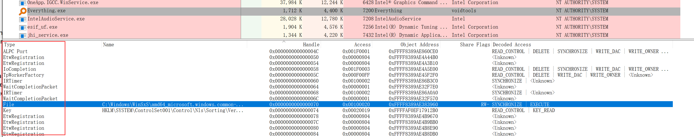

# Win枚举句柄

**关键词**：枚举句柄，文件占用，ntdll。

## 背景
我们在删除一个文件时，经常会遇到弹框提示“文件被占用，无法删除”，又或者，我们试图读取某个文件时，发现文件被其他进程独占了，导致我们读取失败。因此，本文记录一下*应用层*枚举进程的方法。

## 技术点
* 枚举句柄信息：ZwQuerySystemInformation。
* 查询句柄信息： ZwQueryObject。

## 枚举文件句柄
### ntdll接口
ZwQuerySystemInformation和ZwQueryObject都是ntdll导出的函数，是微软未公开的函数。按照微软MSDN文档，应该通过GetProcAddress方法动态获取函数接口，不应该采用静态链接的方式。  
这就遇到了第一个问题，函数原型是什么。  
这是一份网上找到的[ntdll.h](./EnumFileHandle/ntdll.h)头文件，里面定义了函数原型和各种数据结构。单就枚举句柄而言，这一份头文件还算准确。
* 系统差异：ntdll实现是微软未公开的内容，各个系统版本有差异，所以，网上能找到多种数据结构的定义，彼此各有差异。
* 动态导出：LoadLibrary加载ntdll.h，动态导出函数接口。
* 数据结构定义：不要直接ntdll.h头文件，将需要的数据结构和函数原型直接定义一次，直接引入这么大一个文件，不合适。
* ntdll.lib：文档还附带了一份ntdll.lib，位于/EnumFileHandle/ntdll.lib。这一份lib可以通过`#progma comment(lib, "ntdll.lib")`的方式引入，配合ntdll.h，可以直接使用ZwQuerySystemInformation函数。**注意**：不推荐。

额外问个问题：
1. 假设静态链接了ntdll.lib，并包含了ntdll.h，工程是可以编译通过的，那么，这个lib包含了哪些内容，为什么可以链接过？  
  头文件提供函数声明，lib提供函数实现，那么，这一版本的lib肯定无法兼容不同版本的操作系统。这么调用API会有什么坑。

## 枚举句柄信息
```c
NTSTATUS WINAPI ZwQuerySystemInformation(
  _In_      SYSTEM_INFORMATION_CLASS SystemInformationClass,
  _Inout_   PVOID                    SystemInformation,
  _In_      ULONG                    SystemInformationLength,
  _Out_opt_ PULONG                   ReturnLength
);
```
此函数可以获取系统非常多的信息，包括进程、模块、处理器、内存等等各种信息。  
SystemHandleInformation = 16就能获取到系统所有的句柄信息。其核心代码如下，主要是分配内存，获取句柄信息，遍历句柄并获取句柄对应的文件路径，最后再基于文件路径实现具体的业务需求。
```c++
PSYSTEM_HANDLE_INFORMATION_EX pSystemHandleInfo = NULL;
ULONG ulBufferSize = 0x200;
pSystemHandleInfo = (PSYSTEM_HANDLE_INFORMATION_EX)malloc(ulBufferSize);

ZwQuerySystemInformation(SystemHandleInformation, pSystemHandleInfo, ulBufferSize, &ulRetSize);

for (ULONG i = 0; i < pSystemHandleInfo->NumberOfHandles; ++i)
{
    SYSTEM_HANDLE_INFORMATION handleInfoItem = pSystemHandleInfo->Information[i];

    HANDLE hFile = (HANDLE)handleInfoItem.Handle;

    PUNICODE_STRING pusName = (PUNICODE_STRING)malloc(ulNameSize);
    ZwQueryObject(hFile, ObjectNameInformation, pusName, ulNameSize, NULL);     // Note： Error !!!

    // pusName 拿到了句柄的文件路径。
}
```
### 进程句柄复制
ZwQuerySystemInformation遍历到的句柄，不是当前进程的句柄表项，在当前进程是无法直接使用的。通过DuplicateHandle将句柄复制一份到当前进程，我们才能使用后续的ZwQueryObject获取句柄信息。
```c++
BOOL DuplicateHandle(
  [in]  HANDLE   hSourceProcessHandle,
  [in]  HANDLE   hSourceHandle,
  [in]  HANDLE   hTargetProcessHandle,
  [out] LPHANDLE lpTargetHandle,
  [in]  DWORD    dwDesiredAccess,
  [in]  BOOL     bInheritHandle,
  [in]  DWORD    dwOptions
);
```
### ZwQueryObject阻塞
通过ZwQueryObject获取句柄对应的文件路径时，可能发生阻塞，导致程序卡死无法继续运行。这是因为如果文件被是同步（SYNCHRONIZE）打开的，内核会等待一下锁，等其他线程操作完成，本线程才能拿到所有权。  
因此，解决方案是起一个工作线程，等待ZwQueryObject执行完成，若ZwQueryObject顺利执行则工作线程正常退出；若ZwQueryObject异常阻塞，等待超时以后杀掉线程。
```c++
HANDLE hQueryThread = (HANDLE)_beginthreadex(NULL, 0, &CFileHandleMgr::QueryInfoThreadFunc, (PVOID)&queryInfo, 0, NULL);
if (hQueryThread)
{
    DWORD dwRet = WaitForSingleObject(hQueryThread, 1 * 1000);
    if (dwRet == WAIT_OBJECT_0)
    {
        if (NT_SUCCESS(queryInfo.ntQueryRet) && wcslen(queryInfo.wszFileName) != 0)
        {
            bret = true;
        }
    }
    else
    {
        LOG_TRACE("wait for query info thread timeout or failed");
        TerminateThread(hQueryThread, 3);
        hQueryThread = NULL;
    }
}
```
## 路径转换
ZwQueryObject获取到的nt path，我们需要转换为我们能够看懂的dos路径。  
核心API是`QueryDosDevice`和`GetLongPathName`。

## 遍历优化
系统打开的文件句柄数量会很多，在自测时句柄数量通常有10w+，我们可以尝试精简遍历的次数。  
假设我们仅想知道某个txt文件被谁占用了，我们可以利用 `SYSTEM_HANDLE_INFORMATION->ObjectTypeNumber`字段来过滤，例如，在win10下ObjectTypeNumber = 37表示文本文件类型。  
只是，ObjectTypeNumber的值在不同系统下有差异，一种比较优雅的方式是 我们可以自己创建并打开一个txt文件，在当前进程中遍历此txt文件，从而拿到具体的文件类型。
```c++
DWORD dwCurProcId = GetCurrentProcessId();
for (ULONG i = 0; i < pSystemHandleInfo->NumberOfHandles; ++i)
{
    SYSTEM_HANDLE_INFORMATION handleInfoItem = pSystemHandleInfo->Information[i];
    // 只能拿到pid小于65535的进程，因此，获取FileType不一定能成功
    if (handleInfoItem.UniqueProcessId != dwCurProcId)
    {
        continue;
    }

    if (handleInfoItem.Handle == (USHORT)hFile)
    {
        m_dwTxtFileType = handleInfoItem.ObjectTypeNumber;
        break;
    }
}
```
## 句柄枚举的坑
### 进程Pid小于65535
我们在网上能找到多份ntdll.h的定义，对于句柄信息的数据结构，下面这种定义是合理的，UniqueProcessId是一个USHORT类型。  
有的头文件会将数据结构的前两个USHORT合并为一个ULONG，将ULONG作为ProcessId。这看起来ProcessId是一个ULONG类型，但实际枚举的时候，pid不会超过65535。  
因此，当我们在遍历优化（动态获取txt文件类型）时，GetCurrentProcessId很有可能返回一个大于65535的pid，此时，`if (handleInfoItem.UniqueProcessId != dwCurProcId)`是不会成功的。所以，在遍历优化的时候，要注意这个场景。
```c
// ULONG ProcessId is wrong!!!!
typedef struct _SYSTEM_HANDLE_INFORMATION {
    USHORT UniqueProcessId;
    USHORT CreatorBackTraceIndex;
    UCHAR  ObjectTypeNumber;
    UCHAR  Flags;
    USHORT Handle;
    PVOID  Object;
    ACCESS_MASK  GrantedAccess;
} SYSTEM_HANDLE_INFORMATION, *PSYSTEM_HANDLE_INFORMATION;
```
### 句柄类型获取
在遍历优化时提到了ObjectTypeNumber在不同系统下有不同的差异。本人没有具体获取各个系统下有哪些值。  
在网上找到了一个方法，利用procexp工具，看文件句柄的类型，可以减轻一些工作量。例如下面这个截图，Everything底下通过Handle和Type的对应关系，可以知道ObjectTypeNumber的值对应哪个类型。  
我们写一个demo程序，遍历自己进程的句柄，同时拿procexp观察，哪个Handle值是多少，对应ObjectTypeNumber是哪个类型。
  

## 参考文档
* [深度探索：解除文件占用那些坑](https://anhkgg.com/unlockfile/)
* [用Windows Native API枚举所有句柄及查找文件句柄对应文件名的方法](https://www.cnblogs.com/Philip-Tell-Truth/p/6932966.html)