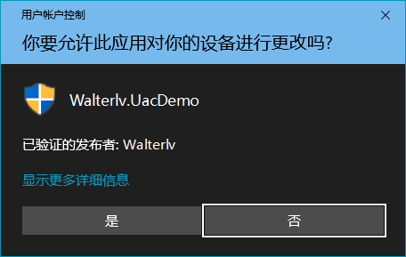
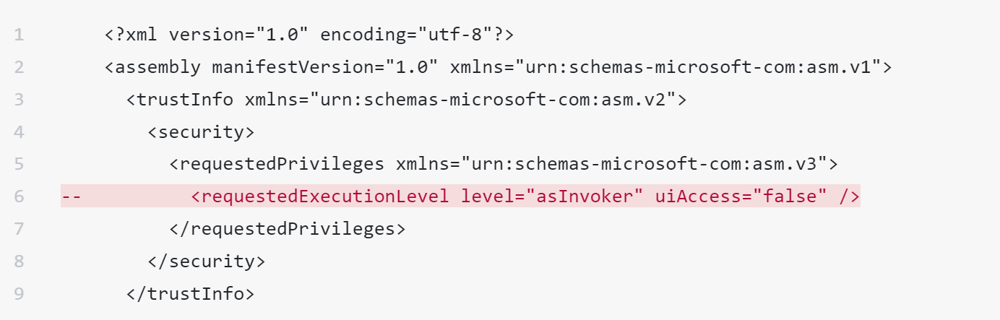
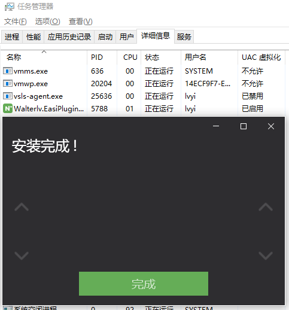

# 应用程序清单Manifest
如果你的程序对 Windows 运行权限有要求，那么需要设置应用程序清单（Manifest）。

## 各种不同的 UAC 清单选项
从默认生成的应用程序清单中，我们可以很容易的知道有四种不同的设置：

* asInvoker
* requireAdministrator
* highestAvailable
* 删除 requestedExecutionLevel 元素 （不要忘了还可以删除）

### asInvoker
**父进程是什么权限级别，那么此应用程序作为子进程运行时就是什么权限级别。**

默认情况下用户启动应用程序都是使用 Windows 资源管理器（explorer.exe）运行的；在开启了 UAC 的情况下，资源管理器是以标准用户权限运行的。于是对于用户点击打开的应用程序，默认就是以标准用户权限运行的。

如果已经以管理员权限启动了一个程序，那么这个程序启动的子进程也会是管理员权限。典型的情况是一个应用程序安装包安装的时候使用管理员权限运行，于是这个安装程序在安装完成后启动的这个应用程序进程实例就是管理员权限的

### requireAdministrator
此程序需要以管理员权限运行。

在资源管理器中可以看到这样的程序图标的右下角会有一个盾牌图标。
  
用户在资源管理器中双击启动此程序，或者在程序中使用 Process.Start 启动此程序，会弹出 UAC 提示框。点击“是”会提权，点击“否”则操作取消。

  

### highestAvailable
这个概念可能会跟前面说的 requireAdministrator 弄混淆。

要更好的理解这两个概念的区别，你可能需要对 UAC 用户账户控制有一个初步的了解。

如果你指定为 highestAvailable：

* 当你在管理员账户下运行此程序，就会要求权限提升。资源管理器上会出现盾牌图标，双击或使用 Process.Start 启动此程序会弹出 UAC 提示框。在用户同意后，你的程序将获得完全访问令牌（Full Access Token）。
* 当你在标准账户下运行此程序，此账户的最高权限就是标准账户。受限访问令牌（Limited Access Token）就是当前账户下的最高令牌了，于是 highestAvailable 已经达到了要求。资源管理器上不会出现盾牌图标，双击或使用 Process.Start 启动此程序也不会出现 UAC 提示框，此程序将以受限权限执行。

参考UAC那篇文章，管理员账户下的最高权限High，但是管理员账户下的explorer.exe默认是Medium令牌权限，这是为了防止误起高权限进程（比如桌面双击），因此，管理员账户下的highestAvailable是希望提升到High，所以会有uac弹框。标准用户账户下的最高权限是medium，再拉起进程时，默认就是medium，不用再额外提权了。

### 删除 requestedExecutionLevel 元素
删除 requestedExecutionLevel 元素指的是将下面标注的这一行删掉：
  

注释中说删除 requestedExecutionLevel 元素将开启 UAC 虚拟化。
  

不过在以下任意一种情况下，UAC 虚拟化即便删了 requestedExecutionLevel 也是不会开启的：

* 64 位进程
* 不可交互的进程（例如服务）
* 进程模拟用户的操作（如果一个进程像用户一样执行了某项操作，那么这个操作不会被虚拟化）
* 驱动等内核模式进程

## 这些值都用于什么场景
* asInvoker 是默认情况下的首选。如果你的程序没有什么特殊的需求，就使用 asInvoker；就算你的程序需要管理员程序做一些特殊的任务，那最好也写成 asInvoker，仅在必要的时候才进行管理员权限提升。
* requireAdministrator，只有当你的程序大量进行需要管理员权限的操作的时候才建议使用 requireAdministrator 值，例如你正在做安装程序。
* highestAvailable，当你的程序需要管理员权限，但又要求仅对当前用户修改时设置为此值。因为标准用户申请 UAC 提权之后会以其他用户的身份运行进程，这就不是对当前用户的操作了；使用 highestAvailable 来确保以当前用户运行。