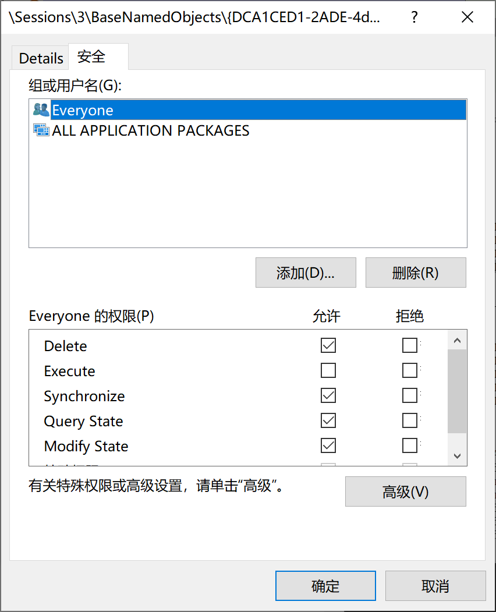

# session隔离

https://learn.microsoft.com/zh-cn/previous-versions/msdn10/Ee791007(v=MSDN.10)

服务（Service）对于大家来说一定不会陌生，它是Windows 操作系统重要的组成部分。我们可以把服务想像成一种特殊的应用程序，它随系统的“开启～关闭”而“开始～停止”其工作内容，在这期间无需任何用户参与。

Windows 服务在后台执行着各种各样任务，支持着我们日常的桌面操作。有时候可能需要服务与用户进行信息或界面交互操作，这种方式在XP 时代是没有问题的，但自从Vista 开始你会发现这种方式似乎已不起作用。

## 服务是什么？
服务是Microsoft Windows操作系统的一个组成机制，您可以将服务想像成一种忽略当前用户上下文环境的“特殊的应用程序”。服务与“普通”的用户应用程序有很大不同，主要是因为您可以配置让服务在系统启动（引导）后就自动运行，直到系统关闭才结束，而并不需要用户登录。也就是说，就算没有用户登录，服务业可以正常运行。

我们也可以把服务看作是不需要用户的干预，直接在后台运行的“任务”。Windows上的服务需要负责所有不需要用户参与的后台活动，例如远程过程调用（RPC）服务，以及打印池服务，甚至还有网络位置感知服务等。

## 问题在哪里？
有些服务可能需要在用户界面上显示对话框，或需要与用户的应用程序通讯，这种类型的功能“通常”属于Windows XP服务，因为在Windows XP中，这样做很容易。如果您的服务恰好需要显示某些用户界面对象，例如对话框，或者需要与应用程序通讯，则在Windows 7下运行可能会遇到问题。

如果在Windows 7上运行需要显示对话框的服务，此时并不能看到所需的对话框，您将在任务栏上看到一个闪烁的图标。而且，如果单击这个闪烁图标，还会看到一个对话框。更具体来说，在Windows 7中运行时，您的服务可能会遇到下列一个或多个现象，这个服务可能会：
* 正常运行，但无法完成既定工作，同时耗费大量CPU时钟和内存。
* 正常运行，但其他进程无法与该服务通讯，该服务业无法与用户或其他应用程序/服务通讯。
* 尝试通过Windows消息机制与用户应用程序通讯，但Windows消息机制无法实现目标。
* 在任务栏上显示一个闪烁的图标，代表该服务希望与桌面交互。

上述所有现象都意味着，您的服务遇到了Windows 7服务的Session 0隔离问题，也就是说，服务和用户应用程序之间存在“物理上的”分离。
* 服务无法显示ui，或者ui被系统弹框接管。即使服务允许用户交互（服务-属性里面可以设置），系统替代层会显示弹框提示用户，这个弹框不是产品预期，会打断产品交互流。
* 服务创建的对象无法被用户进程访问。比如，服务创建的句柄是session 0的，用户进程是session 1的，服务创建的session 0句柄是无法被用户进程访问的，用户进程甚至可能都看不到这个句柄。

将服务和用户应用程序一起在Session 0中运行会导致安全风险，因为服务会使用提升后的权限运行，而用户应用程序使用用户特权（大部分都是非管理员用户）运行，这会使得恶意软件以某个服务为攻击目标，通过“劫持”该服务，达到提升自己权限级别的目的。

从Windows Vista开始，只有服务可以托管到Session 0中，用户应用程序和服务之间会被隔离，并需要运行在用户登录到系统时创建的后续会话中。例如第一个登录的用户创建 Session 1，第二个登录的用户创建Session 2，以此类推。

使用不同会话运行的实体（应用程序或服务）*如果不将自己明确标注为全局命名空间*，并提供相应的访问控制设置，将无法互相发送消息，共享UI元素，或共享内核对象。这一过程如下图所示：
  

## 怎么确认
* procexp看进程所在的session是哪个，session 0和session x是无法通信的。
* procexp看进程包含的句柄，右键看属性，如果是Everyone就表示此句柄可以被其他人访问，即使这个句柄是session 0的进程所有。
  

