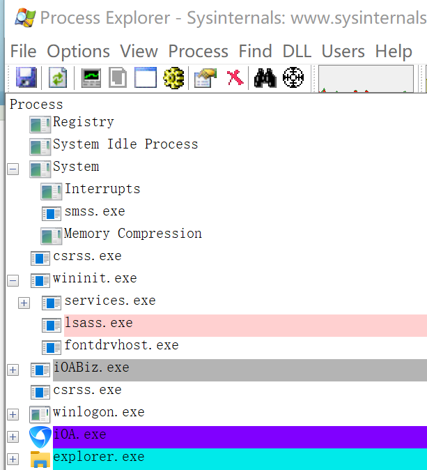
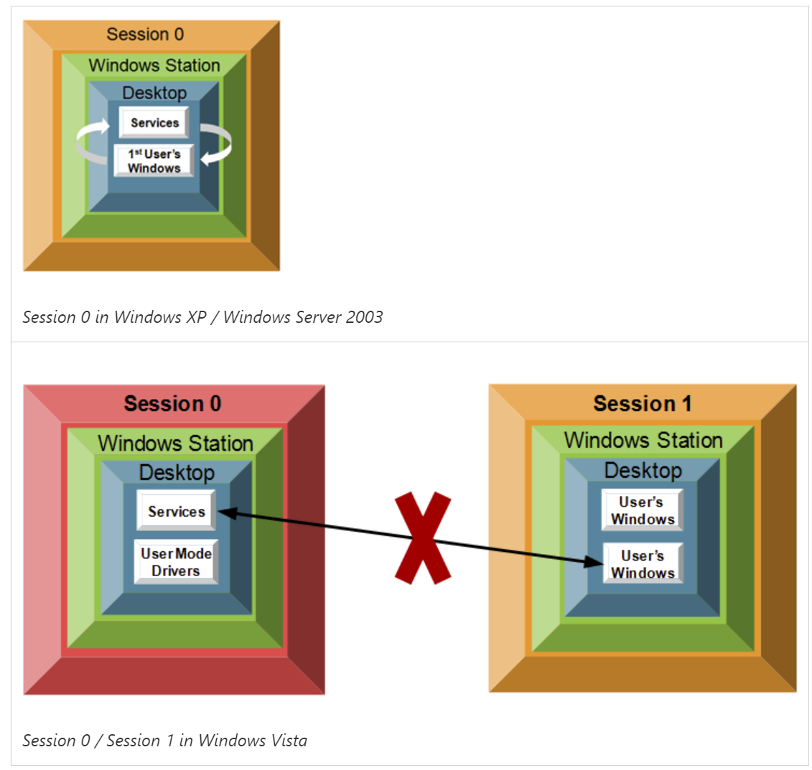

# windows session

## 概述
* win是多用户系统。
* 一个系统可以同时登录多个用户，包远程用户登录。
* 一个用户登录以后会创建一个会话（session），远程用户称为远程会话。
* 一个session拥有多个窗口站（Window Station），其中只能拥有一个交互式窗口站Winsta0。
  1. 一个会用拥有一系列的私有进程和模块：Csrss.exe，WinLogin.exe，win32k.sys。
  2. 一个会话拥有一个私有对象名字空间(\BaseNamedObjects)，私有对象命名空间的内核对象不能被其他会话访问。
* 窗口站是其包含的桌面和进程的安全边界。
  1. 一个窗口站可以包含多个桌面，其中仅Winsta0可以与用户交互（交互式窗口站）。
  2. 一个交互式窗口站至少拥有三个桌面：默认桌面（user desktop）、登录桌面（logon screen）、屏保桌面（disconnect）。这三个桌面是独立显示的。
  3. 一个非交互式窗口站至少拥有一个桌面。
* 一个桌面拥有0-N个窗口（非交互式工作站中的桌面可以没有窗口）。
* 一个与用户交互的桌面拥有一个Explorer.exe进程。
* 窗口必须与一个桌面绑定。
* 窗口之间不能跨桌面访问。

## 会话session
会话(session)是由进程和其他的系统对象(比如窗口站、桌面和窗口)构成的，它们代表了一个用户的工作站登录会话。会话具体是由如下几个部分组成的：
1. 每个会话包含一个单独的win32k.sys。
2. 专门的换页池区域。
3. 私有windows子系统和登陆进程的拷贝。
4. 系统空间中被映射的空间，被称为会话空间的区域。

Windows系统是支持多会话的，因此会话空间（session space）包含了一些针对每个会话的全局信息。  
会话空间是用来管理会话的。

## 会话管理器
会话管理器（smss.exe，Session Manager Subsystem）是系统中第一个创建的用户态模式进程。

## Windows会话过程
1. 内核模式的系统线程初始化Windows执行体和内核，最后阶段创建实际的Smss进程。
2. 在启动Windows的过程中，会话管理器负责许多重要的步骤，比如打开额外的页面文件、执行延迟的文件改名和删除操作（重启后删除或重启后重命名）、创建系统环境变量；它也将子系统进程（csrss.exe，Client/Server Runtime Subsystem，客户端/服务端运行时子系统）和 winlogon.exe进程启动起来，winlogon进程一次会创建其他的系统进程。
3. Smss的主线程负责监视Csrss和winlogon，一旦Csrss或Winlogon非正常终止，Smss会让系统崩溃。（崩溃代码是STATUS_SYSTEM_PROCESS_TERMINATED或0xC000021A）。
4. Smss等待加载子系统的请求、调试事件，以及创建新的终端服务器会话。
5. 身份认证阶段。
6. 认证完成后，lsass调用安全引用监视器中的函数NtCreateToken生成一个访问令牌对象，其包含了当前用户的安全轮廓。
7. winlogon利用此访问令牌来创建用户会话中的初始进程（Userinit）。
8. Userinit执行该用户环境中的一些初始化工作（比如运行登录脚本、应用组策略），然后再注册表中查找Shell值，并创建进程来运行外壳程序Explorer.exe。
9. 至此会话创建完成。

  

## 身份认证过程
* Winlogon登录进程处理交互式用户的登录和注销。
* winlogon在用户登录、注销、截取键盘SAS时是活动的，它是负责处理这些交互工作的进程。
登录过程的身份识别和认证是在GINA.dll中实现的。开发人员可以提供自己的GINA.dll实现其他的身份识别和认证机制。
* 用户名和密码捕捉到后，被送到本地安全认证服务器进程lsass.exe进行认证。lsass.exe检查口令是否符合存储在活动目录或者SAM中的口令信息。

## 窗口站 windows station
* 一个窗口站包含一个剪切板、一个原子表、和一个或多个桌面对象。
* 窗口站创建时和进程相关联，并且被放到当前的会话。
* 只有WinSta0可以有交互界面，和接收用户输入，其他窗口站是不可以有用户交互的。
* 远程登录的用户会新建一个会话，每个会话和自己的窗口站关联（窗口站名为WinSta0）。
* 系统会创建默认的窗口站和桌面，并且和当前的用户关联WinSta0\Default。
* 程序调用User32或者GDI函数时自动连接，如果调用了SetProcessWindowStation或者从父进程继承了指定的窗口站，那么就会连接到指定的窗口站。或者连接创建进程指定的STARTINFO里面的lpDesktop。如果都没有的话，则会连接到交互进程的窗口站。如果从父进程继承了多个，那么连接行为是不确定的。

## session隔离
一个用户session包含了用户登录以后的资源（进程和对象等），在xp时代，只有一个session，多用户登录以后都位于session 0，因此，彼此可以互相访问。在vista及以后，session之间是隔离的，session 0的进程是无法访问session 1的资源。

  
