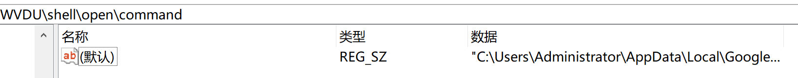

# win设置系统
本文主要记录一些系统设置项。

## win禁用系统更新
* 不支持win10。
* 组策略注册表路径。
`HKEY_LOCALMACHINE\SOFTWARE\Policies\Microsoft\Windows\WindowsUpdate\AU - NoAutoUpdate`
* 个人注册表路径。
`HKEY_LOCALMACHINE\SOFTWARE\Microsoft\Windows\CurrentVersion\WindowsUpdate\Auto Update - AUOptions`
* 注册表路径要注意Wow64。
* 对于组策略而言，启用自动更新，就需要同时设置NoAutoUpdate为0，且AUOptions为4。
* 对于个人设置而言，启用自动更新，就需要设置AUOptions为4。
* 对于组策略而言，启用自动更新，就需要同时设置NoAutoUpdate为1，且AUOptions为1。
* 对于控制面板而言，启用自动更新，就需要设置AUOptions为1。

## 获取默认浏览器
获取用户设置的默认浏览器。  
1. 获取浏览器ProgId。  
先尝试注册表 `HKEY_CURRENT_USER\SOFTWARE\Microsoft\Windows\Shell\Associations\URLAssociations\https\UserChoice | ProgId`，若获取不到ProgId再尝试 `HKEY_USERS\ %UserId% \SOFTWARE\Microsoft\Windows\Shell\Associations\URLAssociations\https\UserChoice | ProgId` 。  
例如，本机获取的ProgId是 ChromeHTML.CMK4ZFU7DGXQ23RWU5EBYWWVDU 。
%UserId%怎么获取呢？

2. 通过ProgId获取浏览器进程的位置。  
读注册表`HKEY_CLASSES_ROOT\ %ProgId% \shell\open\command | ""`，此注册表没有对应的value值，获取默认值用空字符串就好了。
  
例如，本机获取到的是`"C:\Users\Administrator\AppData\Local\Google\Chrome\Application\chrome.exe" --single-argument %1`。

3. 若获取用户设置默认浏览器失败，则继续尝试获取系统默认浏览器。
读注册表`HKEY_CLASSES_ROOT\http\shell\open\command | ""`，获取系统默认的浏览器。  
例如，本机获取到的是`"C:\Program Files\Internet Explorer\iexplore.exe" %1`。

4. 拉起浏览器，加载url。  
获取到的浏览器命令行，最后是`%1`，我们要将字符串`%1`替换为实际的url。注意，有的系统获取到的可能是`%*`。CreateProcess传入命令行即可。

## 获取用户id
1. 获取explorer.exe的pid。
2. 通过pid获取用户名。
3. 通过用户名获取userId。LookupAccountName