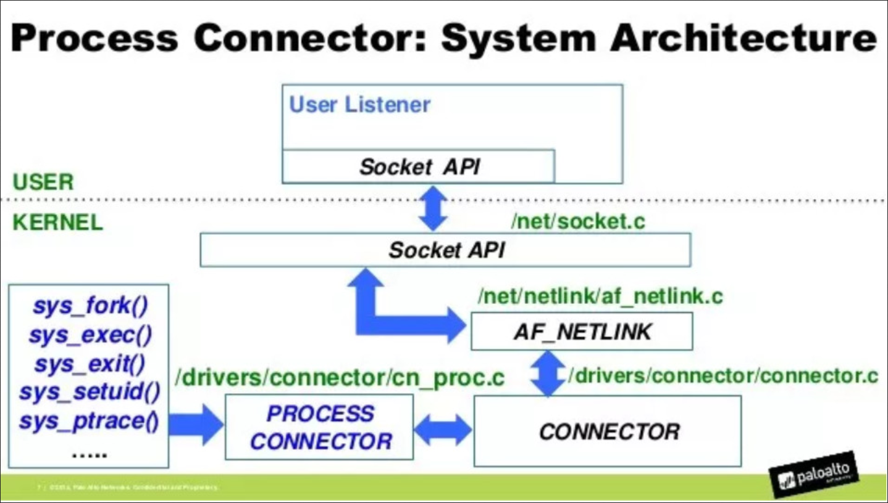
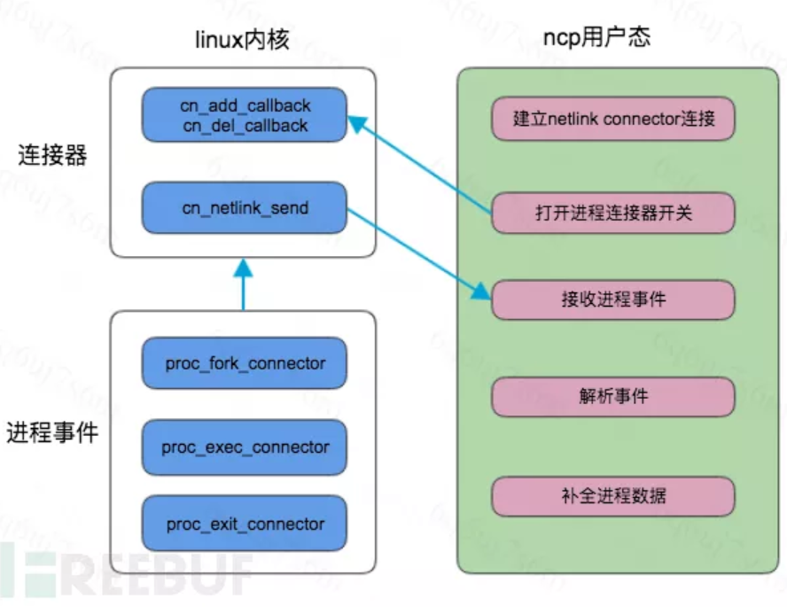
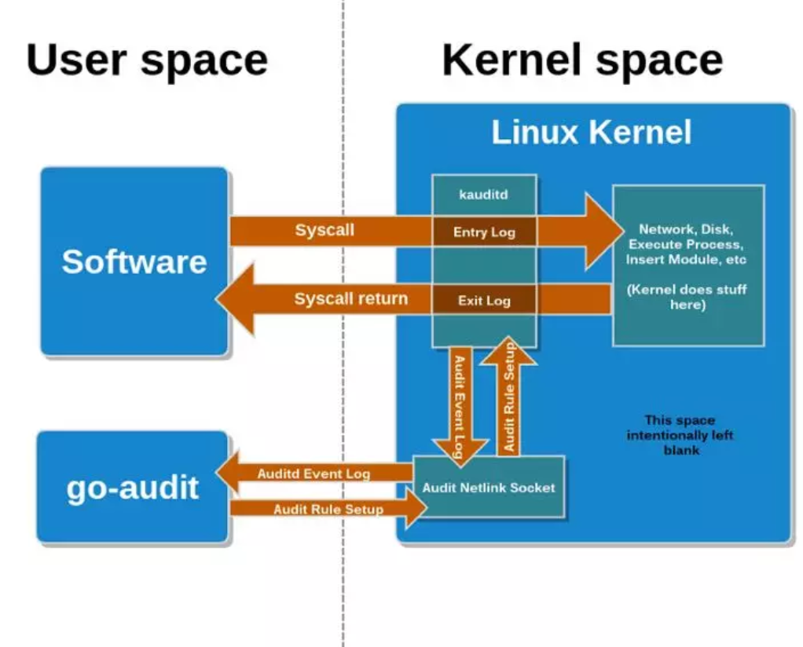
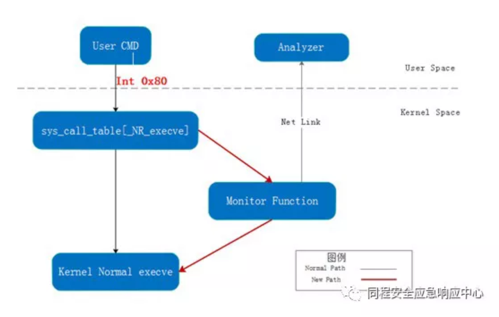

# Linux进程监控

Linux系统上监控进程启停的方式有几种。
* LD_PRELOAD：预加载模块注入。
* netlink：应用层和内核之间IPC通信，接收内核通知的进程监控。
* audit：利用系统审计功能进行进程监控。
* syscall hook：hook系统进程创建的api。

先说结论：推荐netlink。

## LD_PRELOAD
LD_PRELOAD是Linux系统的一个环境变量，它可以影响程序的运行时的链接（Runtime linker），它允许你定义在程序运行前优先加载的动态链接库。这个功能主要就是用来有选择性的载入不同动态链接库中的相同函数。通过这个环境变量，我们可以在主程序和其动态链接库的中间加载别的动态链接库，甚至覆盖正常的函数库。一方面，我们可以以此功能来使用自己的或是更好的函数（无需别人的源码），而另一方面，我们也可以以向别人的程序注入程序，从而达到特定的目的。

`/etc/ld.so.preload`配置文件和环境变量是同一个效果。

### preload监控原理
两点基础知识：
1. Linux 中大部分的可执行程序是动态链接的，常用的有关进程执行的函数例如`execve`均实现在 libc.so 这个动态链接库中。
2. Linux 提供了一个 ld preload 的机制，它允许定义优先加载的动态链接库，方便使用者有选择地载入不同动态链接库中的相同函数。

结合上述两点，我们可以通过 lf preload 来覆盖 libc.so 中的`execve`等函数来监控进程的创建。

### 优缺点
* 使用条件
  该方法没有什么条件限制，只需有 root 权限即可。
* 优点
  轻量级，只修改库函数代码，不与内核进行交互。
* 缺点
  1. 只影响preload之后创建的进程。一些系统初始化就运行的进程会监控不到。
  2. 无法监控静态链接的进程，此进程不需要加载动态库，因此，没有机会触发preload。
  3. 系统全局影响，范围太广，容易出问题。
  4. 很容易被检测并篡改。

## NET_LINK
Netlink 是一种特殊的 socket，它是 Linux 所特有的，类似于 BSD 中的AF_ROUTE 但又远比它的功能强大。

Netlink 是一种在内核与用户应用间进行双向数据传输的非常好的方式，用户态应用使用标准的 socket API 就可以使用 netlink 提供的强大功能，内核态需要使用专门的内核 API 来使用 netlink。

Netlink Connector 是一种 Netlink ，它的 Netlink 协议号是 NETLINK_CONNECTOR，其代码位于 https://github.com/torvalds/linux/tree/master/drivers/connector 中，其中 connectors.c 和 cnqueue.c 是 Netlink Connector 的实现代码，而 cnproc.c 是一个应用实例，名为进程事件连接器，我们可以通过该连接器来实现对进程创建的监控。

  

  

在 Github 上已有人基于进程事件连接器开发了一个简单的进程监控程序：https://github.com/ggrandes-clones/pmon/blob/master/src/pmon.c ，其核心函数为以下三个：
* nl_connect：与内核建立连接
* set_proc_ev_listen：订阅进程事件
* handle_proc_ev：处理进程事件
其执行流程正如上图所示。

### 优缺点
* 使用条件
  1. 内核支持 Netlink Connector。
  2. 版本 > 2.6.14。
  3. 内核配置开启： cat/boot/config-$(uname-r)|egrep'CONFIG_CONNECTOR|CONFIG_PROC_EVENTS'。
* 优点
  轻量级，在用户态即可获得内核提供的信息。
* 缺点
  仅能获取到 pid ，详细信息需要查 /proc/<pid>/，这就存在时间差，可能有数据丢失。

## Audit
Linux Audit 是 Linux 内核中用来进行审计的组件，可监控系统调用和文件访问，具体架构如下。
  

1. 用户通过用户态的管理进程配置规则（例如图中的 go-audit ，也可替换为常用的 auditd ），并通过 Netlink 套接字通知给内核。
2. 内核中的 kauditd 通过 Netlink 获取到规则并加载。
3. 应用程序在调用系统调用和系统调用返回时都会经过 kauditd ，kauditd 会将这些事件记录下来并通过 Netlink 回传给用户态进程。
4. 用户态进程解析事件日志并输出。

从上面的架构图可知，整个框架分为用户态和内核态两部分，内核空间的 kauditd 是不可变的，用户态的程序是可以定制的，目前最常用的用户态程序就是 auditd ，除此之外知名的 osquery 在底层也是通过与 Audit 交互来获取进程事件的。

### 使用方法
如何通过 auditd 来监控进程创建。

1. 首先安装并启动 auditd ：
```
apt update && apt install auditd
systemctl start auditd && systemctl status auditd
```
2. auditd 软件包中含有一个命名行控制程序 auditctl，我们可以通过它在命令行中与 auditd 进行交互，用如下命令创建一个对 execve这个系统调用的监控：  
```
auditctl -a exit,always -F arch=b64 -S execve
```
3. 再通过 auditd 软件包中的 ausearch来检索 auditd 产生的日志：
```
ausearch -sc execve | grep /usr/bin/id
```

### 优缺点
* 使用条件
  内核开启 Audit：`cat/boot/config-$(uname-r) | grep^CONFIG_AUDIT`
* 优点
  1. 组件完善，使用 auditd 软件包中的工具即可满足大部分需求，无需额外开发代码。
  2. 相比于 Netlink Connector ，获取的信息更为全面，不仅仅是 pid 。
* 缺点
  性能消耗随着进程数量提升有所上升，需要通过添加白名单等配置来限制其资源占用。

## syscall
上面的 Netlink Connector 和 Audit 都是 Linux 本身提供的监控系统调用的方法，如果我们想拥有更大程度的可定制化，我们就需要通过安装**内核**模块的方式来对系统调用进行 hook 。

目前常用的 hook 方法是通过修改 sys_call_table（ Linux 系统调用表）来实现，具体原理就是系统在执行系统调用时是通过系统调用号在 sys_call_table中找到相应的函数进行调用，所以只要将 sys_call_table中 execve对应的地址改为我们安装的内核模块中的函数地址即可。

  


关于 Syscall hook 的 Demo ，我在 Github 上找了很多 Demo 代码，其中就包括驭龙 HIDS 的 hook 模块，但是这些都无法在我的机器上（ Ubuntu 16.04 Kernel 4.4.0-151-generic ）正常运行，这也就暴露了 Syscall hook 的兼容性问题。

最后我决定使用 Sysdig 来进行演示，Sysdig 是一个开源的系统监控工具，其核心原理是通过内核模块监控系统调用，并将系统调用抽象成事件，用户根据这些事件定制检测规则。作为一个相对成熟的产品，Sysdig 的兼容性做得比较好，所以这里用它来演示，同时也可以方便大家自己进行测试。

### 优缺点
* 使用条件
  1. 可以安装内核模块。
  2. 需针对不同 Linux 发行版和内核版本进行定制。
* 优点
  高定制化，从系统调用层面获取完整信息。
* 缺点
  1. 开发难度大。
  2. 兼容性差，需针对不同发行版和内核版本进行定制和测试。
   
## 结论
本文共讲了4种常见的监控进程创建的方法，这些方法本质上是对库函数或系统调用的监控，各有优劣，这里再用一句话总结一下：
* ld preload ：Hook 库函数，不与内核交互，轻量但易被绕过。
* Netlink ：从内核获取数据，监控系统调用，轻量，仅能直接获取 pid ，其他信息需要通过读取`/proc/<pid>/`来补全。
* Audit ：从内核获取数据，监控系统调用，功能多，不只监控进程创建，获取的信息相对全面。
* Syscall hook ：从内核获取数据，监控系统调用，最接近实际系统调用，定制度高，兼容性差。

单纯地看监控进程创建这方面，我还是更推荐使用 Netlink 的方式，这种方式在保证从内核获取数据的前提下又足够轻量，方便进行定制化开发。如果是想要进行全方面的监控包括进程、网络和文件，Audit 是一个不错的选择。