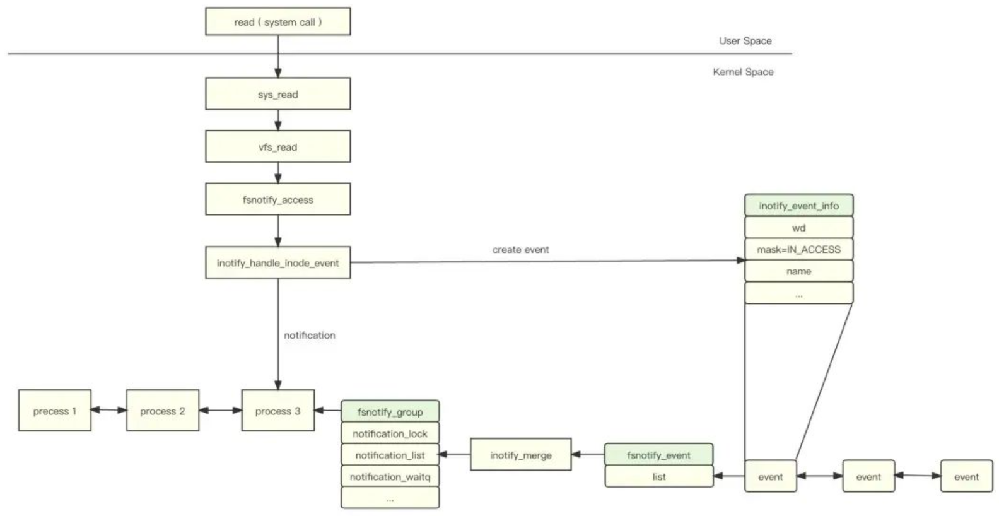
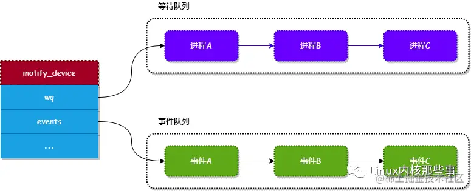

# Linux inotify

本篇首先介绍 inotify 的使用方式，再介绍 inotify 的实现原理。  

来自：https://mp.weixin.qq.com/s?__biz=MzA3NzYzODg1OA==&mid=2648464820&idx=1&sn=81bbffbc188e796a292d19a8f8908323&scene=21#wechat_redirect


## inotify 接口
其实 inotify 的接口比较少，只有3个：inotify_init、inotify_add_watch 和 inotify_rm_watch。

1. inotify_init  
inotify_init 函数用于创建一个 inotify 的句柄，可以认为此句柄就是 inotify 的对象。其原型如下：
```c
int inotify_init(void);
```
2. inotify_add_watch  
创建好 inotify 句柄后，就可以通过调用 inotify_add_watch 函数添加要进行监听的文件或者目录。其原型如下：
```c
int inotify_add_watch(int fd, const char *path, uint32_t mask);
```
inotify_add_watch 调用成功后，会返回被监听文件或目录的描述符。下面介绍一下各个参数的意义：
* fd：就是通过 inotify_init 函数创建的 inotify 句柄。
* path：要监听的文件或目录的路径。
* mask：要监听的事件，其事件类型如下。

| 类型             | 描述                        |
| ---------------- | --------------------------- |
| IN_ACCESS        | 文件被访问                  |
| IN_ATTRIB        | 文件元数据改变              |
| IN_CLOSE_WRITE   | 关闭为了写入而打开的文件    |
| IN_CLOSE_NOWRITE | 关闭只读方式打开的文件      |
| IN_CREATE        | 在监听目录内创建了文件/目录 |
| IN_DELETE        | 在监听目录内删除文件/目录   |
| IN_DELETE_SELF   | 监听目录/文件本身被删除。   |
| IN_MODIFY        | 文件被修改                  |
| IN_MOVE_SELF     | 受监控目录/文件本身被移动   |
| IN_MOVED         | 文件被移                    |
| IN_OPEN          | 文件被打开                  |
| IN_ALL_EVENTS    | 以上所有输出事件的统称      |

3. inotify_rm_watch
inotify_rm_watch 函数用于删除被监听的文件或目录，其原型如下：
```c
int inotify_rm_watch(int fd, uint32_t wd);
```
下面介绍一下各个参数的意义：
* fd：调用 inotify_init 函数返回的 inotify 句柄。
* wd：由 inotify_add_watch 函数的返回被监听文件或目录的描述符。

## 读取变动事件
inotify 并没有提供特定的接口来获取被监听的文件或目录的变动事件，而是通过通用的 read 函数来读取，我们来看看 read 函数的原型：
```c
int read(int fd, void *events, size_t len);
```
下面说说各个参数的意义：
* fd：由 inotify_init 创建的 inotify 句柄。
* events：存放变动事件的缓冲区。
* len：缓冲区的大小。
events 参数用于存放被监听文件或目录的变动事件，一般指定为 inotify_event 结构的数组，inotify_event 结构的定义如下：
```c
struct inotify_event {
   int         wd;      // 被监控文件或目录的描述符(由inotify_add_watch)
   uint32_t    mask;    // 变动的事件
   uint32_t    cookie;  // 比较少使用，可以忽略
   uint32_t    len;     // name的长度
   char        name[];  // 用于存放发生变动的文件或目录名称
};
```

## 使用实例
```c
#include <stdio.h>
#include <string.h>
#include <stdlib.h>
#include <sys/inotify.h>  // 引入 inotify 的头文件

/*
* 用于打印发生的事件
*/
void display_event(const char *base, struct inotify_event *event)
{
   char *operate;
   int mask = event->mask;

   if (mask & IN_ACCESS)        operate = "ACCESS";
   if (mask & IN_ATTRIB)        operate = "ATTRIB";
   if (mask & IN_CLOSE_WRITE)   operate = "CLOSE_WRITE";
   if (mask & IN_CLOSE_NOWRITE) operate = "CLOSE_NOWRITE";
   if (mask & IN_CREATE)        operate = "CREATE";
   if (mask & IN_DELETE_SELF)   operate = "DELETE_SELF";
   if (mask & IN_MODIFY)        operate = "MODIFY";
   if (mask & IN_MOVE_SELF)     operate = "MOVE_SELF";
   if (mask & IN_MOVED_FROM)    operate = "MOVED_FROM";
   if (mask & IN_MOVED_TO)      operate = "MOVED_TO";
   if (mask & IN_OPEN)          operate = "OPEN";
   if (mask & IN_IGNORED)       operate = "IGNORED";
   if (mask & IN_DELETE)        operate = "DELETE";
   if (mask & IN_UNMOUNT)       operate = "UNMOUNT";

   printf("%s/%s: %s\n", base, event->name, operate);
}

#define EVENTS_BUF_SIZE 4096

int main(int argc, char const *argv[])
{
   int fd;
   int nbytes, offset;
   char events[EVENTS_BUF_SIZE];
   struct inotify_event *event;

   fd = inotify_init(); // 创建 inotify 句柄
   if (fd < 0) {
       printf("Failed to initalize inotify\n");
       return -1;
  }

   // 从命令行参数获取要监听的文件或目录路径
   // 添加要监听的文件或者目录, 监听所有事件
   if (inotify_add_watch(fd, argv[1], IN_ALL_EVENTS) == -1) {
       printf("Failed to add file or directory watch\n");
       return -1;
  }

   for (;;) {
       memset(events, 0, sizeof(events));

       // 读取发生的事件
       nbytes = read(fd, events, sizeof(events));
       if (nbytes <= 0) {
           printf("Failed to read events\n");
           continue;
      }

       // 开始打印发生的事件
       for (offset = 0; offset < nbytes; ) {
           event = (struct inotify_event *)&events[offset]; // 获取变动事件的指针

           display_event(argv[1], event);

           offset += sizeof(struct inotify_event) + event->len; // 获取下一个变动事件的偏移量
      }
  }

   return 0;
}
```
上面的实例逻辑比较简单，主要步骤如下：
* 调用 inotify_init 函数创建一个 inotify 句柄。
* 从命令行中获取要监听的文件或目录路径，并且通过 inotify_add_watch 函数把其添加到 inotify 中进行监听。
* 在一个无限循环中，通过 read 函数读取被监听的文件或目录的变动事件，并且通过调用 display_event 函数打印事件。

## 重要的数据结构

如果让我们来设计 inotify 应该如何实现呢？下面来分析一下：
* 我们知道，inotify 是用来监控文件或目录的变动事件，所以应该定义一个对象来存储被监听的文件或目录列表和它们所发生的事件列表（在内核中定义了 inotify_device 对象来存储被监听的文件列表和事件列表）。
* 另外，当对被监听的文件或目录进行读写操作时会触发相应的事件产生。所以，应该在读写操作相关的系统调用中嵌入产生事件的动作（在内核中由 inotify_dev_queue_event 函数产生事件）。

inotify 的原理如下：当用户调用 read 或者 write 等系统调用对文件进行读写操作时，内核会把事件保存到 inotify_device 对象的事件队列中，然后唤醒等待 inotify 事件的进程。

  


从上图可知，当应用程序调用 read 函数读取文件的内容时，最终会调用 inotify_dev_queue_event 函数来触发事件，调用栈如下：
```
1read()
2└→ sys_read()
3   └→ vfs_read()
4      └→ fsnotify_access()
5         └→ inotify_inode_queue_event()
6            └→ inotify_dev_queue_event()
```

inotify_dev_queue_event 函数主要完成两个工作：
* 创建一个表示事件的 inotify_kernel_event 对象，并且把其插入到 inotify_device 对象的 events 列表中。
* 唤醒正在等待 inotify 发生事件的进程，等待的进程放置在 inotify_device 对象的 wq 字段中。

### inotify_device对象
内核使用 inotify_device 来管理 inotify 监听的对象和发生的事件，其定义如下：
```c
struct inotify_device {
    wait_queue_head_t       wq; // 正在等待当前 inotify 发生事件的进程列表。
    ...
    struct list_head        events; // 保存由 inotify 监听的文件或目录所发生的事件。
    ...
    struct inotify_handle   *ih; // 内核用来存储 inotify 监听的文件或目录。
    unsigned int            event_count; //inotify 监听的文件或目录所发生的事件数量。
    unsigned int            max_events; // inotify 能够保存最大的事件数量。
};
```
下图描述了 inotify_device 对象中两个比较重要的队列（等待队列 和 事件队列），当事件队列中有数据时，就可以通过调用 read 函数来读取这些事件。
  

### inotify_kernel_event对象
内核使用 inotify_kernel_event 对象来存储一个事件，其定义如下：
```c
struct inotify_kernel_event {
    struct inotify_event    event;
    struct list_head        list; // 用于把所有由 inotify 监听的文件或目录所发生的事件连接起来
    char                    *name; // 用于记录发生事件的文件名或目录名。
};
```

## 总结
inotify 的实现过程总结为以下两点：
* 当用户调用读写、创建或删除文件的系统调用时，内核会注入相应的事件触发函数来产生一个事件，并且添加到 inotify 的事件队列中。
* 唤醒等待读取事件的进程，当进程被唤醒后，就可以通过调用 read 函数来读取 inotify 事件队列中的事件。
