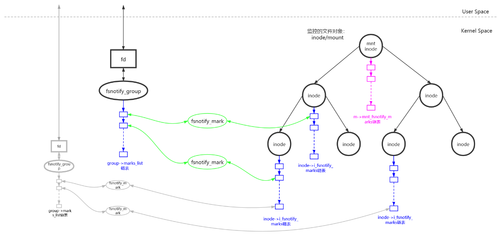
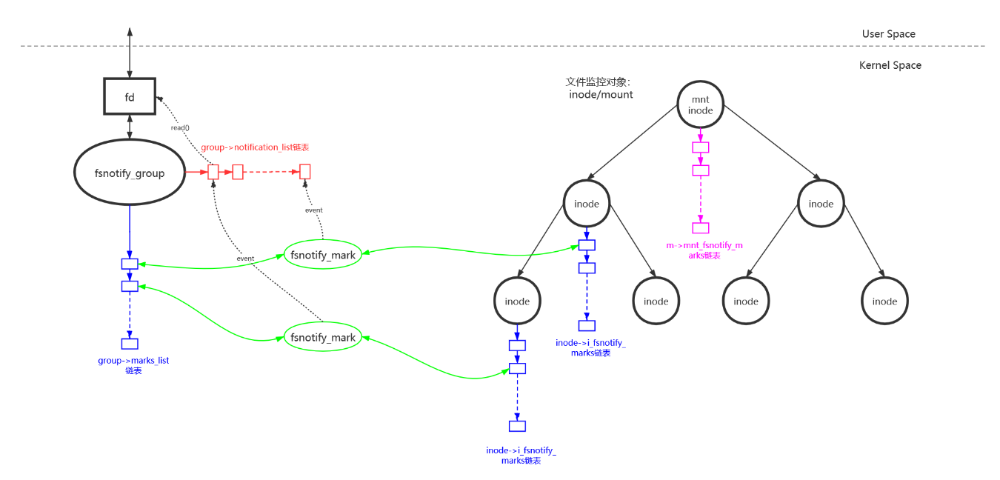

# Linux fanotify

Fanotify (Filesystem wide access notification) 是一个 notifier，即一种对文件系统变化产生通知的机制。fanotify是inotify的一个新进版本，主要是用于文件系统扫描的检测和分层存储的管理。最近几年对fanotify的完善也是很快的，查看了一下源码可以看出来fanotify支持的文件系统事件已经比inotify多了。

fanotify与inotify最大区别是fanotify加入了打开关闭等事件的许可判断:

即在打开或者关闭文件之前，需要程序员注册一个函数，根据程序所需要去判断是否允许打开文件或者关闭文件，然后将判断的结果再写入内核中，此时内核会执行该结果（相当于Ring0级别的Hook）。很明显，这几个文件系统事件可以用来实现一个文件监测控制系统，除了文件系统的扫描以外还可以控制文件的打开关闭等操作。很符合杀毒软件的开发。

## 基本原理
fanotify功能的使用分为以下几步：
1. 用户调用fanotify_init()函数创建一个fd供监控者使用。在内核中这个fd对应一个fsnotify_group结构体。
2. 用户调用fanotify_mark()函数来确定需要监控哪些文件对象以及哪些类型的事件消息。在内核中会把fsnotify_group和需要监控的文件对象链接起来。
3. 用户调用read()函数来读取fd接收到的监控事件消息并处理。在内核中文件对象发生相应类型的事件时，会把事件消息发送到fsnotify_group的接收消息队列中。
4. 如果注册了FAN_OPEN_PERM/FAN_ACCESS_PERM类型的监控，在接收到事件消息后，需要对当前的操作做许可判断(Allow/Deny)，并调用write()函数把许可结果回写给内核。在内核中文件对象发生FAN_OPEN_PERM/FAN_ACCESS_PERM类型的事件后会把当前进程挂起并等待用户监控程序的判断，用户程序通过write()函数下发允许结果后，阻塞的进程恢复执行(Continue/Return)。

fanotify的内部数据关系如下图所示，用户创建了一个监控group，一个group可以监控多个文件对象(inode/mount)。同时一个文件对象(inode/mount)可以被多个group所监控。group和监控对象是多对多的关系：

  

在监控对象的事件发生时，通过fsnotify_mark建立起来的关系把事件发送到group的消息队列中。用户通过read()操作来读取消息队列，获得监控事件：

  

以下是访问控制功能的基本流程图：
1. 被监控的inode对象被进程进行(FAN_OPEN_PERM|FAN_ACCESS_PERM)类型的操作时，会通过fsnotify_mark建立起来的关系，发送event消息到group的消息队列中。
2. 判断有人在监控(FAN_OPEN_PERM|FAN_ACCESS_PERM)类型的消息，访问inode的进程会调用waie_event()把自己挂起，等待监控进程对自己的操作权限进行判断。
3. 监控进程通过read()操作读到group消息队列中的所有监控消息并处理。
4. 监控进程读取到(FAN_OPEN_PERM|FAN_ACCESS_PERM)类型的消息，判断目标进程是否有权限进行操作，通过write()操作将判断结果进行下发，并且唤醒目标进程来接收判断结果，进行继续(Allow)或者返回(Deny)操作。

  

## 基本功能

### 文件系统事件的通知
这个功能和inotify的功能是一样的，即监听一些普遍的文件系统事件，例如读写打开关闭等操作的发生。当这些事件发生后，fanotify就会通知程序员发生了什么事件。

### 实现文件系统的监测管控
该功能是实现全文件的系统的监测。相对于inotify来讲，fanotify在该功能上更具备扩展性。inotify在进行监控的时候，是需要一个wd对象进行监控的，所以当文件系统一复杂，wd的维护就变得麻烦。而fanotify所支持的三种模式可以使得该管理变得简洁。

Fanotify 有三个个基本的模式：directed，per-mount 和 global。
* directed 模式和 inotify 类似，直接工作在被监控的对象的 inode 上，一次只可以监控一个对象。因此需要监控大量目标时也很麻烦。
* Global 模式则监控整个文件系统，任何变化都会通知 Listener。杀毒软件便工作在这种模式下。
* Per-mount 模式工作在 mount 点上，比如磁盘 /dev/sda2 的 mount 点在 /home，则 /home 目录下的所有文件系统变化都可以被监控，这其实可以被看作另外一种 Global 模式。

在很久以前，Fanotify 就暗示说实现 sub-tree notification 不是不可能的，但直到今天 fanotify 依然无法支持 sub-tree 监控。但比 inotify 进了一步的是，fanotify 可以监控某个目录下的直接子节点。比如可以监控 /home 和他的直接子节点，文件 /home/foo1，/home/foo2 等都可以被监控，但 /home/pics/foo1 就不可以了，因为 /home/pics/foo1 不是 /home 的直接子节点。

面对 sub-tree 监控的需要，目前 fanotify 的折中方案是采用 Global 模式，然后在监控程序内部进行判断，剔除那些不感兴趣的文件系统对象。这虽然不完美，但也算一个可行的方案吧。

### 访问控制
访问控制这个功能是之前inotify没有的，这是fanotify和inotify之间最大的不同之处。fanotify增加了访问控制的事件，例如:FAN_OPEN_PERM、FAN_CLOSE_PERM等，这些事件需要程序员通过程序需要判断该文件是否被允许打开或者关闭操作，并把该决策向内核进行写入和注册，最后让系统调用返回该结果。

### 监听者级别的划分
该功能便是允许多个Listener监听同一个文件对象，并且可以设置Listener的级别。fanotify将所有的Listener设置了三个group,其优先从高到低分别为:FAN_CLASS_PRE_CONTENT、FAN_CLASS_CONTENT、FAN_CLASS_NOTIF。

从上述宏的命名也大致可知：
* FAN_CLASS_PRE_CONTENT 用于 HSM（Hierarchical Storage Management - 分层存储管理） 等需要在应用程序使用文件的 CONTENT 之前就得到文件操作权的应用程序；
* FAN_CLASS_CONTENT 适用于杀毒软件等需要检查文件 CONTENT 的软件；
* FAN_CLASS_NOTIF 则用于纯粹的 notification 软件，不需要访问文件内容的应用程序。

### 监听者程序的PID过滤
监听者程序也可能会触发fanotify中的事件，在fanotify中，如果触发者是Listener的PID的话，fanotify就会忽略该事件，避免两者进入死循环。能够实现该过滤的原因是fanotify在事件中包含了Listener的PID，而inotify并不具备该功能。

### 缓存机制
例如一个文件没有进行任何修改，但是每次都需要扫描监测的话会很麻烦，这时候fanotify的缓存机制就有很好的体现，假设它对某个文件对象设置了ignore mask标志位的话，只会对该对象进行一次扫描，之后如果该文件对象没有进行任何修改的话，它的打开关闭操作就会正常执行，fanotify会忽略访问控制事件，始终允许访问。如果进行了修改的话，fanotify会自动清除它的ignore mask标志位，然后对它进行正常的访问控制等事件。

Fanotify 支持这种 cache，也叫做 ignore marks。它的工作原理很简单，假如对一个文件系统对象设置了 ignore marks，那么下次该文件被访问时，相应的事件便不会触发访问控制的代码，从而始终允许该文件的访问。
杀毒软件可以这样使用此特性，当应用程序第一次打开文件 file A 时，Fanotify 将通知杀毒软件 AV 进行文件内容扫描，如果 AV 软件发现该文件没有病毒，在允许本次访问的同时，对该文件设置一个 ignore mark。
