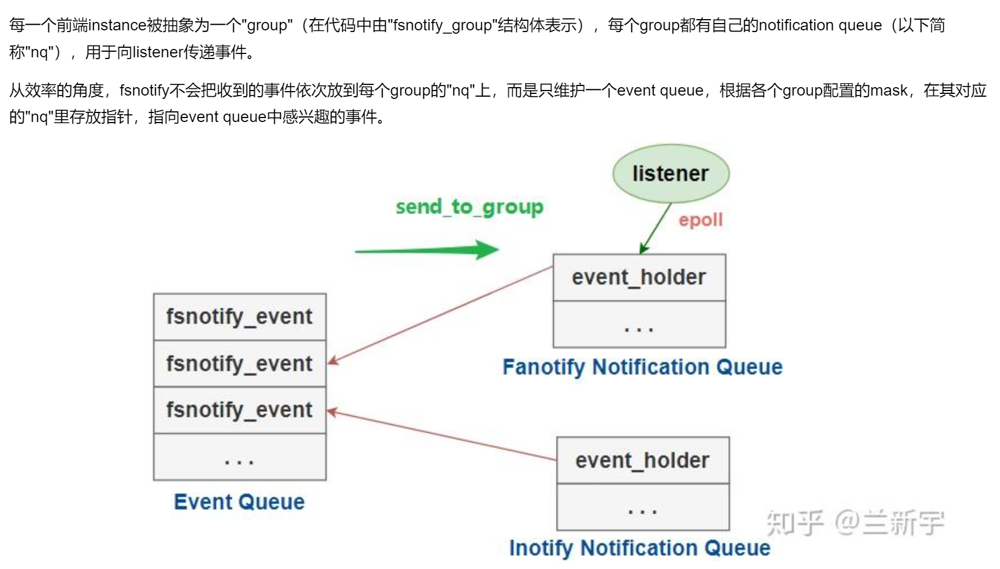

# Linux fanotify代码说明

## 代码说明
参考上一篇github的代码，我们在这里说几个细节。
### FAN_MARK_MOUNT标记
```c
fanotify_mark (fanotify_fd,
                         FAN_MARK_ADD | FAN_MARK_MOUNT,
                         event_mask,
                         AT_FDCWD,
                         path)
```
* FAN_MARK_MOUNT：表示监控path所在的挂载点。对应于前面提过的 per-mount 模式。
* FAN_MARK_IGNORED_MASK：对于global模式，监控所有文件系统的活动。
* FAN_MARK_DIRENT：监控指定目录及其下一级子目录。

例如，在/home/user/desktop/dir1和/home/user/desktop/dir2两个目录，如果使用FAN_MARK_MOUNT标记监控这两个目录（调用两次fanotify_mark），那么，实际上是挂载点（/home）被监控了两次，/home下所有的文件变动都会通知过来。

### EVENT_MAASK注册
在`linux/fanotify.h`头文件中定义了可以监控的事件类型，部分定义如下：
```c
/* the following events that user-space can register for */
#define FAN_ACCESS		0x00000001	/* File was accessed */
#define FAN_MODIFY		0x00000002	/* File was modified */
#define FAN_ATTRIB		0x00000004	/* Metadata changed */
#define FAN_CLOSE_WRITE		0x00000008	/* Writtable file closed */
#define FAN_CLOSE_NOWRITE	0x00000010	/* Unwrittable file closed */
#define FAN_OPEN		0x00000020	/* File was opened */
#define FAN_MOVED_FROM		0x00000040	/* File was moved from X */
#define FAN_MOVED_TO		0x00000080	/* File was moved to Y */
#define FAN_CREATE		0x00000100	/* Subfile was created */
#define FAN_DELETE		0x00000200	/* Subfile was deleted */
#define FAN_DELETE_SELF		0x00000400	/* Self was deleted */
#define FAN_MOVE_SELF		0x00000800	/* Self was moved */
#define FAN_OPEN_EXEC		0x00001000	/* File was opened for exec */
```
注意：部分event不可用，会导致fanotify_mark返回-1，Invalid argument。

在kylin系统上实测，只有`FAN_CLOSE_WRITE | FAN_CLOSE_NOWRITE | FAN_MODIFY | FAN_OPEN`是可以fanotify_mask成功的，其他的event无论是单独使用还是组合使用，都会失败。
```shell
# 内核版本是5.10，是个高版本内核
$ uname -r
5.10.0-8-generic

# 内核开启fanotify功能
$ grep FANOTIFY /boot/config-$(uname -r)
CONFIG_FANOTIFY=y
# CONFIG_FANOTIFY_ACCESS_PERMISSIONS is not set

# 监控的目标文件夹存在，如果不存在会返回-1，No such file or directory。
# root权限运行demo code
```

网上也有人遇到了类似的问题，参考文档：https://stackoverflow.com/questions/59015209/fanotify-problem-with-new-flags-introduced-in-kernel-5-1

stackoverflow的回答也没有解决问题，回答里面只是说提问者用错了demo code。demo code来自man fanotify(7)，相当于官方发布的example。不过，看官方example，它其实有用到多个event。

结论：猜测是内核版本问题，系统内核没有支持某些event特性。

### poll等待事件
github的代码是有监控进程信号，我们可以直接fds[0]=fanotify_fd，只关心fanotify就好了。
```c
    fds[FD_POLL_SIGNAL].fd = signal_fd;
    fds[FD_POLL_SIGNAL].events = POLLIN;
    fds[FD_POLL_FANOTIFY].fd = fanotify_fd;
    fds[FD_POLL_FANOTIFY].events = POLLIN;

    if (poll(fds, FD_POLL_MAX, -1) < 0)
        {
            fprintf(stderr,
                    "Couldn't poll(): '%s'\n",
                    strerror(errno));
            exit(EXIT_FAILURE);
        }
```

### metadata结构
* fd：是文件句柄，可以获取到文件路径（/proc/self/fd/%d）。
* pid：进程pid，可以获取到进程信息（/proc/%d/cmdline），也就是谁操作了文件。
```c
struct fanotify_event_metadata {
	__u32 event_len;
	__u8 vers;
	__u8 reserved;
	__u16 metadata_len;
	__aligned_u64 mask;
	__s32 fd;
	__s32 pid;
};
```

### 监控实现细节
我们在用fanotify监控多个目录时，需要注意去重。

前面提到了，我们监控的实际是目录所在的挂载点，如果业务侧分别监控了/home/user/desktop/dir1和/home/user/desktop/dir2，那么，/home实际被监听了两次，这会导致一个事件通知多次。因此，我们需要判断一下，dir1和dir2都是一个挂载点，所以，只有fanotify监控一次即可。

同时，fanotify实际会把/home下所有的事件都通知出来，所以，我们还需要区分一下，哪些事件才是可以通知给dir1的，哪些事件是要通知给dir2的。不然，大量无关的文件操作都被通知出去了。


我们以`FAN_MARK_MOUNT`方式监控了一个目录，那么，只有该目录下的文件（及其子目录，递归）变动会通知过来。也就是说，监控了哪个目录，此目录就相当于挂载点，此目录下的所有变化都能收到。

同时，如果我们用一个`fd=fanotify_init(...)`监控/home/user/desktop和/home/user/desktop/dir两个目录，那么，当dir或其子目录下有文件变化时，我们只会收到一次通知，不会说监控了两次就收到两次通知。没有弄清楚这里的实现细节，大概猜测，可能如下图，fanotify将文件变动插入EventQueue，再通知给fanotify_mask的挂载点，一个EventQueue元素，只通知fd的一个mask。

  


在fanotify中，这是通过listener对文件设置ignore mask来实现的。在同一文件系统内，重命名或移动文件不会改变文件的inode编号，因此其对应的cache entry依然有效。但如果文件的内容发生变化，或者被删除，抑或是移动到了另一文件系统，entry都将会失效。