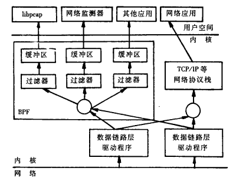

# Linux流量监控

## Libpcap简介　
Libpcap是Packet Capture Libray的英文缩写，即数据包捕获函数库。该库提供的C函数接口用于捕捉经过指定网络接口的数据包，该接口应该是被设为混杂模式。这个在原始套接子中有提到。

著名的软件TCPDUMP就是在Libpcap的基础上开发而成的。Libpcap提供的接口函数实现和封装了与数据包截获有关的过程。

Libpcap提供了用户级别的网络数据包捕获接口，并充分考虑到应用程序的可移植性。Libpcap可以在绝大多数Linux平台上运行。在Windows平台上，也有一款与其功能类似的开发库：Wincap。

它的工作在上层应用程序与网络接口之间。主要功能：
* 数据包捕获：捕获流经网卡的原始数据包
* 自定义数据包发送：构造任何格式的原始数据包
* 流量采集与统计：采集网络中的流量信息
* 规则过滤：提供自带规则过滤功能，按需要选择过滤规则

它的应用范围非常广泛，典型应用包括玩罗协议分析器，网络流量发生器，网络入侵检测系统，网络扫描器和其他安全工具。

## Libpcap安装
源码地址：https://www.tcpdump.org/release/
```shell
sudo apt-get update
sudo apt-get install libpcap-dev
```

还有一个c++封装的库：PcapPlusPlus，需要源码安装。
```
git clone https://github.com/seladb/PcapPlusPlus.git
```

当完成了安装以后，可以用一个简单的demo来验证。
```c
#include <stdio.h>
#include <pcap.h>

int main() {
    char errbuf[PCAP_ERRBUF_SIZE];
    char *dev = pcap_lookupdev(errbuf);

    if (dev == NULL) {
        printf("Device not found: %s\n", errbuf);
        return 1;
    }

    printf("Monitoring device: %s\n", dev);

    pcap_t *handle = pcap_open_live(dev, BUFSIZ, 1, 1000, errbuf);

    if (handle == NULL) {
        printf("Error opening device: %s\n", errbuf);
        return 1;
    }

    struct pcap_pkthdr header;
    const u_char *packet;

    while (1) {
        packet = pcap_next(handle, &header);
        printf("Received packet of length %d\n", header.len);
    }

    pcap_close(handle);

    return 0;
}
```

## Libpcap原理
作为捕捉网络数据包的库，它是一个独立于系统的用户级的API接口，为底层网络检测提供了一个可移植的框架。

一个包的捕捉分为三个主要部分，包括面向底层包捕获、面向中间层的数据包过滤和面向应用层的用户接口。这与Linux操作系统对数据包的处理流程是相同的（网卡->网卡驱动->数据链路层->IP层->传输层->应用程序）。包捕获机制是在数据链路层增加一个旁路处理（并不干扰系统自身的网络协议栈的处理），对发送和接收的数据包通过Linux内核做过滤和缓冲处理，最后直接传递给上层应用程序。

Libpcap 主要由两部份组成：网络分接头(Network Tap)和数据过滤器(Packet Filter)。网络分接头从网络设备驱动程序中收集数据拷贝，过滤器决定是否接收该数据包。Libpcap利用BSD Packet Filter(BPF)算法对网卡接收到的链路层数据包进行过滤。BPF算法的基本思想是在有BPF监听的网络中，网卡驱动将接收到的数据包复制一份交给BPF过滤器，过滤器根据用户定义的规则决定是否接收此数据包以及需要拷贝该数据包的那些内容，然后将过滤后的数据给与过滤器相关联的上层应用程序。BPF的架构如图所示：

  

Libpcap 的包捕获机制就是在数据链路层加一个旁路处理。当一个数据包到达网络接口时，Libpcap 首先利用已经创建的Socket从链路层驱动程序中获得该数据包的拷贝，再通过Tap函数将数据包发给BPF过滤器。BPF过滤器根据用户已经定义好的过 滤规则对数据包进行逐一匹配，匹配成功则放入内核缓冲区，并传递给用户缓冲区，匹配失败则直接丢弃。如果没有设置过滤规则，所有数据包都将放入内核缓冲区，并传递给用户层缓冲区。

## Libpcap的抓包流程
1. 查找网络设备：目的是发现可用的网卡，实现的函数为pcap_lookupdev()，如果当前有多个网卡，函数就会返回一个网络设备名的指针列表。
2. 打开网络设备：利用上一步中的返回值，可以决定使用哪个网卡，通过函数pcap_open_live()打开网卡，返回用于捕捉网络数据包的秒数字。
3. 获得网络参数：这里是利用函数pcap_lookupnet()，可以获得指定网络设备的IP地址和子网掩码。
4. 编译过滤策略：Lipcap的主要功能就是提供数据包的过滤，函数pcap_compile()来实现。
5. 设置过滤器：在上一步的基础上利用pcap_setfilter()函数来设置。
6. 利用回调函数，捕获数据包：函数pcap_loop()和pcap_dispatch()来抓去数据包，也可以利用函数pcap_next()和pcap_next_ex()来完成同样的工作。
7. 关闭网络设备：pcap_close()函数关系设备，释放资源。

## 分析数据包
libpcap是数据链路层的旁路监听，也就是说libpcap接收到的是二层数据包，对数据报文的解析，要从二层开始解析。

## 过滤数据包
libpcap利用BPF来过滤数据包。过滤数据包需要完成3件事：
1. 构造一个过滤表达式
2. 编译这个表达式
3. 应用这个过滤器

### 构造过滤表达式
Lipcap已经把BPF语言封装成为了更高级更容易的语法了。
```
// TCP 建立连接
捕获 SYN 报文：tcp[tcpflags] & (tcp-syn) != 0
捕获 SYN-ACK 报文：tcp[tcpflags] & (tcp-syn|tcp-ack) == (tcp-syn|tcp-ack)
捕获 ACK 报文：tcp[tcpflags] & (tcp-ack) != 0

//选择只接受某个IP地址的数据包
src host 127.0.0.1

//选择只接受TCP/UDP的目的端口是80的数据包
dst port 8000

//不接受TCP数据包
not tcp

//只接受SYN标志位置（TCP首部开始的第13个字节）且目标端口号是22或23的数据包
tcp[13]==0x02 and (dst port ** or dst port **)

//只接受icmp的ping请求和ping响应的数据包
icmp[icmptype]==icmp-echoreply or icmp[icmptype]==icmp-echo

//只接受以太网MAC地址为00：00：00：00：00：00的数据包
ehter dst 00:00:00:00:00:00

//只接受ip的ttl=5的数据包（ip首位第八的字节为ttl）
ip[8]==5
```

### 编译过滤表达式
构造完过滤表达式后，就可以使用pcap_compile()函数来编译。
```
int pcap_compile(pcap_t * p, struct bpf_program * fp, char * str, int optimize, bpf_u_int32 netmask)
//fp：这是一个传出参数，存放编译后的bpf
//str：过滤表达式
//optimize：是否需要优化过滤表达式
//metmask：简单设置为0即可
```

### 应用过滤过滤器
最后通过函数pcap_setfilter()来设置这个规则。
```
int pcap_setfilter(pcap_t * p,  struct bpf_program * fp)
//参数fp就是pcap_compile()的第二个参数，存放编译后的bpf
```

## 过滤示例
举例：

可以在抓包前，也就是pcap_next()或pcap_loop之前，加入下面的代码：
```c
//design filter  
struct bpf_program filter;  
pcap_compile(device, &filter, "dst port 80", 1, 0);  //只接受80端口的TCP/UDP数据包
pcap_setfilter(device, &filter); 
```
