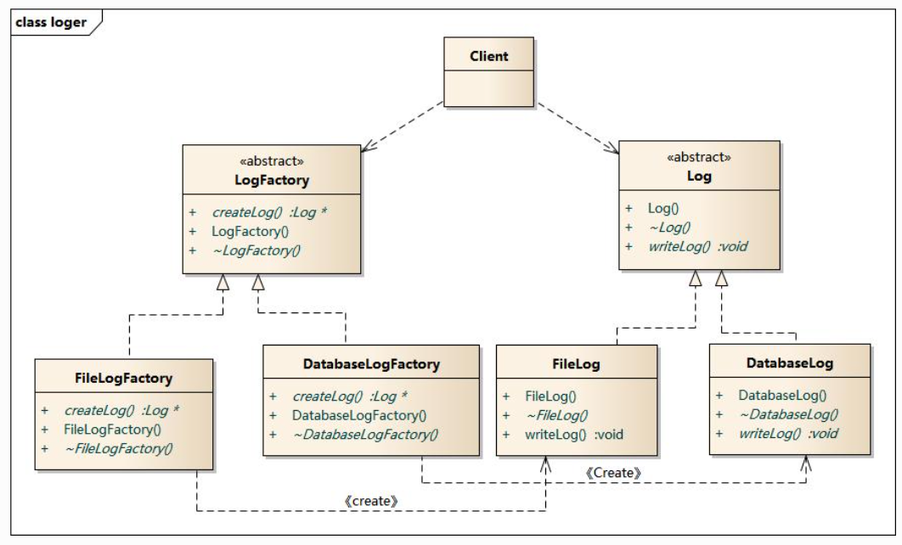

# 工厂模式-工厂方法

  

## 模式定义
工厂方法模式(Factory Method Pattern)又称为工厂模式，也叫虚拟构造器(Virtual Constructor)模式或者多态工厂(Polymorphic Factory)模式，它属于类创建型模式。在工厂方法模式中，工厂父类负责定义创建产品对象的公共接口，而工厂子类则负责生成具体的产品对象，这样做的目的是将产品类的实例化操作延迟到工厂子类中完成，即通过工厂子类来确定究竟应该实例化哪一个具体产品类。

## 模式分析
工厂方法模式是简单工厂模式的进一步抽象和推广。由于使用了面向对象的多态性，工厂方法模式保持了简单工厂模式的优点，而且克服了它的缺点。在工厂方法模式中，核心的工厂类不再负责所有产品的创建，而是将具体创建工作交给子类去做。这个核心类仅仅负责给出具体工厂必须实现的接口，而不负责哪一个产品类被实例化这种细节，这使得工厂方法模式可以允许系统在不修改工厂角色的情况下引进新产品。

## 结论
工厂方法是对简单工厂的扩展改进。

简单工厂的核心逻辑集中在工厂中，每次改动都要修改工厂的创建过程，因此，工厂方法就是把工厂也继承了一次，每个产品的具体的创建由子类工厂负责，这样，当有新增的产品时，不用再改工厂类，我们可以新增一个子类工厂，这样就不用修改老代码，符合开闭原则。这么做的一个缺点就是代码冗余扩张太快，每个产品都要一个子类工厂对应。