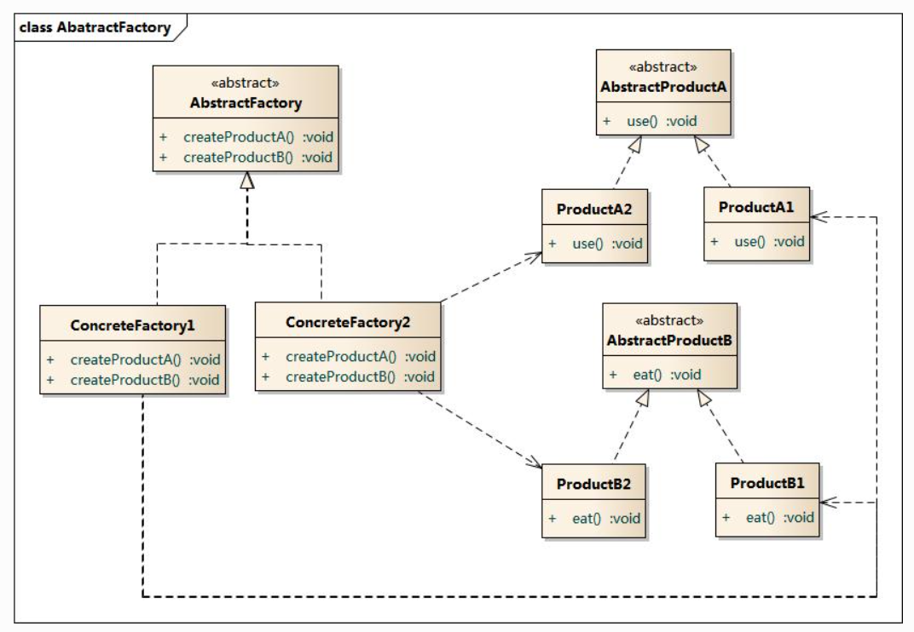

# 工厂模式-抽象工厂

  

前面的两种工厂模式，每个工厂都是创建一种产品，但是，产品可能是多种类型的。比如，我想生产电视，那么一个工厂专门生产电视，有海信电视，有创维电视。但是，海信还可以生产冰箱，创维也可以生产冰箱，一个公司生产多种产品也是很合理的。此时，公司和产品已经交叉关联起来了。

如果我想同时生产（海信电视和海信冰箱），（海信电视和创维冰箱），那么，我们需要改造工厂，让工厂能够同时生产两种产品，这样我们就得到了抽象工厂模式。

在上面的图中，每个工厂都可以生产两种产品，海信和创维，电视和冰箱，这两组排列组合，就需要多个子类工厂来对应。

抽象工厂的缺点是产品种类多扩展性。比如，除了电视和冰箱，我还想再生产空调，此时，工厂类需要新增一个接口创建空调，那么，之前已经存在的子类工厂都要修改，它们也要支持新的类型空调。这个影响面就很大了。

抽象工厂的优点是公司的扩展很方便，如果要新增格力公司，那么，电视下面派生一个格力电视，冰箱下面派生一个格力冰箱，对应的，再新增子类工厂就可以了，这就很符合开闭原则。
