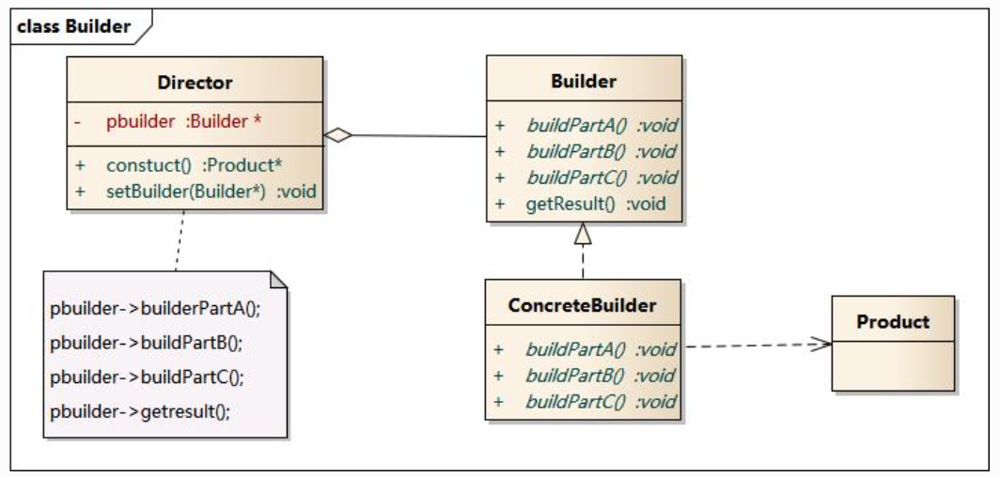

# 建设者模式

  

## 模式定义
造者模式(Builder Pattern)：将一个复杂对象的构建与它的表示分离，使得同样的构建过程可以创建不同的表示。

建造者模式是一步一步创建一个复杂的对象，它允许用户只通过指定复杂对象的类型和内容就可以构建它们，用户不需要知道内部的具体构建细节。建造者模式属于对象创建型模式。根据中文翻译的不同，建造者模式又可以称为生成器模式。

## 结论
没想到这也算个设计模式，这个思路就是把一个复杂的生产过程封装到了builder里面。一个产品的生产可能有很多步骤，步骤前后还有依赖关系，那么，不要把这些步骤暴露出来，把细节封装到Builder里面。对于业务侧（上图的Director）来说，它通过setBuilder拿到具体的ConcreteBuilder，然后就可以创建Product了。
