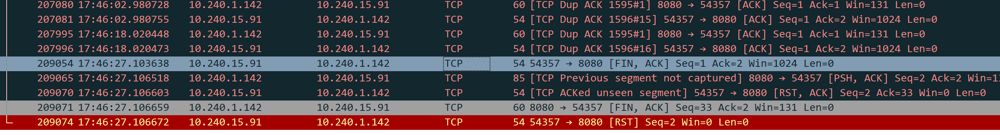
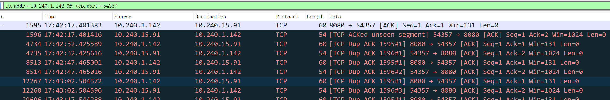
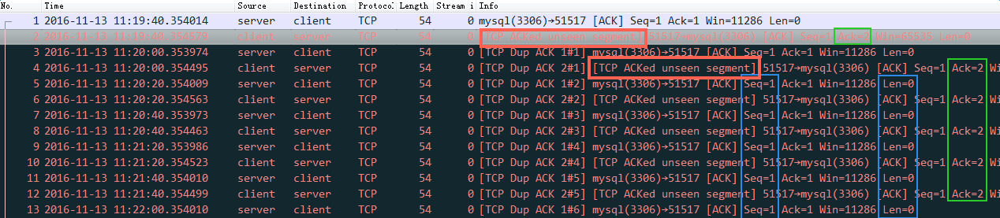
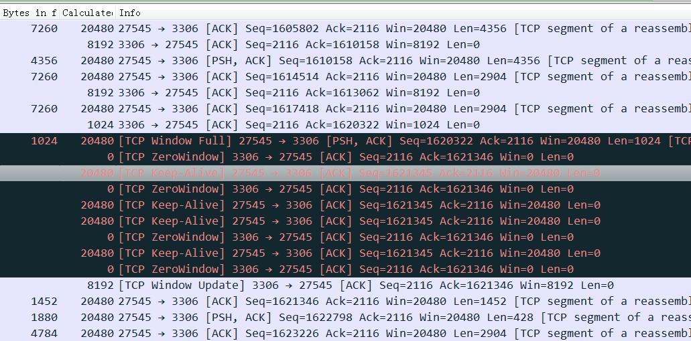
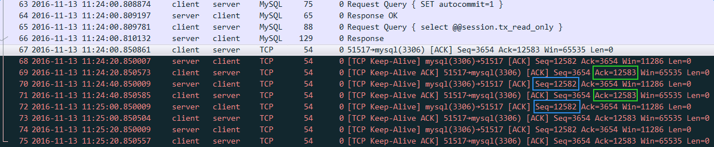

# 背景
tcp recv error，错误码10054。

# 现象
1. 日志显示，tcp recv的时候失败了，错误码是10054，表示对端关闭了链接。
2. 有一份对应wireshark抓包记录，我们看到是客户端主动发了fin。
  
3. 同时，在这个tcp链路上，有大量的tcp dup ack。
  
4. 看时间戳，客户端recv 10054和客户端发fin包的时间是能对上的。

# 分析
参考网上的文章，其对wireshark显示大量的dup ack进行了解释。  

## 网上文章
### 现象
在wireshark中看到一个tcp会话中的两台机器突然一直互相发dup ack包，但是没有触发重传。每次重复ack都是间隔精确的20秒。  
  

client都一直在回复收到2号包（ack=2）了，可是server跟傻了一样居然还发seq=1的包（按理，应该发比2大的包啊）。

### 系统配置
net.ipv4.tcp_keepalive_time = 20
net.ipv4.tcp_keepalive_probes = 5
net.ipv4.tcp_keepalive_intvl = 3

### 原因
抓包不全的话wireshark有缺陷，把keepalive包识别成了dup ack包，看内容这种dup ack和keepalive似乎是一样的，flags都是0x010。keep alive的定义的是后退一格(seq少1）。

2、4、6、8……号包，都有一个“tcp acked unseen segment”。这个一般表示它ack的这个包，没有被抓到。Wirshark如何作出此判断呢？前面一个包是seq=1, len=0，所以正常情况下是ack = seq + len = 1，然而Wireshark看到的确是ack = 2, 它只能判断有一个seq =1, len = 1的包没有抓到。
dup ack也是类似道理，这些包完全符合dup ack的定义，因为“ack = ” 某个数连续多次出现了。

这一切都是因为keep alive的特殊性导致的。打开66号包的tcp层（见后面的截图），可以看到它的 next sequence number = 12583，表示正常情况下server发出的下一个包应该是seq = 12583。可是在下一个包，也就是68号包中，却是seq = 12582。keep alive的定义的确是这样，即后退一格。
Wireshark只有在抓到数据包（66号包）和keep alive包的情况下才有可能正确识别，前面的抓包中恰好在keep alive之前丢失了数据包，所以Wireshark就蒙了。

如果用“frame.number >= 68” 过滤这个包，然后File–>export specified packets保存成一个新文件，再打开那个新文件，就会发现Wireshark又蒙了。本来能够正常识别的keep alive包又被错看成dup ack了，所以一旦碰到这种情况不要慌要稳。

### Keepalive
TCP报文接收方必须回复的场景：  
* TCP携带字节数据
* 没有字节数据，携带SYN状态位
* 没有字节数据，携带FIN状态位

keepalive 提取历史发送的最后一个字节，充当心跳字节数据，依然使用该字节的最初序列号。也就是前面所说的seq回退了一个

对方收到后因为seq小于TCP滑动窗口的左侧，被判定为duplicated数据包，然后扔掉了，并回复一个duplicated ack

所以keepalive跟duplicated本质是一回事，就看wireshark能够正确识别了。

### Duplication ack
server收到了3和8号包，但是没有收到中间的4/5/6/7，那么server就会ack 3，如果client还是继续发8/9号包，那么server会继续发dup ack 3#1 ; dup ack 3#2 来向客户端说明只收到了3号包，不要着急发后面的大包，把4/5/6/7给我发过来。

### TCP Window Update
  

如上图，当接收方的tcp Window Size不足一个MSS的时候，为了避免 Silly Window Syndrome，Client不再发小包，而是发送探测包（跟keepalive一样，发一个回退一格的包，触发server ack同时server ack的时候会带过来新的window size）探测包间隔时间是200/400/800/1600……ms这样。

### 正常的keep-alive Case
  

keep-alive 通过发一个比实际seq小1的包，比如server都已经 ack 12583了，client故意发一个seq 12582来标识这是一个keep-Alive包。