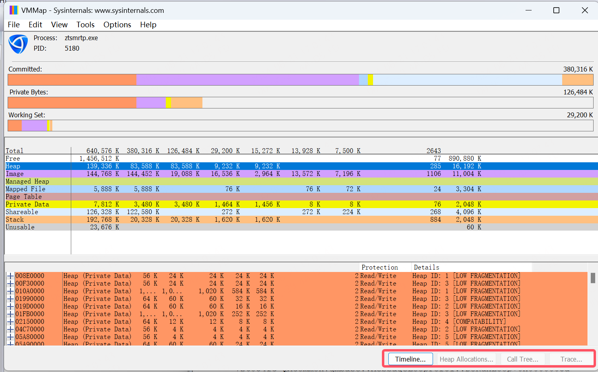

# win内存泄露vmmap

vmmap可以分析一个进程的内存分布，每种类型的内存占了多大。当发生内存泄露时，可以协助定位是什么内存在泄露。

  

vmmap有两种用法。

## vmmap运行进程
通过vmmap启动目标进程，vmmap会定时抓取内存快照，同时，右下角的那几个btn是可以点击的，可以看到调用栈。

不过，这种方法有一个问题，vmmap运行一段时间以后，内存不足会自动退出，所以，这种工具适合短时间内大量内存泄露的场景，如果是小场景的泄露，工具可能先退了。

## vmmap抓快照
相比于前面的方法，vmmap可以打开某个pid，然后，手动Refresh抓取一次快照，多次手动抓取快照，可以在右下角的Timeline看到内存变化情况。

## 总结
目前属于辅助分析，没有单纯靠vmmap定位到内存泄露。