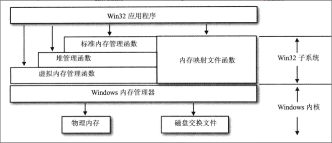

# win内存泄露windbg

进程的内存泄露有两种，一个是heap leak，一个是virtual memory leak。大体上来说，
* new/malloc是从“标准内存管理器”上分配内存，也就是crt堆。
* HeapAlloc是直接在“堆管理器”上申请内存。
* VirtualAlloc是直接从“虚拟内存管理器”上申请内存。

因此，今天我们遇到的问题的 heap mem leak，也就是通过new/malloc/HeapAlloc的内存泄露问题。  
Virtual mem leak还没有遇到过，理论上可以通过etw来分析。

  

## 分析步骤
### 确定heap内存泄露
通过procexp看PrivateBytes大小。

通过vmmap看具体的内存分布，先确认是heap内存在增长，增长的幅度和总内存（private bytes）增长相当。

### 分析dmp
多次抓取dmp，看heap差异，是哪个堆块的内存在增长。

```shell
## 我们重点解释第二个dmp文件。
## 查看堆统计信息
0:000> !heap -s
  Heap     Flags   Reserv  Commit  Virt   Free  List   UCR  Virt  Lock  Fast 
                    (k)     (k)    (k)     (k) length      blocks cont. heap 
-----------------------------------------------------------------------------
0d7b0000 08000002   16420  14416  16364    361   283     5    0      4   LFH
0df00000 08001002    1136    124   1080     12    10     2    0      0   LFH
0f6c0000 08001002   47836  26644  47780   3729   346    30    3     22   LFH
    External fragmentation  14 % (346 free blocks)
10f90000 08001002     116     44     60      5     6     1    0      0   LFH
1bc10000 08001002    1080    136   1080    129     3     2    0      0      
1e7d0000 08001002      60     32     60     16     2     1    0      0      
1dae0000 08001002     116     64     60     21     8     1    0      3   LFH
-----------------------------------------------------------------------------


## 对比第一个dmp，我们看到 0d7b0000 堆块的大小增长明显。
## 0d7b0000 08000002   16420  11556  16364    495   249     5    0      2   LFH

## 看0d7b0000堆的分布
0:000> !heap -stat -h 0d7b0000 
 heap @ 0d7b0000
group-by: TOTSIZE max-display: 20
    size     #blocks     total     ( %) (percent of total busy bytes)
    30 e793 - 2b6b90  (32.13)
    40 54f7 - 153dc0  (15.72)
    54510 3 - fcf30  (11.70)
    20 68ea - d1d40  (9.70)
    60 e40 - 55800  (3.95)

## 同样的，对比一下第一个dmp，我们看到是size=30bytes的内存块增长了很多，现在是分配了e793次。

## 过滤堆块，s是size的意思，30是上面的30bytes。
0:000> !heap -flt s 30
    _HEAP @ d7b0000
      HEAP_ENTRY Size Prev Flags    UserPtr UserSize - state
        1a949568 0009 0009  [00]   1a949580    00030 - (busy)
          Plugin!ATL::g_strmgr
        1a9495b0 0009 0009  [00]   1a9495c8    00030 - (busy)
          Plugin!ATL::g_strmgr
        1a9495f8 0009 0009  [00]   1a949610    00030 - (busy)
          Plugin!ATL::g_strmgr
        1a949640 0009 0009  [00]   1a949658    00030 - (busy)
          Plugin!ATL::g_strmgr
        1a949688 0009 0009  [00]   1a9496a0    00030 - (busy)

## 由于30分配了e793次，所以，可以提前按break停止打印，否则信息太多。
## 上面显示了部分结果。
## 我们再继续看单个堆块的信息
0:000> !heap -p -a 1a949568
    address 1a949568 found in
    _HEAP @ d7b0000
      HEAP_ENTRY Size Prev Flags    UserPtr UserSize - state
        1a949568 0009 0000  [00]   1a949580    00030 - (busy)
          Plugin!ATL::g_strmgr
        7711e236 ntdll!RtlpCallInterceptRoutine+0x00000028
        7708d69e ntdll!RtlpAllocateHeapInternal+0x0000102e
        7708c65e ntdll!RtlAllocateHeap+0x0000003e
        6fdc6b4c Plugin!ATL::CWin32Heap::Allocate+0x0000000f
        6fcd63af Plugin!ATL::CSimpleStringT<wchar_t,0>::Fork+0x00000028
        6fcd6204 Plugin!ATL::CSimpleStringT<wchar_t,0>::operator=+0x0000000e

        6fd7199b Plugin!CCommonCfg::ParseBaseInfo+0x0000000f
        6fd713cc Plugin!CCommonCfg::Parse+0x0000019b

## 这下就看到具体的函数调用栈了。再结合代码，就可以分析到了。
0:000> ln 6fd7199b 
 [e:\config\commonadcfg.cpp @ 679] (6fd7198c)   Plugin!CCommonCfg::ParseBaseInfo+0xf   |  (6fd71a10)   Plugin!CCommonCfg::CalcFileMd5
```