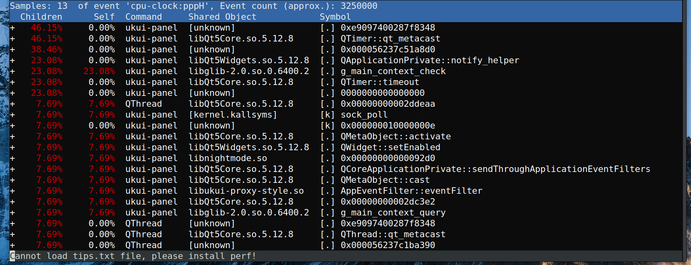

# 高CPU占用-perf工具分析

## perf安装
Linux内核集成了perf工具，可用于探测内核性能事件、硬件性能计数器以及用户级应用程序性能事件。

可以通过以下命令行安装。

对于基于Debian的系统（如Ubuntu），你可以使用apt-get命令来安装。
```shell
sudo apt-get update
sudo apt-get install linux-tools-common linux-tools-generic linux-tools-`uname -r`
```
对于基于Red Hat的系统（如CentOS或Fedora），你可以使用yum或dnf命令来安装perf：
```shell
sudo yum install perf  # 或者 sudo dnf install perf
```

## perf使用
先采集，后分析。

record 是 perf 的一个子命令，用于记录程序的性能事件。这些事件可以包括CPU周期、缓存命中/未命中、分支预测错误等等。

-g 是 perf record 的一个选项，用于启用调用图（call-graph）记录。这意味着 perf 不仅会记录哪些事件发生了，还会记录这些事件是在哪个函数中发生的，以及这个函数是由哪个函数调用的。这对于理解程序的行为和性能瓶颈非常有帮助。

### 系统卡顿分析
perf record -g 命令默认情况下是针对整个系统进行性能事件的记录，包括所有的进程和内核。这意味着它会记录所有进程的CPU消耗，以及这些消耗的调用关系。
```shell
# 开始采集
$ perf record -g

# 等待一段时间以后ctrl+c退出
# 默认会在执行命令路径下生成perf.data文件

# 分析结果
$ perf report
```

### pid卡顿分析
加上pid，就是针对某个进程的分析。
```shell
$ ps -ef | grep xxx

# 开始采集
$ perf record -g -p 1234

# 等待一段时间以后ctrl+c退出

# 分析结果
$ perf report -i perf.data
```

### 进程卡顿分析
运行某个进程并分析卡顿。
```shell
# 开始采集
$ perf record -g -- /path/to/myprogram

# 等待一段时间以后ctrl+c退出

# 分析结果
$ perf report -i perf.data
```

### 执行某个命令的分析
```shell
# 执行ls并记录
$ perf record ls -g

# 分析结果
$ perf report
```

## perf分析
perf report会生成一个报告图，可以看到每个函数调用执行时间的占比。

perf report命令的输出包含以下五列：
1. Children：这一列显示了子函数（包括当前函数）在所有采样中所占的百分比。换句话说，它表示了当前函数及其所有子函数的执行时间占总执行时间的百分比。
2. Self：这一列显示了当前函数在所有采样中所占的百分比。换句话说，它表示了当前函数自身的执行时间占总执行时间的百分比。
3. Command：这一列显示了执行的命令或程序的名称。
4. Shared Object：这一列显示了相关的共享对象或库。这通常是包含当前函数的二进制文件的名称。
5. Symbol：这一列显示了函数的名称或者如果无法解析函数名称，则显示函数的地址。
6. [k] 表示内核符号。
7. [.] 表示当前进程的符号。

我们随便看一个进程，例如，/usr/bin/ukui-panel，其pid是2099。
  

如果我们有pdb，把pdb放到二进制所在的目录，perf会自动加载pdb，有pdb对于我们分析问题会有很大帮助。在缺乏pdb的时候，大部分的调用都是系统调用了，不一定能发现问题在哪里。