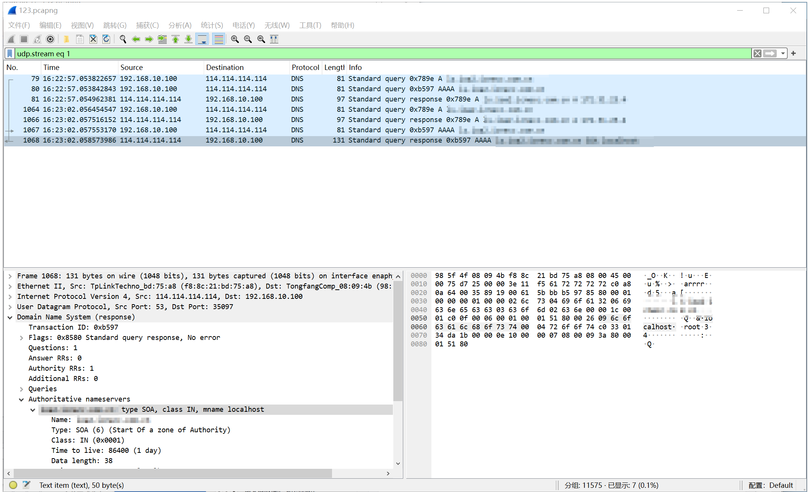
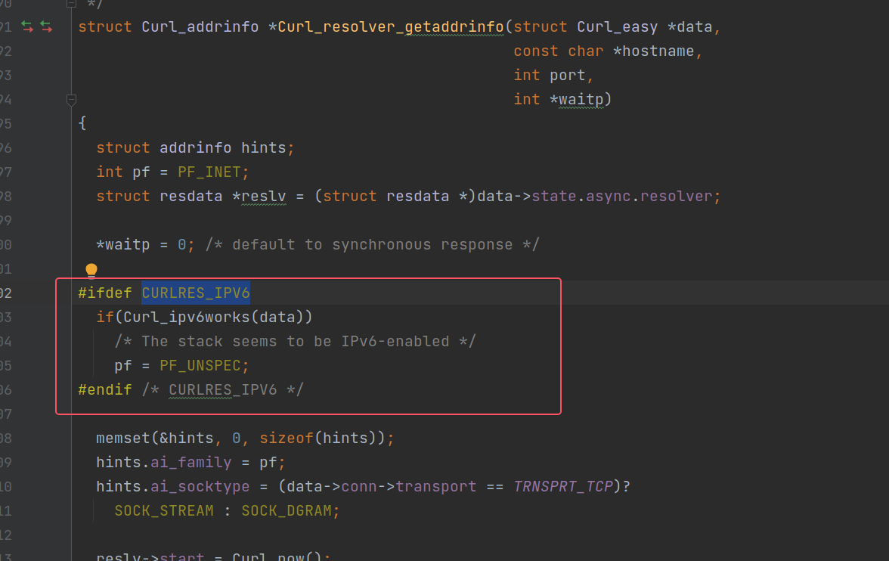
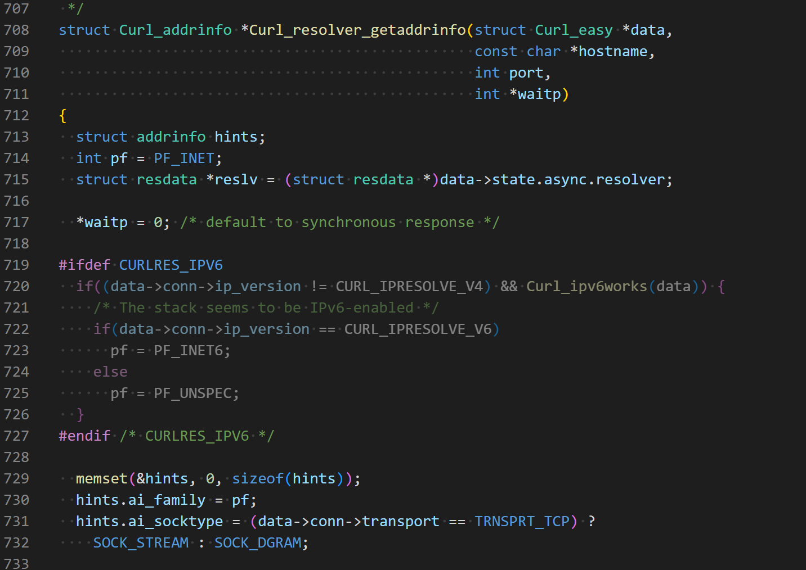

# Linux上dns超时

## 现象
在Linux系统上，客户端访问后台业务失败了，libcurl的错误是：response error code: 8, msg: Resolving timed out after 5000 milliseconds。

## 排查第一阶段
网络环境和系统环境排查，这些是基础操作。
1. nslookup检查域名解析。
2. time nslookup检查域名解析耗时。
3. /etc/resolv.conf文件，看配置是否正常。
4. curl -k -v https://www.baidu.com，看看curl命令行是否ok。
5. ping检查网络连通性。

这些基础操作，如果遇到了异常，那么考虑重置网卡`sudo systemctl restart NetworkManager`，看能否恢复，或者，这个问题就是网络环境问题。

## 异常跟进阶段1
在上面基础排查以后，发现基础环境都是正常的，curl命令行是可以正常访问的，但是，我们的客户端进程就是不行。

现在就只能wireshark抓包了。过滤dns协议，然后，追踪一个dns解析流。
  

我们可以仔细观察，发现A请求和应答很快，AAAA请求的应答会很慢。具体来说No80是AAAA query，但是，No1067又发送了一次AAAA query，然后，No1068才收到了AAAA response。并且，这个response是type SOA，表示dns服务器的信息。

我们注意到No80和No1067的间隔是5s，这个时间是NetworkManager默认dns超时时间。所以，我们猜测是dns服务器没有应答AAAA请求，所以，5秒超时以后系统又发了一次AAAA query，然后直接填充了SOA作为应答。

阶段1结论：我们有抓包证明dns服务器有异常，就先跟到这里，让客户去确认dns服务器了。

## 异常跟进阶段2
隔了一段时间，在另一个机器上又遇到了类似的现象。此时，我们试图去解决一下问题。

1. 禁用系统ipv6

Linux系统上`/etc/sysctl.conf`配置文件可以禁用ipv6，但是，禁用了ipv6以后还是不行。
```
sudo vim /etc/sysctl.conf

# 在文件末尾添加以下行：
net.ipv6.conf.all.disable_ipv6 = 1
net.ipv6.conf.default.disable_ipv6 = 1
net.ipv6.conf.lo.disable_ipv6 = 1

# 应用更改
sudo sysctl -p
```

我们以为禁用了ipv6就能解决问题，但是发现不行，这是因为系统设置影响的是数据收发，影响不到dns协议。

2. libcurl设置ipv4

我们知道libcurl是能设置ipv4和ipv6的，我们想试试通过设置ipv4能否解决问题。因为，dns超时的原因是ipv4应答出问题了，那么，我们指定了ipv4，只有ipv query，那就不会超时了。

代码很简单，就一行。

`curl_easy_setopt(curl_->handle, CURLOPT_IPRESOLVE, CURL_IPRESOLVE_V4);`

但是，我们抓包去看，发现dns里面依旧有AAAA query。很尴尬，难道libcurl的实现跟上面禁用ipv6的效果类似？都是 影响数据收发，而不是dns？

3. curl命令行验证

我们用系统自带的curl命令行再试试，`curl -k -v -4 https://www.baidu.com`，`-4`表示ipv4，结果，我们发现抓包只有dns A query。

尴尬，系统的curl命令行ok，但是，我们libcurl代码不符合预期。

4. 看libcurl源码

我们使用的是v7.80.0版本，我们切换到对应tag下去，搜索dns解析的代码。其调用顺序大概如下：
```
// url.c
resolve_server
	rc = Curl_resolv_timeout()
		rc = Curl_resolv(data, hostname, port, TRUE, entry)
			addr = Curl_getaddrinfo(data, hostname, port, &respwait);
				Curl_resolver_getaddrinfo(data, hostname, port, waitp);
					pf = PF_UNSPEC; // 在没有显示设置CURLOPT_IPRESOLVE的情况下
					hints.ai_family = pf;
					hints.ai_socktype = (data->conn->transport == TRNSPRT_TCP) ?
						SOCK_STREAM : SOCK_DGRAM;
						
					init_resolve_thread(data, hostname, port, &hints)
						init_thread_sync_data(td, hostname, port, hints)
							Curl_thread_create(getaddrinfo_thread, &td->tsd)
							|
							getaddrinfo_thread
								rc = Curl_getaddrinfo_ex(tsd->hostname, service, &tsd->hints, &tsd->res);
									error = getaddrinfo(nodename, servname, hints, &aihead);

// 关键代码
https://github.com/curl/curl/blob/curl-7_68_0/lib/asyn-thread.c#L733
```
关键代码在`Curl_resolver_getaddrinfo`中，如下图。
  

在这个代码图片中，我们看到如果define CURLRES_IPV6，那么，就直接将`pf = PF_UNSPEC;`，随后，hints就拿到了PF_UNSPEC然后调用到getaddrinfo去做了dns解析。在Linux系统上，getaddrinfo就会同时发起ipv4和ipv6请求。

我们对比一下master版本的代码，如下图。
  

在master代码中，会先判断`data->conn->ip_version`，这个字段就是来自`CURLOPT_IPRESOLVE`的set设置。所以，master代码是能响应到ipv4设置的。我们更新了libcurl版本，再试一下，这回wireshark只能抓到A query了。

5. 再继续确认系统curl
我们前面说了，是由于系统curl的效果跟libcurl代码不一样，我们才会翻看了libcurl源码。那么，系统curl命令行是什么原因呢？

系统curl命令行是v7.68.0，我们去看这个tag的源码，其实现也是ok的。那就解释了现象。

6. 再对比win
我们再检查了win libcurl，发现也是同一个版本v7.80，那么，win会怎么样呢？我们发现wireshark在win上抓不到AAAA query。

我们再继续，我们写了一个demo去直接调用getaddrinfo，传入AF_UNSPEC，我们发现，依旧只有A query，没有AAAA query。为了确保我们的检查环境，查看了网卡的ipv6设置，是开启状态。

同样的demo getaddrinfo代码，我们在Linux上，AF_UNSPEC就会同时发起A和AAAA query。

那么，这就是 系统内核的网络库实现差异了。