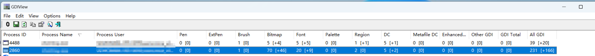

# win-GDI泄露定位

一个UI进程，连续运行一段时间以后，如果偶现图片显示异常，任务栏图标异常，托盘ico异常，那么，可能是GDI泄露导致资源不足。

## 确定是否有泄露
1. 任务管理器：查看gdi句柄数量。
2. GDIView：win平台的一个工具，可以查看应用层的GDI句柄详情。

如下是GDIView的示例图。

我们可以看到每个类型的句柄数量，同时，在末尾还有句柄总数。需要说明的是总数不等于前面各个类型的句柄数量之和，这是因为有内核GDI资源，这些资源在应用层是无法扫描到的。

我们看是否有泄露，主要是看总数是否持续增长。
  


## 泄露定位
参考文章： https://www.duidaima.com/Group/Topic/ASP.NET/13504

参考文章，主要使用windbg分析gdi泄露。目前仅成功分析了bitmap类型的资源泄露。
### 下断点
GDI的逻辑是封装在gdi32.dll中，我们在gdi32中下断点，监控bitmap资源的创建。
```
# 模糊断点，监控所有位图资源的创建。
0:077> bm gdi32!*CreateBitmap*
  1: 75c05e87          @!"GDI32!IsCreateBitmapIndirectPresent"
  2: 75c05330          @!"GDI32!NtGdiCreateBitmapFromDxSurface2"
  3: 75c05340          @!"GDI32!NtGdiCreateBitmapFromDxSurface"
  4: 75c04c60          @!"GDI32!CreateBitmapStub"
  5: 75c07850          @!"GDI32!EngCreateBitmap"
  6: 75c0783c          @!"GDI32!_imp_load__EngCreateBitmap"
  7: 75c0b650          @!"GDI32!CreateBitmapIndirectStub"
  8: 75c05f7d          @!"GDI32!_imp_load__CreateBitmapIndirect"
  9: 75c05f6d          @!"GDI32!_imp_load__CreateBitmap"
 10: 75c05e3c          @!"GDI32!IsCreateBitmapPresent"
```

### 分析栈
```
# 运行一段时间，直到触发断点，下面是触发了4号断点。
0:000> g
Breakpoint 4 hit
eax=00000001 ebx=00000000 ecx=77bb1cf3 edx=00000000 esi=75c04990 edi=778afa00
eip=75c04c60 esp=00a3e69c ebp=00a3e6e8 iopl=0         nv up ei pl nz na po nc
cs=0023  ss=002b  ds=002b  es=002b  fs=0053  gs=002b             efl=00000202
GDI32!CreateBitmapStub:
75c04c60 8bff            mov     edi,edi

# 4号断点是什么？如下。我们也可以Disable掉一些断点，以缩小范围。
0:000> bl
     1 e Disable Clear  75c05e87     0001 (0001)  0:**** GDI32!IsCreateBitmapIndirectPresent
     2 e Disable Clear  75c05330     0001 (0001)  0:**** GDI32!NtGdiCreateBitmapFromDxSurface2
     3 e Disable Clear  75c05340     0001 (0001)  0:**** GDI32!NtGdiCreateBitmapFromDxSurface
     4 e Disable Clear  75c04c60     0001 (0001)  0:**** GDI32!CreateBitmapStub
     5 e Disable Clear  75c07850     0001 (0001)  0:**** GDI32!EngCreateBitmap
     6 e Disable Clear  75c0783c     0001 (0001)  0:**** GDI32!_imp_load__EngCreateBitmap
     7 e Disable Clear  75c0b650     0001 (0001)  0:**** GDI32!CreateBitmapIndirectStub
     8 e Disable Clear  75c05f7d     0001 (0001)  0:**** GDI32!_imp_load__CreateBitmapIndirect
     9 e Disable Clear  75c05f6d     0001 (0001)  0:**** GDI32!_imp_load__CreateBitmap
    10 e Disable Clear  75c05e3c     0001 (0001)  0:**** GDI32!IsBitBltPresent

# 查看调用栈
0:000> k
 # ChildEBP RetAddr  
00 00a3e698 6ef69a51 GDI32!CreateBitmapStub
01 00a3e6e8 6ef2b07b Main!CIconUtils::CombineIcon+0xdd 
02 00a3e804 6ef2c332 Main!CMainUI::CreateIcon+0x2a7 
03 00a3ec04 6ef2c5e6 Main!CMainUI::OnUpdateRes+0x62 
```

### 分析函数
```c
HICON CIconUtils::CombineIcon(HICON hBaseIcon, HICON hTopIcon, int iWidth, int iHeight, COLORREF colorkey)
{
	HDC hdc = GetDC(NULL);
	HDC memdc = CreateCompatibleDC(hdc);
	HBITMAP membmp = (HBITMAP)CreateCompatibleBitmap(hdc, 32, 32);
	HBITMAP oldbmp = (HBITMAP)SelectObject(memdc, membmp);

	DrawIconEx(memdc, 0, 0, hBaseIcon, iWidth, iHeight, 0, NULL, DI_NORMAL);  
	DrawIconEx(memdc, 0, 0, hTopIcon , iWidth, iHeight, 0, NULL, DI_NORMAL);

	SelectObject(memdc, oldbmp);

	ICONINFO info;
	info.fIcon = true;
	info.hbmMask = CreateBitmap(iWidth, iHeight, 1, 1, NULL);
	info.hbmColor = membmp;
	return CreateIconIndirect(&info);
}
```
这个代码的问题就很多了，dc，memdc，bitmap资源都没有释放，最后，return出去是HICON类型句柄，也是需要外层释放的。

### LoadImage
```c
HICON hTempIcon = NULL;
if(PathFileExists(iconpath.c_str()))
{
    hTempIcon = (HICON)LoadImage(0, iconpath.c_str(), IMAGE_ICON, wSMSize, wSMSize, LR_CREATEDIBSECTION | LR_LOADFROMFILE);
}
else
{
    hTempIcon = (HICON)LoadImage((HINSTANCE)&__ImageBase, MAKEINTRESOURCE(uResID), IMAGE_ICON, wSMSize, wSMSize, LR_SHARED);
}
```
这个代码也有问题，参考MSDN LoadImage，如果没有指定LR_SHARED参数，那么，我们需要手动释放hTempIcon资源。
