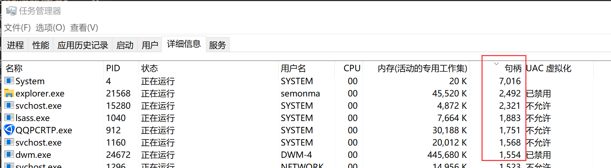
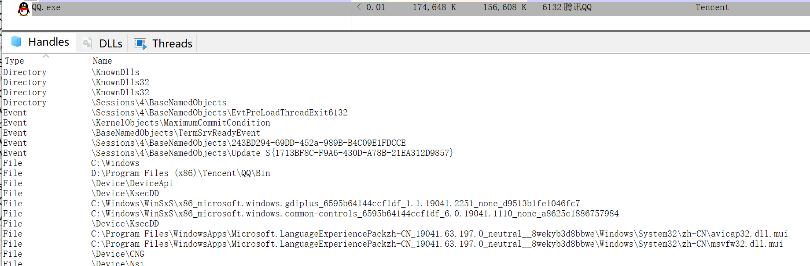
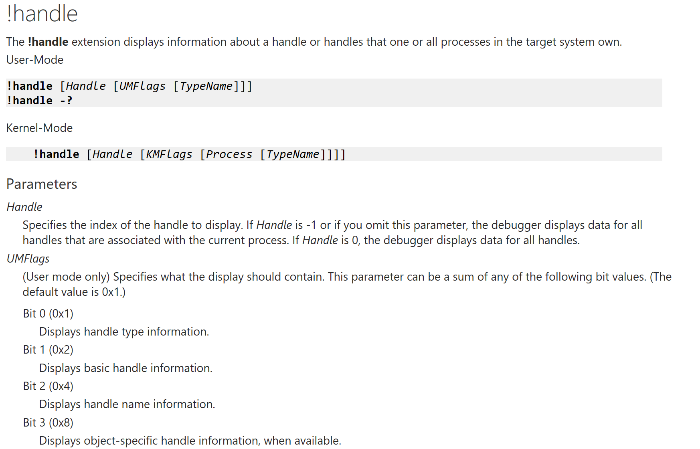

# win句柄泄露

windows句柄泄露，是指应用程序打开了句柄，但是没有正确的关闭，导致句柄数量不断累计。  
句柄可以是Event，File，Register，Mutex等。

## 怎么看句柄泄露
* 任务管理器  
windows下利用任务管理器可以看到句柄数量。  
如果句柄数量较高，那通常就要去分析一下了，这么高数量的句柄是否正常。
  

* procexp  
windows下使用procexp可以看到句柄的详情，一个进程打开了哪些句柄，是可以被枚举出来的。  
如下图所示，QQ.exe打开了哪些句柄，都会被显示出来。如果有句柄泄露，那意味着有某个句柄，比如File，被重复打开但是没有关闭，那么，在下面就能看到多个文件句柄，它们都对应同一个文件。  
  

* windbg  
windbg提供了handle diff功能，先后抓两个句柄快照，对比前后的句柄差，就能看到句柄是否有泄露。  
我没有实际使用过这个点，先记录一下。

## windbg看句柄泄露
### htrace命令
htrace的用法如下。
```
!htrace [Handle [Max_Traces]] 
!htrace -enable [Max_Traces]
!htrace -snapshot
!htrace -diff
!htrace -disable
!htrace -?
```
核心的步骤是下面三步。
1. windbg attach到目标进程。
2. `!handle -enable`，启用句柄追踪。
3. `!htrace -snapshot`，打一个句柄快照。
4. 进程继续运行，看到明显的句柄增长以后。
5. `!htrace -diff`，当前句柄状态与快照对比，看哪些句柄没有close。
6. 提示，windbg使用`Break`可以暂停进程运行，然后才有机会输入命令。

下面这一段是网上的结果，`OPEN`状态的就是未关闭的句柄，下面还有函数调用栈，方便定位。
```
0:000> !htrace -diff  
Handle tracing information snapshot successfully taken.  
0xfa new stack traces since the previous snapshot.  
Ignoring handles that were already closed...  
Outstanding handles opened since the previous snapshot:  
--------------------------------------  
Handle = 0x000005b0 - OPEN  
Thread ID = 0x000007f4, Process ID = 0x000013f0  
0x00401657: test1!CServer::GetToken+0x00000047  
0x0040136f: test1!CServer::GetSID+0x0000001f  
0x004010de: test1!ThreadWorker+0x0000007e  
0x7c80b729: kernel32!BaseThreadStart+0x00000037  
--------------------------------------  
Handle = 0x000005b4 - OPEN  
Thread ID = 0x00000c34, Process ID = 0x000013f0  
0x00401657: test1!CServer::GetToken+0x00000047  
0x0040136f: test1!CServer::GetSID+0x0000001f  
0x004010de: test1!ThreadWorker+0x0000007e  
0x7c80b729: kernel32!BaseThreadStart+0x00000037  
```

### handle命令
handle命令是查看某个句柄的信息，用于定位句柄泄露不大方便。  
```
!handle [Handle [UMFlags [TypeName]]] 
!handle -?
```

写了一个demo程序，能看到一些信息，但是不确定实际是否可行。因为在很多场景之下，我们没有机会attach到目标进程上去，我们大多数的时候，是让对方抓个dump，我们来分析dump。

```c++
#include "stdafx.h"
#include <Windows.h>

LPCTSTR g_lpEventName = L"{10C4A3B3-BDB8-4e63-B7DD-DC0A974472F4}";

int _tmain(int argc, _TCHAR* argv[])
{
    for (int i = 0; i < 100; ++i)
    {
        HANDLE h = CreateEvent(NULL, TRUE, FALSE, g_lpEventName);
    }

    HANDLE h = CreateEvent(NULL, TRUE, FALSE, g_lpEventName);
    WaitForSingleObject(h, INFINITE);
	return 0;
}
```

**注意**：使用任务管理器导出的dmp文件不包括handle信息，使用`!handle`命令会看不到句柄详情，提示错误。

1. 运行进程。
2. procexp导出full dmp。
3. windbg分析。

* !handle命令。  
我们看到了所有句柄的基础信息，以及最后的统计信息。Event打开的最多，有118个。
```
0:000> !handle
Handle 00000004
  Type         	Event
Handle 00000008
  Type         	Key
Handle 0000000c
  Type         	Event

246 Handles
Type                    	Count
None                    	68
Event                   	118
Section                 	8
File                    	12
Directory               	4

```

* 随便看一下Event，`!handle [addr] [flags]`。
```
0:000> !handle 00000164 7
Handle 00000164
  Type         	Key
  Attributes   	0
  GrantedAccess	0x20019:
         ReadControl
         QueryValue,EnumSubKey,Notify
  HandleCount  	2
  PointerCount 	65536
  Name         	\REGISTRY\MACHINE\SOFTWARE\Microsoft\Ole

0:000> !handle 00000304 7
Handle 00000304
  Type         	Event
  Attributes   	0
  GrantedAccess	0x1f0003:
         Delete,ReadControl,WriteDac,WriteOwner,Synch
         QueryState,ModifyState
  HandleCount  	102
  PointerCount 	3342338
  Name         	\Sessions\3\BaseNamedObjects\{10C4A3B3-BDB8-4e63-B7DD-DC0A974472F4}
```
解释一下命令，`!handle [addr] [flags]`，addr是句柄的地址，后面的flags是标记，按位或起来的，7表示句柄类型+句柄基础信息+句柄名词信息。  
对于其中的`HandleCount`字段，应该是句柄打开的次数，这里的102，跟代码中的次数是能对上的，同时，`Name`字段能告诉我们对应Event的名词，这样就可以搜索定位了。  
不过，这种方法定位起来确实效率低。因为很多Event句柄，我们不知道去看哪一个，运气好才能发现问题在哪里。其次，如果使用procexp看handle信息，这里会更快。还是前面那句话，在没有现场的情况下，只有一个dmp文件，慢就慢点，总比没办法要强。

  

