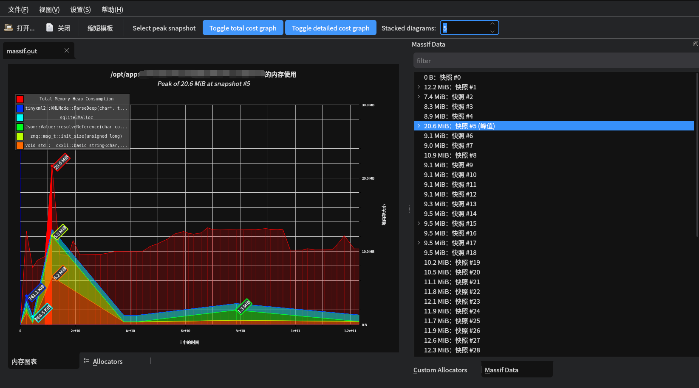

# valgrind massif工具

massif是分析内存占用的工具。


massif内存分析工具，主要用于堆内存，也可以用于栈内存（栈内存分析开关默认是关闭）。它分析的原理是通过打内存快照来监控内存分配情况。

对于待分析的进程，最好是debug版本，如果是release，valgrind运行的很慢，而且栈信息也缺失很多。

ms_print和massif-visualizer是解析工具，用于分析massif捕获的内存结果。

## massif用法
```shell
# 通过valgrind运行目标进程
$ valgrind --tool=massif /file/path/your_program

# 运行一段时间以后，如果进程自动退出，或者ctrl+c退出，或者kill -INT your_program_pid。
# 不要kill -9，这样不会生成结果文件！！！

# 分析结果
$ ms_print massif.out.pid
$ massif-visualizer massif.out.pid
```

* --heap=<yes|no> [default: yes]。  
  是否对 malloc, new, free, delete 等动态分配内存的函数进行采样? 默认采样。
* --stacks=<yes|no> [default: no]。  
  栈上内存是否也进行跟踪。很耗性能，会大幅降低massif的运行速度。
* --depth=<number> [default: 30]。  
  最大堆栈数量。
* --alloc-fn=<name>。  
  添加其他内存分配函数，可以自己写一个分配器，不用 glibc 的 malloc, free。
* --time-unit=<i|ms|B> [default: i]。  
  x轴的单位: i: 指令，ms：毫秒， B:分配和是否的字节数。通常是用i，在某些很快退出的进程上可以使用B。
* --detailed-freq=<n> [default: 10]。  
  详细采样频率: 默认10; 每次都采样可以设置为 1, 更详细的内容, 但是有很多可能重复的。
* --massif-out-file=<file> [default: massif.out.%p]。  
  输出文件名; 不建议修改。%p是pid的意思，默认以pid来区分，因为，进程可能拉起子进程，子进程可以通过pid区分出来，否则，修改了输出文件，那么，子进程也耦合到一个输出里面了。


## ms_print分析
运行一段时间以后，kill -INT 结束掉目标进程，然后分析结果文件。
```shell
$ ms_print massif.out.pid ms-print-result.txt
```
如下图，会得到类似的一个文本格式产物，不是很好看。  
这玩意没怎么看懂，大概来说，横坐标是指令个数，纵坐标是堆内存大小。为什么横坐标从一开始没有值呢，不清楚啊。
  

## massif-visualizer
massif-visualizer会跟着valgrind一起安装，如果没有，那就单独装一下。
```shell
$ massif-visualizer massif.out.pid
```
同样的一个massif结果，用可视化工具显示，可读性会高很多。
* 横坐标是i的时间，那就是指令的个数了。
* 纵坐标是堆内存大小。
* 图中还标识了峰值内存的大小。
* 在右侧可以展开，看到调用栈。
  

