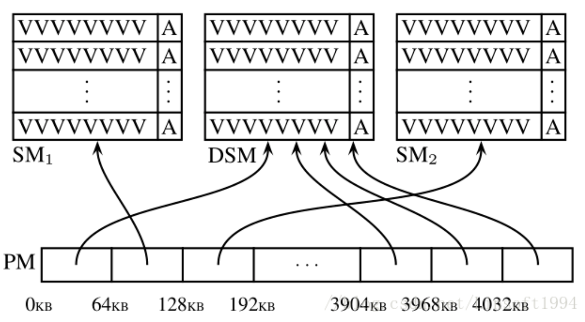

# valgrind memcheck

memcheck是检测内存泄漏的工具。

本文记录memcheck的原理。  
参考文献：  
* https://valgrind.org/docs/manual/mc-manual.html#mc-manual.machine  
4.5. Details of Memcheck's checking machinery
* https://blog.csdn.net/Linsoft1994/article/details/79562518
* https://zhuanlan.zhihu.com/p/510362477

## 自己的话
valgrind是一个壳进程，内部加载了memcheck工具用来做内存检测，内存检测工具可以识别以下内容。
* 使用未初始化的变量。
* 内存访问越界。
* 内存释放以后再次读写。
* 内存double free。
* malloc/free，new/delete不匹配。
* 内存泄漏。

通过valgrind启动目标进程时，valgrind虚拟了一个cpu，将原始进程的代码转译扩展到虚拟cpu上执行，因此，valgrind有机会接触到内存分配和内存读写。  
在memcheck内部，会维护两个map结构，一个是valid-value map，一个是valid-address map。v
* alid-value map是8bits的映射表，目标进程的内存空间的每一个bytes映射到一个8bits map中，8bits位记录了是否初始化等信息。
* valid-address map也是进程内存空间的映射，map每一项是1bit，用来记录内存空间是否可以合法的访问。  
valgrind通过虚拟cpu和两个map相结合，可以“智能判断”内存访问是否应该报错，比如未初始化的变量，如果没有实际有意义的访问，那么是不会报错的。

## valgrind概述
Valgrind是用于构建程序动态分析工具的重量级插桩框架。目前Valgrind内置的工具，可用于检测内存管理和线程竞争等等过程中产生的问题，更快速、更准确和更详细地分析所需的程序。

Valgrind可以理解一个壳进程，它加载不同的工具可以做不同的检测项。

其中，Memcheck是valgrind应用最广泛的工具。它是一个重量级的内存检查器，能够发现C或者C++在开发过程中绝大多数导致程序崩溃或者不可预知的行为的内存相关的错误，比如：使用未初始化的内存、使用已释放内存、内存访问越界等。

## valgrind原理
Valgrind的工具是在Valgrind内核基础上使用C语言编写的插件。最直观的表达就是：Valgrind内核 + 工具插件 = Valgrind工具。在Valgrind框架下编写一个二进制程序动态分析工具比从零开始简很多，因为Valgrind内核为新工具的编写提供了许多通用的工具集，比如错误记录、动态插桩等。

当Valgrind工具程序启动时，会将需要分析的程序加载与工具程序同一个进程空间中，然后使用JIT（just-in-time）的动态二进制重编译技术，将代码分成一个个小的代码块实施重编译。在重编译过程中，Valgrind内核会将相应代码块的机器码转化成中间表示，插件会在中间代码中进行相应分析代码的插桩，最后通过内核把中间表示转换成原本的机器码，在目标机器上执行。Valgrind内核大部分时间花在上述机器码和中间表示的相互翻译执行中，而原程序的所有机器码并没有执行，执行的都是插桩后的代码。

所有的Valgrind工具都是使用静态链接的可执行文件，里面包含了Valgrind内核和工具插件。虽然这样会导致每个工具程序中都需要包含一份Valgrind内核，内核大概2.5MB左右，稍微浪费一些磁盘空间，但是静态链接可以使整个可执行文件加载到非标准的启动地址，方便把待分析程序加载进同一个进程空间中，然后使用Valgrind重编译技术将待分析程序机器码重编译到别的地址执行。

### 工具启动
Valgrind工具，是在命令行中通过valgrind程序通过指定tool命令行参数为具体的工具名称来启动的。valgrind命令行程序只是一个很简单的封装程序，根据tool命令行来调用execv去执行目标Valgrind工具程序。然后Valgrind内核会先初始化各种子系统，如地址空间管理器、内部内存分配器等，再将待分析程序的.text和.data段等映射到同一个程序的地址空间中，并为其配置好堆栈等。接着，开始内核和插件中的命令行参数初始化和加载，并完成内核中更多子系统的加载，如翻译表、信号处理机制、线程调度器和调试信息等等。此时，Valgrind工具准备完毕，开始从待分析程序的第一条指令执行重编译和运行。

Valgrind内核和插件本身是运行在物理CPU上的，而待分析程序是运行在虚拟出的CPU上。由于有JIT手段来加速，整体看起来不像在解析执行，执行效率也比较高。物理CPU是直接使用真实CPU上的寄存器的，而虚拟CPU使用的寄存器则是保存在内存中的虚拟寄存器，同时影子寄存器也是类似的方法方便模拟出来。Valgrind为每个线程提供一个ThreadState结构，用于保存所有的虚拟寄存器和影子寄存器，方便后续的分析工作。

### 中间表示（VEX）
在Valgrind的重编译的过程中，使用的中间表示是一种平台无关的语言——VEX，通过屏蔽硬件平台的差异性，节省了大量针对不同平台的插桩代码。

Statement（结构体IRStmt）表示有副作用的操作，如写寄存器、写内存、临时变量赋值等。其中，Statement由Expression组成。Expression(结构体IRExpr)表示没有副作用的操作，如读内存、做算术运算等，这些操作可以包含子表达式和表达式树。

Valgrind根据一定规则将代码划分为很多小代码块后，会进行以下八个阶段，将插件的分析代码进行插桩并优化：
1. 反汇编：机器码 → 树状中间表示
2. 优化1：树状中间表示 → 扁平中间表示
3. 插桩： 扁平中间表示 → 带桩的扁平中间表示
4. 优化2：带桩的扁平中间表示 → 优化的扁平中间表示
5. 重建树：优化的扁平中间表示 → 带桩的树状中间表示
6. 汇编选择：带桩的树状中间表示 → 目标汇编代码
7. 寄存器分配：目标汇编代码 → 寄存器优化的目标汇编代码
8. 汇编：寄存器优化的目标汇编代码 → 机器码

### JIT执行
通过上面的插桩优化后得到的机器码会保存到一个定长、使用线性探测的哈希表中。如果哈希表达到了80%的程度，使用FIFO的策略将八分之一旧的重编译得到的机器码丢弃。

当一个代码块执行完毕，下一个代码块的路由是靠dispatcher和scheduler两个组件来实现。首先，翻译后的代码执行完毕后，代码执行会陷入由汇编代码写的dispatcher，dispatcher内部有一个小的保存最近使用代码块的快速缓存，用于快速查找下一个需要用到的代码块，这样切换的效率非常高。

如果快查找失败了，控制流会到用C写的scheduler上面。scheduler会在上述的哈希表中查找已经翻译好的代码块，找不到的话，会进行重编译并加入哈希表中，还有更新dispatcher内部的快速缓存，以便dispatcher快速的后续使用。

对于system call、signal处理、事件机制等就不展开讨论了。

## Valgrind回调Memcheck
```c
static void mc_pre_clo_init( void );
static void mc_post_clo_init ( void );
IRSB* MC_(instrument) ( VgCallbackClosure* closure,
                        IRSB* sb_in,
                        const VexGuestLayout* layout,
                        const VexGuestExtents* vge,
                        const VexArchInfo* archinfo_host,
                        IRType gWordTy, IRType hWordTy );
static void mc_fini ( Int exitcode );
```
上述四个接口，由Valgrind在不同阶段调用。其中，mc_pre_clo_init 和 mc_post_clo_init用于初始化memcheck插件，MC_(instrument) 是在scheduler需要translate的插桩阶段会调用。
```c
   VG_(track_new_mem_startup)     ( mc_new_mem_startup );
   VG_(track_new_mem_mmap)        ( mc_new_mem_mmap );
   VG_(track_change_mem_mprotect) ( mc_new_mem_mprotect );
   VG_(track_copy_mem_remap)      ( MC_(copy_address_range_state) );
   VG_(track_die_mem_stack_signal)( MC_(make_mem_noaccess) );
   VG_(track_die_mem_brk)         ( MC_(make_mem_noaccess) );
   VG_(track_die_mem_munmap)      ( MC_(make_mem_noaccess) );
   ...
   VG_(track_die_mem_stack)       ( mc_die_mem_stack     );
   VG_(track_ban_mem_stack)       ( MC_(make_mem_noaccess) );
   VG_(track_pre_mem_read)        ( check_mem_is_defined );
   VG_(track_pre_mem_read_asciiz) ( check_mem_is_defined_asciiz );
   VG_(track_pre_mem_write)       ( check_mem_is_addressable );
   VG_(track_post_mem_write)      ( mc_post_mem_write );
   VG_(track_post_reg_write)                  ( mc_post_reg_write );
   VG_(track_post_reg_write_clientcall_return)( mc_post_reg_write_clientcall );
```
上述这些 VG_(track_*) 函数是用于向Valgrind内核注册相应的事件监控，这些事件难以通过插桩来拦截的，如堆块的分配、堆栈指针的修改、信号处理等。当注册的事件发生时，Valgrind内核会调用Memcheck注册的函数。

## 内存错误检测
  

* Valid-Value表  
对于进程的整个地址空间中的每一个字节(byte)，都有与之对应8个bits；对于CPU每个寄存器，也有一个与之对应的bit向量。这些bits负责记录该字节或者寄存器值是否已初始化。
* Valid-Address表  
对于进程整个地址空间中的每一个字节(byte)，还有与之对应1个bit，负责记录该地址是否能够被读写。
* 检测原理  
当要读写内存中某个字节时，首先检查这个字节对应的 A bit。如果该A bit显示该位置是无效位置，memcheck 则报告读写错误。  
待分析程序在虚拟的CPU环境上运行，当内存中的某个字节被加载到真实的CPU时，该字节对应的V bits也被加载到虚拟CPU环境中。一旦寄存器中的值，被用来产生内存地址，或者该值能够影响程序输出，则memcheck会检查对应的V bits，如果该值尚未初始化，则会报告使用未初始化内存错误。